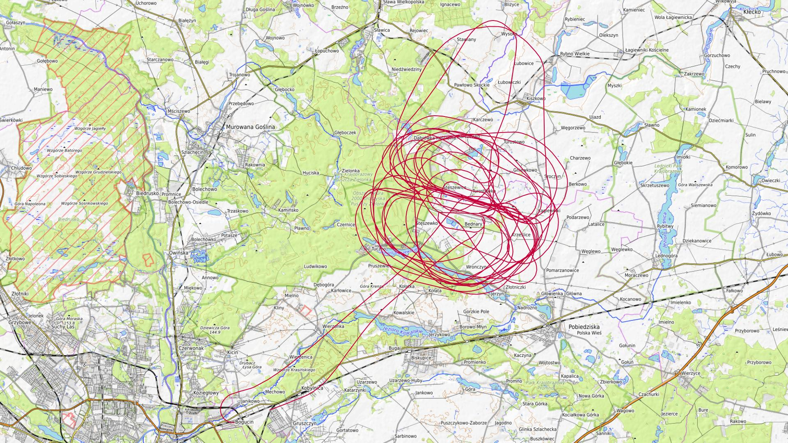
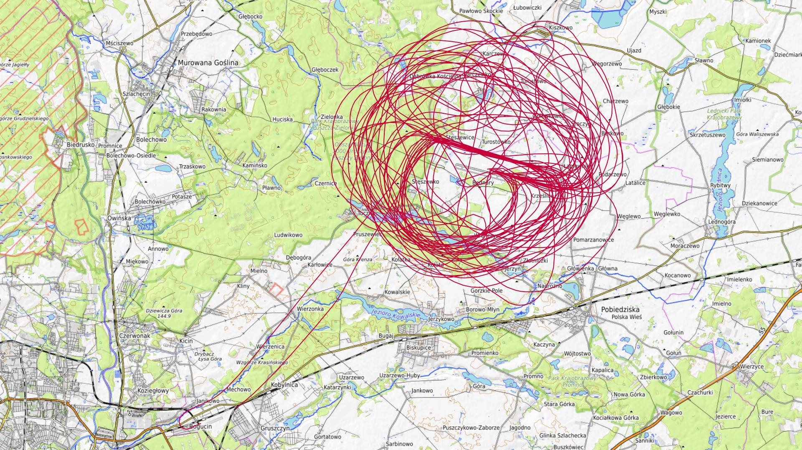
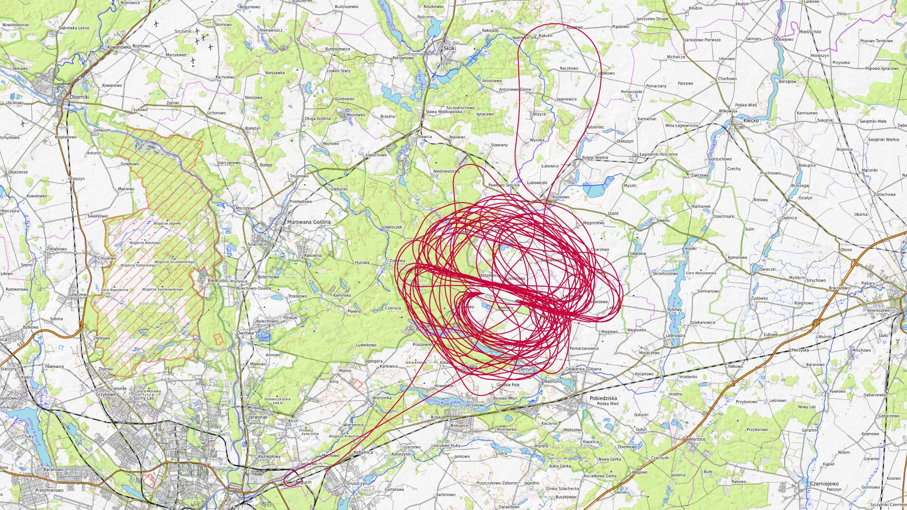
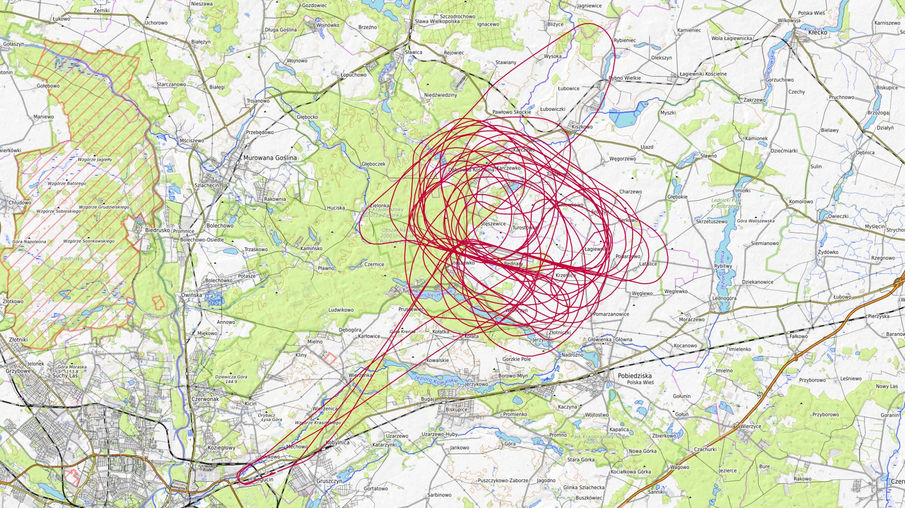
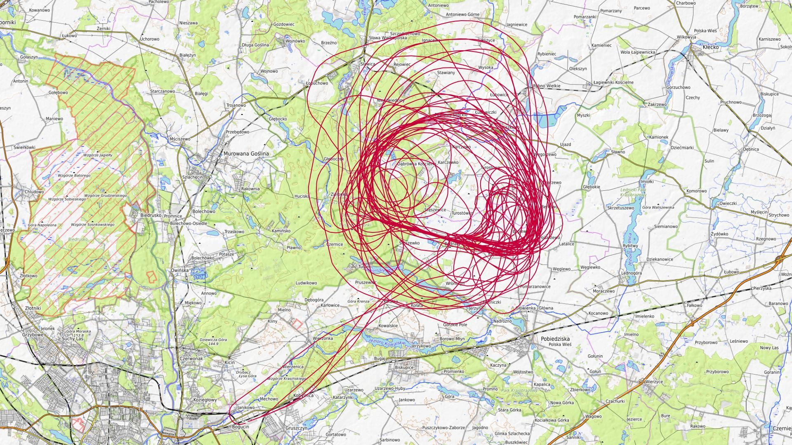
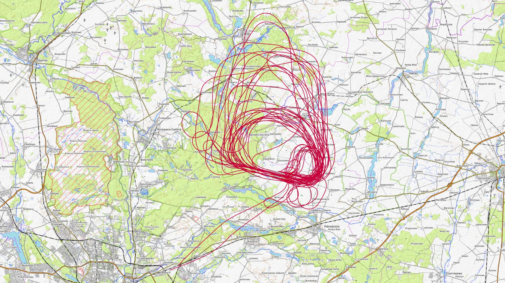
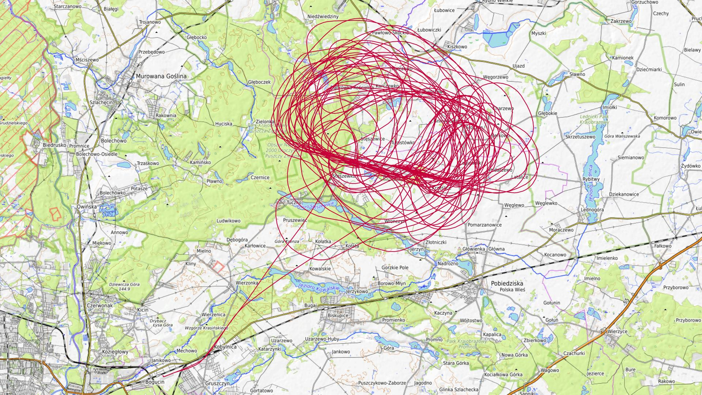
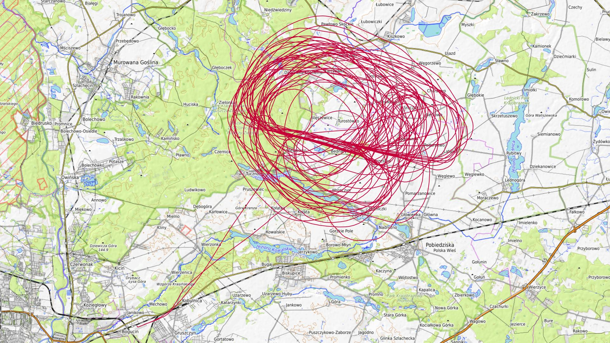

# Maj 2024

Liczba dni z lotami: 8 
Suma czasów netto wszystkich lotów: 39 h 49 min 
 

### 2024-05-10 PIĄTEK

Loty w godzinach: 10:58:23 - 19:44:01, **8 h 45 min**  
Czas netto: **2 h 17 min**  
Ilość lotów: **9**  

|Lot|Od|Do|Czas [min]|
|----:|--------:|--------:|--------:|
|1|10:58:23|11:04:11|5|
|2|12:16:42|12:20:28|3|
|3|13:00:13|13:18:08|17|
|4|14:10:06|14:30:03|19|
|5|15:22:13|15:42:23|20|
|6|16:28:17|16:53:16|24|
|7|17:35:22|17:55:57|20|
|8|18:38:18|18:59:29|21|
|9|19:40:20|19:43:52|3|

### 2024-05-11 SOBOTA

Loty w godzinach: 07:15:51 - 20:20:00, **13 h 4 min**  
Czas netto: **5 h 21 min**  
Ilość lotów: **15**  

|Lot|Od|Do|Czas [min]|
|----:|--------:|--------:|--------:|
|1|07:15:51|07:19:53|4|
|2|08:48:44|09:12:32|23|
|3|12:22:36|12:46:41|24|
|4|13:20:35|13:44:53|24|
|5|14:22:11|14:47:18|25|
|6|15:00:47|15:22:19|21|
|7|15:30:37|15:53:18|22|
|8|16:10:14|16:33:17|23|
|9|16:40:51|17:02:59|22|
|10|17:17:55|17:40:54|22|
|11|17:48:53|18:10:59|22|
|12|18:26:19|18:49:35|23|
|13|18:57:21|19:19:23|22|
|14|19:32:27|19:52:12|19|
|15|19:58:53|20:19:57|21|

### 2024-05-12 NIEDZIELA

Loty w godzinach: 08:17:16 - 18:10:50, **9 h 53 min**  
Czas netto: **4 h 54 min**  
Ilość lotów: **13**  

|Lot|Od|Do|Czas [min]|
|----:|--------:|--------:|--------:|
|1|08:17:16|08:21:08|3|
|2|10:08:31|10:31:57|23|
|3|11:10:18|11:33:47|23|
|4|12:10:31|12:33:59|23|
|5|12:43:50|13:08:33|24|
|6|13:20:17|13:43:00|22|
|7|13:50:51|14:14:42|23|
|8|14:27:36|14:51:19|23|
|9|14:59:22|15:24:29|25|
|10|15:36:31|16:00:07|23|
|11|16:08:43|16:33:17|24|
|12|16:45:30|17:10:46|25|
|13|17:44:06|18:10:49|26|

### 2024-05-18 SOBOTA

Loty w godzinach: 09:03:28 - 19:37:35, **10 h 34 min**  
Czas netto: **3 h 30 min**  
Ilość lotów: **11**  

|Lot|Od|Do|Czas [min]|
|----:|--------:|--------:|--------:|
|1|09:03:28|09:07:45|4|
|2|10:17:14|10:38:27|21|
|3|11:19:57|11:46:10|26|
|4|11:56:44|12:02:00|5|
|5|12:32:02|12:56:39|24|
|6|13:30:36|13:55:44|25|
|7|14:28:54|14:52:55|24|
|8|15:29:10|15:53:56|24|
|9|16:29:28|16:54:24|24|
|10|18:33:16|18:57:21|24|
|11|19:31:03|19:37:16|6|

### 2024-05-25 SOBOTA

Loty w godzinach: 08:17:09 - 20:21:04, **12 h 3 min**  
Czas netto: **6 h 35 min**  
Ilość lotów: **19**  

|Lot|Od|Do|Czas [min]|
|----:|--------:|--------:|--------:|
|1|08:17:09|08:21:32|4|
|2|09:24:01|09:50:41|26|
|3|10:23:11|10:47:03|23|
|4|10:56:54|11:24:08|27|
|5|11:34:37|11:58:49|24|
|6|12:10:58|12:37:25|26|
|7|12:45:23|13:10:21|24|
|8|13:23:29|13:48:05|24|
|9|13:55:48|14:20:28|24|
|10|14:33:54|15:00:08|26|
|11|15:07:18|15:31:43|24|
|12|15:45:55|16:11:26|25|
|13|16:18:58|16:44:04|25|
|14|16:57:30|17:24:01|26|
|15|17:32:53|17:57:07|24|
|16|18:09:19|18:31:17|21|
|17|18:35:03|18:39:47|4|
|18|19:02:57|19:08:04|5|
|19|20:16:10|20:20:58|4|

### 2024-05-26 NIEDZIELA

Loty w godzinach: 07:48:54 - 17:40:08, **9 h 51 min**  
Czas netto: **5 h 39 min**  
Ilość lotów: **15**  

|Lot|Od|Do|Czas [min]|
|----:|--------:|--------:|--------:|
|1|07:48:54|07:53:12|4|
|2|09:10:52|09:36:39|25|
|3|09:45:04|10:07:48|22|
|4|10:19:16|10:44:14|24|
|5|10:52:55|11:16:10|23|
|6|11:26:37|11:48:14|21|
|7|11:56:35|12:18:57|22|
|8|12:31:46|12:59:44|27|
|9|13:13:59|13:33:27|19|
|10|13:45:10|14:09:49|24|
|11|14:18:30|14:41:50|23|
|12|14:54:16|15:18:31|24|
|13|15:26:13|15:49:41|23|
|14|16:01:59|16:27:05|25|
|15|17:13:50|17:39:36|25|

### 2024-05-30 CZWARTEK

Loty w godzinach: 09:03:14 - 20:42:05, **11 h 38 min**  
Czas netto: **5 h 21 min**  
Ilość lotów: **14**  

|Lot|Od|Do|Czas [min]|
|----:|--------:|--------:|--------:|
|1|09:03:14|09:07:41|4|
|2|10:21:48|10:43:58|22|
|3|10:50:47|11:14:12|23|
|4|11:25:31|11:52:22|26|
|5|11:59:22|12:26:25|27|
|6|12:35:50|13:01:11|25|
|7|13:12:26|13:38:30|26|
|8|13:45:28|14:08:12|22|
|9|14:19:12|14:45:00|25|
|10|14:51:55|15:16:15|24|
|11|15:27:38|15:51:31|23|
|12|19:12:45|19:33:25|20|
|13|19:44:55|20:07:18|22|
|14|20:14:59|20:41:07|26|

### 2024-05-31 PIĄTEK

Loty w godzinach: 09:00:01 - 19:02:23, **10 h 2 min**  
Czas netto: **6 h 8 min**  
Ilość lotów: **15**  

|Lot|Od|Do|Czas [min]|
|----:|--------:|--------:|--------:|
|1|09:00:01|09:04:28|4|
|2|10:22:00|10:46:52|24|
|3|10:54:02|11:19:23|25|
|4|11:54:09|12:20:02|25|
|5|12:32:26|13:00:06|27|
|6|13:07:23|13:32:48|25|
|7|13:44:19|14:10:57|26|
|8|14:20:49|14:45:53|25|
|9|14:58:01|15:26:55|28|
|10|15:37:10|16:04:17|27|
|11|16:15:36|16:43:44|28|
|12|16:52:41|17:20:30|27|
|13|17:30:33|17:57:55|27|
|14|18:09:31|18:30:32|21|
|15|18:38:51|19:01:56|23|

[początek](./)
