# Czerwiec 2024

Liczba dni z lotami: 12 
Suma czasów netto wszystkich lotów: 47 h 11 min 
 

### 2024-06-09 NIEDZIELA

Loty w godzinach: 07:59:18 - 17:05:24, **9 h 6 min**  
Czas netto: **4 h 10 min**  
Ilość lotów: **14**  

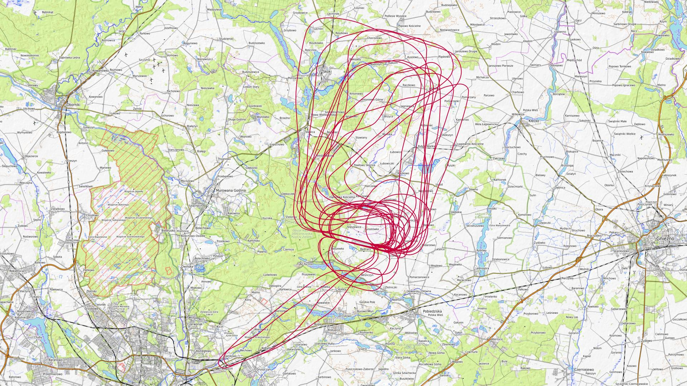

|Lot|Od|Do|Czas [min]|
|----:|--------:|--------:|--------:|
|1|07:59:18|08:04:56|5|
|2|09:13:33|09:36:06|22|
|3|10:09:34|10:35:09|25|
|4|10:43:35|11:07:38|24|
|5|11:18:45|11:43:16|24|
|6|11:51:34|12:12:02|20|
|7|12:25:27|12:50:55|25|
|8|13:03:36|13:23:29|19|
|9|13:35:22|13:57:20|21|
|10|14:32:47|14:56:19|23|
|11|15:31:01|15:56:03|25|
|12|15:58:24|15:58:54|0|
|13|16:17:20|16:21:43|4|
|14|16:58:42|17:05:12|6|

### 2024-06-13 CZWARTEK

Loty w godzinach: 11:05:04 - 20:41:39, **9 h 36 min**  
Czas netto: **2 h 28 min**  
Ilość lotów: **10**  

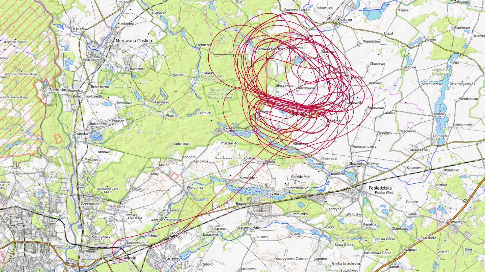

|Lot|Od|Do|Czas [min]|
|----:|--------:|--------:|--------:|
|1|11:05:04|11:10:04|5|
|2|14:14:56|14:33:50|18|
|3|14:43:05|14:56:28|13|
|4|15:32:55|15:51:02|18|
|5|16:37:04|17:00:07|23|
|6|17:47:08|18:00:30|13|
|7|18:11:51|18:30:50|18|
|8|18:38:13|18:52:11|13|
|9|19:45:46|20:06:07|20|
|10|20:37:47|20:41:36|3|

### 2024-06-14 PIĄTEK

Loty w godzinach: 08:03:23 - 20:35:48, **12 h 32 min**  
Czas netto: **3 h 53 min**  
Ilość lotów: **13**  

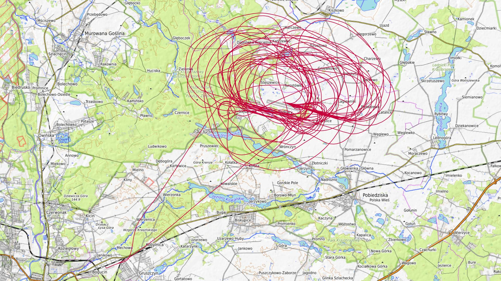

|Lot|Od|Do|Czas [min]|
|----:|--------:|--------:|--------:|
|1|08:03:23|08:07:32|4|
|2|10:09:07|10:22:31|13|
|3|11:57:17|12:11:50|14|
|4|12:22:28|12:45:15|22|
|5|12:53:49|13:08:21|14|
|6|13:37:42|14:01:08|23|
|7|14:38:11|15:00:14|22|
|8|15:42:12|15:55:58|13|
|9|16:04:52|16:25:45|20|
|10|16:34:42|16:49:55|15|
|11|18:06:53|18:25:12|18|
|12|19:12:31|19:32:43|20|
|13|20:05:50|20:35:36|29|

### 2024-06-15 SOBOTA

Loty w godzinach: 08:32:08 - 13:38:12, **5 h 6 min**  
Czas netto: **1 h 57 min**  
Ilość lotów: **6**  

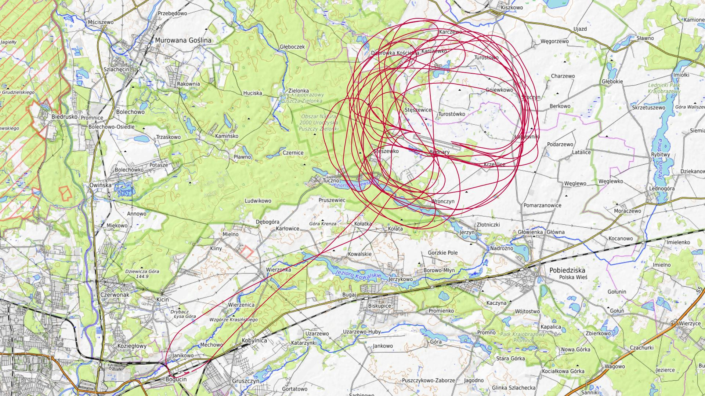

|Lot|Od|Do|Czas [min]|
|----:|--------:|--------:|--------:|
|1|08:32:08|08:36:17|4|
|2|10:03:46|10:28:37|24|
|3|11:02:06|11:29:46|27|
|4|12:01:51|12:31:22|29|
|5|12:57:30|13:22:08|24|
|6|13:31:08|13:38:01|6|

### 2024-06-16 NIEDZIELA

Loty w godzinach: 08:22:30 - 17:36:12, **9 h 13 min**  
Czas netto: **4 h 55 min**  
Ilość lotów: **14**  

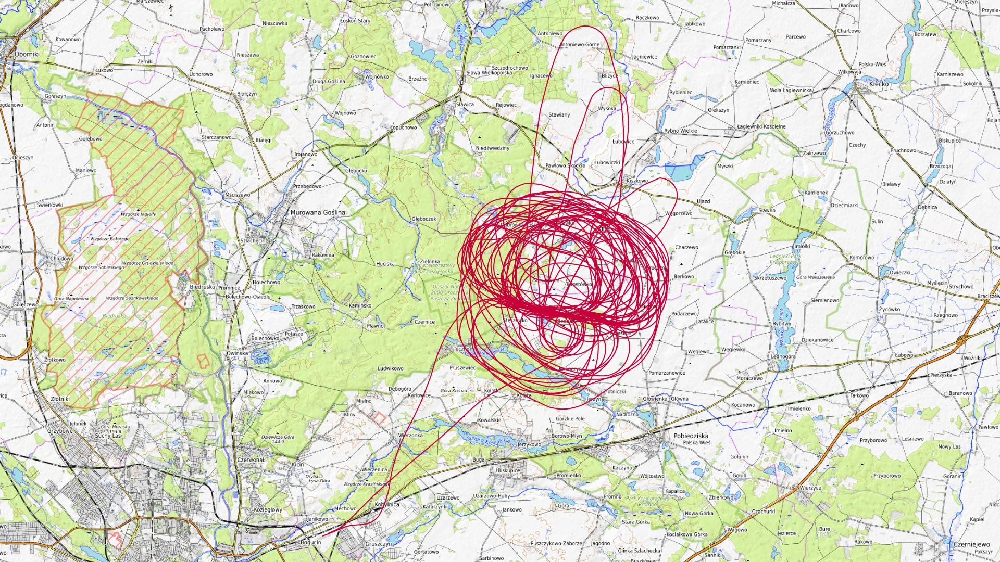

|Lot|Od|Do|Czas [min]|
|----:|--------:|--------:|--------:|
|1|08:22:30|08:29:05|6|
|2|09:13:35|09:37:37|24|
|3|09:44:30|10:07:04|22|
|4|10:18:24|10:41:49|23|
|5|10:48:28|11:08:13|19|
|6|11:21:11|11:45:00|23|
|7|11:50:55|12:12:07|21|
|8|12:24:43|12:47:08|22|
|9|12:54:29|13:14:48|20|
|10|14:32:55|14:54:24|21|
|11|15:05:30|15:27:16|21|
|12|15:38:23|15:59:43|21|
|13|16:08:47|16:29:52|21|
|14|17:10:25|17:36:06|25|

### 2024-06-20 CZWARTEK

Loty w godzinach: 10:07:23 - 20:48:47, **10 h 41 min**  
Czas netto: **3 h 39 min**  
Ilość lotów: **10**  

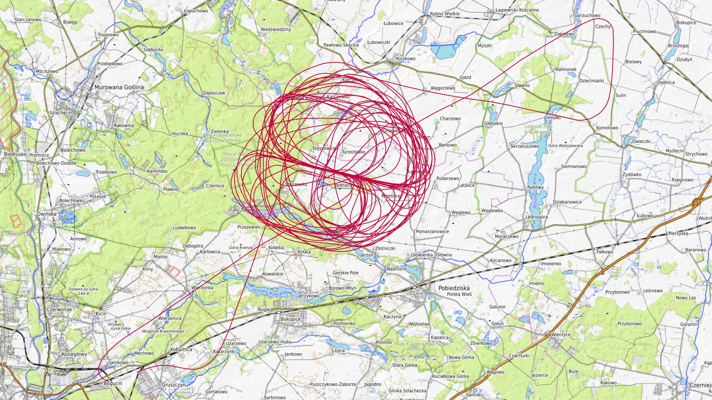

|Lot|Od|Do|Czas [min]|
|----:|--------:|--------:|--------:|
|1|10:07:23|10:11:50|4|
|2|11:45:02|12:09:57|24|
|3|13:11:36|13:39:04|27|
|4|14:50:12|15:16:24|26|
|5|15:54:23|16:19:47|25|
|6|16:58:52|17:21:01|22|
|7|17:30:15|17:53:47|23|
|8|18:28:32|18:55:21|26|
|9|19:39:17|20:00:42|21|
|10|20:31:11|20:48:45|17|

### 2024-06-21 PIĄTEK

Loty w godzinach: 09:22:22 - 18:56:23, **9 h 34 min**  
Czas netto: **3 h 52 min**  
Ilość lotów: **11**  

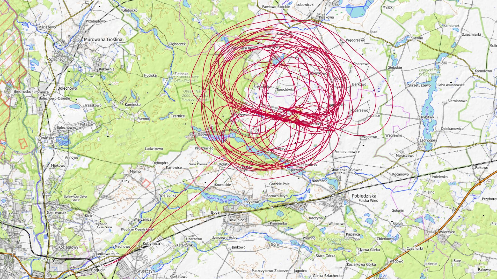

|Lot|Od|Do|Czas [min]|
|----:|--------:|--------:|--------:|
|1|09:22:22|09:26:36|4|
|2|10:17:51|10:46:22|28|
|3|11:30:40|11:53:47|23|
|4|12:30:52|12:51:53|21|
|5|13:01:40|13:27:00|25|
|6|14:07:49|14:33:40|25|
|7|14:43:58|15:09:08|25|
|8|15:52:27|16:15:43|23|
|9|16:23:30|16:48:05|24|
|10|17:34:43|18:01:42|26|
|11|18:51:40|18:56:13|4|

### 2024-06-23 NIEDZIELA

Loty w godzinach: 09:11:06 - 19:08:37, **9 h 57 min**  
Czas netto: **4 h 6 min**  
Ilość lotów: **12**  

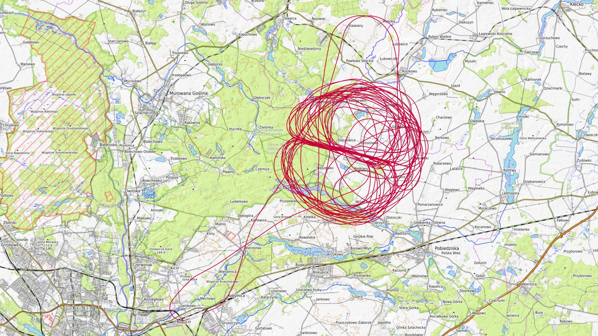

|Lot|Od|Do|Czas [min]|
|----:|--------:|--------:|--------:|
|1|09:11:06|09:16:01|4|
|2|10:08:25|10:32:42|24|
|3|11:07:24|11:27:38|20|
|4|11:37:43|11:58:52|21|
|5|12:39:22|13:00:44|21|
|6|13:41:15|14:02:40|21|
|7|14:38:33|15:01:07|22|
|8|15:13:20|15:35:23|22|
|9|16:17:22|16:39:55|22|
|10|16:50:08|17:09:07|18|
|11|17:46:46|18:10:53|24|
|12|18:45:22|19:08:35|23|

### 2024-06-27 CZWARTEK

Loty w godzinach: 10:23:53 - 19:20:49, **8 h 56 min**  
Czas netto: **2 h 15 min**  
Ilość lotów: **8**  

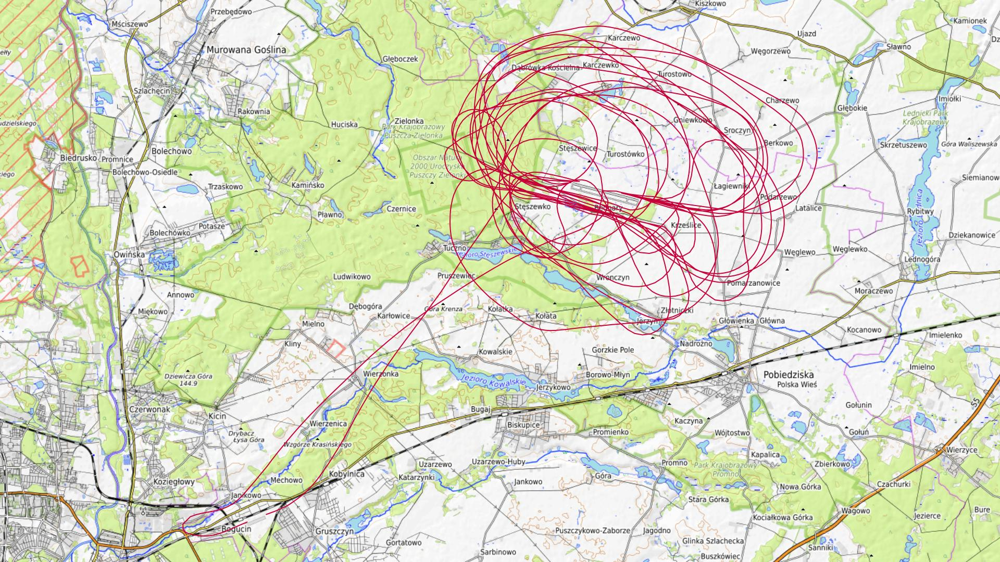

|Lot|Od|Do|Czas [min]|
|----:|--------:|--------:|--------:|
|1|10:23:53|10:28:22|4|
|2|12:39:01|13:00:11|21|
|3|13:11:31|13:33:02|21|
|4|14:16:53|14:41:41|24|
|5|15:25:05|15:51:06|26|
|6|16:02:48|16:20:25|17|
|7|17:28:57|17:43:39|14|
|8|19:15:29|19:20:44|5|

### 2024-06-28 PIĄTEK

Loty w godzinach: 08:15:39 - 17:07:56, **8 h 52 min**  
Czas netto: **3 h 20 min**  
Ilość lotów: **11**  

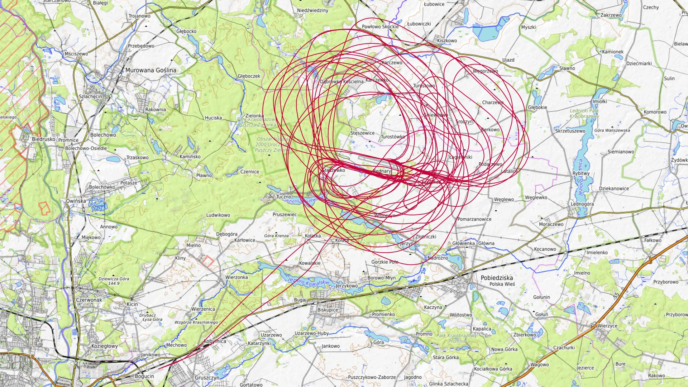

|Lot|Od|Do|Czas [min]|
|----:|--------:|--------:|--------:|
|1|08:15:39|08:19:59|4|
|2|10:00:21|10:16:39|16|
|3|11:01:27|11:26:41|25|
|4|12:02:37|12:17:46|15|
|5|12:28:28|12:52:19|23|
|6|13:01:20|13:16:03|14|
|7|13:29:45|13:55:57|26|
|8|14:41:10|15:08:18|27|
|9|15:47:49|16:04:32|16|
|10|16:18:28|16:44:21|25|
|11|17:03:12|17:07:47|4|

### 2024-06-29 SOBOTA

Loty w godzinach: 08:06:31 - 20:42:29, **12 h 35 min**  
Czas netto: **7 h 55 min**  
Ilość lotów: **19**  

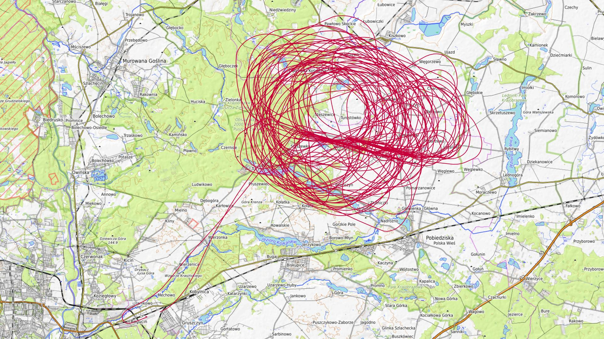

|Lot|Od|Do|Czas [min]|
|----:|--------:|--------:|--------:|
|1|08:06:31|08:10:42|4|
|2|09:06:56|09:31:39|24|
|3|10:05:03|10:28:58|23|
|4|10:40:56|11:05:59|25|
|5|11:12:13|11:34:40|22|
|6|11:46:22|12:11:38|25|
|7|12:18:09|12:44:32|26|
|8|12:57:46|13:25:18|27|
|9|13:32:24|13:57:18|24|
|10|14:09:14|14:36:06|26|
|11|14:43:27|15:11:32|28|
|12|15:24:37|15:51:06|26|
|13|16:02:27|16:28:44|26|
|14|16:36:13|17:00:56|24|
|15|17:12:04|17:39:52|27|
|16|17:49:45|18:18:29|28|
|17|18:29:56|18:56:27|26|
|18|19:07:04|19:33:57|26|
|19|20:12:46|20:41:55|29|

### 2024-06-30 NIEDZIELA

Loty w godzinach: 08:14:53 - 17:57:46, **9 h 42 min**  
Czas netto: **4 h 35 min**  
Ilość lotów: **11**  

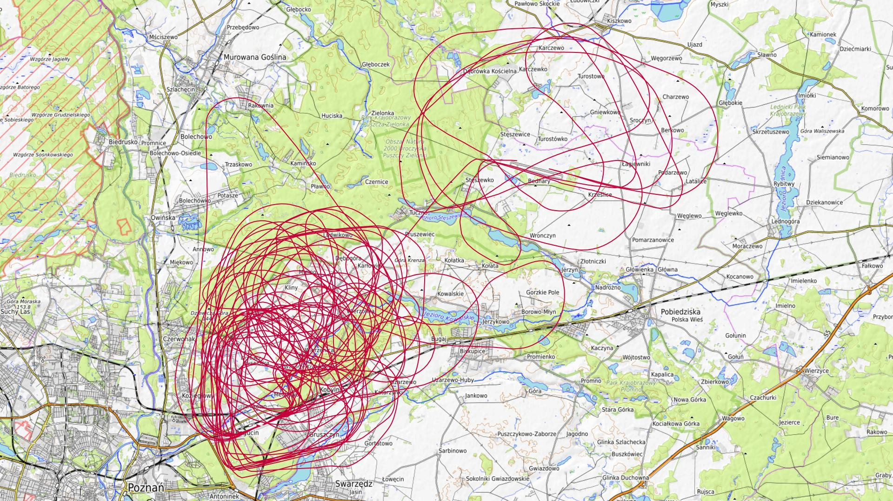

|Lot|Od|Do|Czas [min]|
|----:|--------:|--------:|--------:|
|1|08:14:53|08:44:06|29|
|2|09:24:53|09:54:46|29|
|3|10:38:14|11:10:32|32|
|4|11:51:47|12:19:47|28|
|5|13:00:58|13:25:52|24|
|6|13:58:48|14:21:54|23|
|7|14:30:00|14:49:39|19|
|8|15:22:16|15:43:50|21|
|9|15:54:31|16:18:23|23|
|10|16:27:55|16:48:18|20|
|11|17:35:28|17:57:41|22|

[początek](./)
