# Lipiec 2024

Liczba dni z lotami: 13 
Suma czasów netto wszystkich lotów: 68 h 9 min 
 

### 2024-07-06 SOBOTA

Loty w godzinach: 07:05:46 - 20:24:40, **13 h 18 min**  
Czas netto: **5 h 39 min**  
Ilość lotów: **14**  

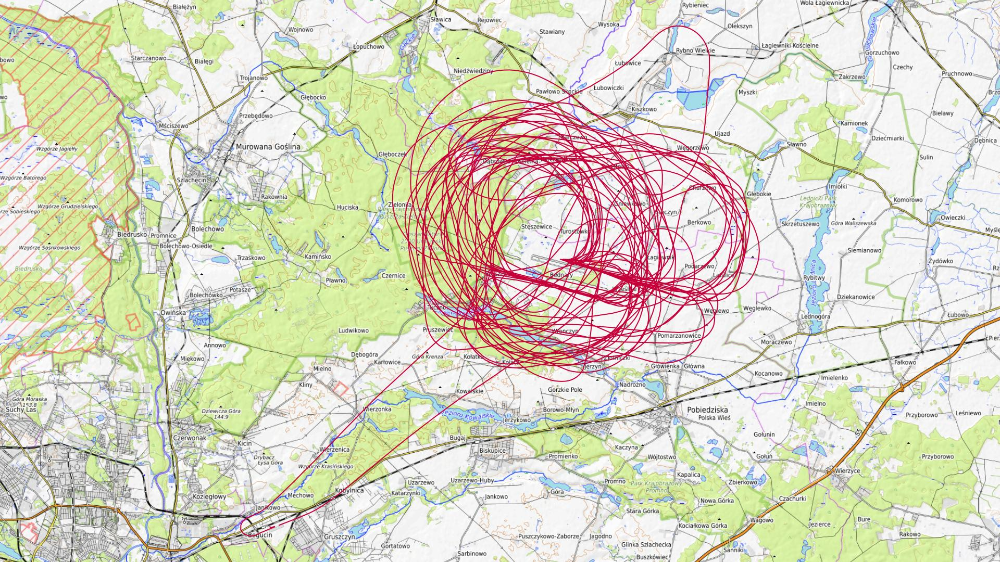

|Lot|Od|Do|Czas [min]|
|----:|--------:|--------:|--------:|
|1|07:05:46|07:10:05|4|
|2|08:10:45|08:34:32|23|
|3|09:15:23|09:38:23|23|
|4|10:18:17|10:42:53|24|
|5|11:18:51|11:44:18|25|
|6|12:17:23|12:44:55|27|
|7|13:22:55|13:49:30|26|
|8|14:21:36|14:47:25|25|
|9|15:21:55|15:47:10|25|
|10|15:55:37|16:23:53|28|
|11|16:55:09|17:18:08|22|
|12|17:52:46|18:18:58|26|
|13|18:51:33|19:18:11|26|
|14|19:55:01|20:24:26|29|

### 2024-07-07 NIEDZIELA

Loty w godzinach: 08:01:54 - 18:49:03, **10 h 47 min**  
Czas netto: **5 h 40 min**  
Ilość lotów: **15**  

|Lot|Od|Do|Czas [min]|
|----:|--------:|--------:|--------:|
|1|08:01:54|08:07:31|5|
|2|09:13:30|09:38:48|25|
|3|10:20:58|10:43:35|22|
|4|10:56:39|11:20:46|24|
|5|11:32:05|11:56:32|24|
|6|12:35:52|12:59:01|23|
|7|13:11:40|13:38:37|26|
|8|13:50:08|14:14:57|24|
|9|15:02:33|15:27:10|24|
|10|15:37:40|16:01:31|23|
|11|16:14:50|16:38:34|23|
|12|16:46:58|17:11:52|24|
|13|17:23:43|17:46:23|22|
|14|17:57:07|18:20:36|23|
|15|18:28:41|18:48:53|20|

### 2024-07-11 CZWARTEK

Loty w godzinach: 10:01:57 - 18:27:43, **8 h 25 min**  
Czas netto: **4 h 28 min**  
Ilość lotów: **12**  

|Lot|Od|Do|Czas [min]|
|----:|--------:|--------:|--------:|
|1|10:01:57|10:06:55|4|
|2|11:48:35|12:12:19|23|
|3|12:48:02|13:11:35|23|
|4|13:21:40|13:46:16|24|
|5|13:57:19|14:20:31|23|
|6|14:28:18|14:53:43|25|
|7|15:04:48|15:27:16|22|
|8|15:37:06|16:00:11|23|
|9|16:11:22|16:36:32|25|
|10|16:44:11|17:10:11|26|
|11|17:21:43|17:44:11|22|
|12|18:03:35|18:27:36|24|

### 2024-07-12 PIĄTEK

Loty w godzinach: 07:43:09 - 18:07:11, **10 h 24 min**  
Czas netto: **4 h 11 min**  
Ilość lotów: **12**  

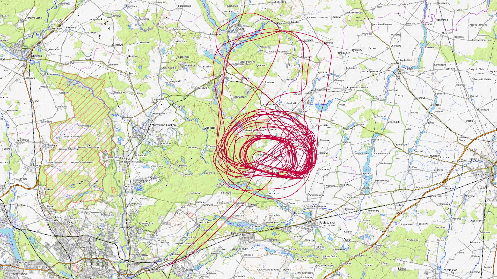

|Lot|Od|Do|Czas [min]|
|----:|--------:|--------:|--------:|
|1|07:43:09|07:47:37|4|
|2|09:13:18|09:37:26|24|
|3|09:47:34|10:11:36|24|
|4|10:21:07|10:46:50|25|
|5|10:57:32|11:21:46|24|
|6|11:28:36|11:48:52|20|
|7|11:58:01|12:23:04|25|
|8|12:31:39|12:55:48|24|
|9|13:06:23|13:31:46|25|
|10|13:39:19|14:03:35|24|
|11|14:41:43|15:05:10|23|
|12|18:00:42|18:07:03|6|

### 2024-07-13 SOBOTA

Loty w godzinach: 08:56:26 - 21:11:43, **12 h 15 min**  
Czas netto: **3 h 49 min**  
Ilość lotów: **11**  

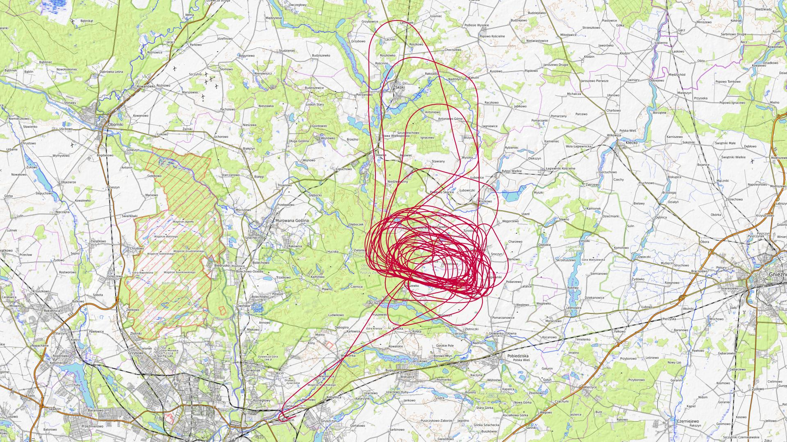

|Lot|Od|Do|Czas [min]|
|----:|--------:|--------:|--------:|
|1|08:56:26|09:00:41|4|
|2|12:02:17|12:25:05|22|
|3|12:58:14|13:16:32|18|
|4|13:49:42|14:13:05|23|
|5|14:50:03|15:14:28|24|
|6|15:47:38|16:10:49|23|
|7|16:47:20|17:08:19|20|
|8|17:43:26|18:07:23|23|
|9|18:42:12|19:03:32|21|
|10|19:52:16|20:17:03|24|
|11|20:49:59|21:11:40|21|

### 2024-07-14 NIEDZIELA

Loty w godzinach: 08:12:58 - 17:19:17, **9 h 6 min**  
Czas netto: **3 h 27 min**  
Ilość lotów: **10**  

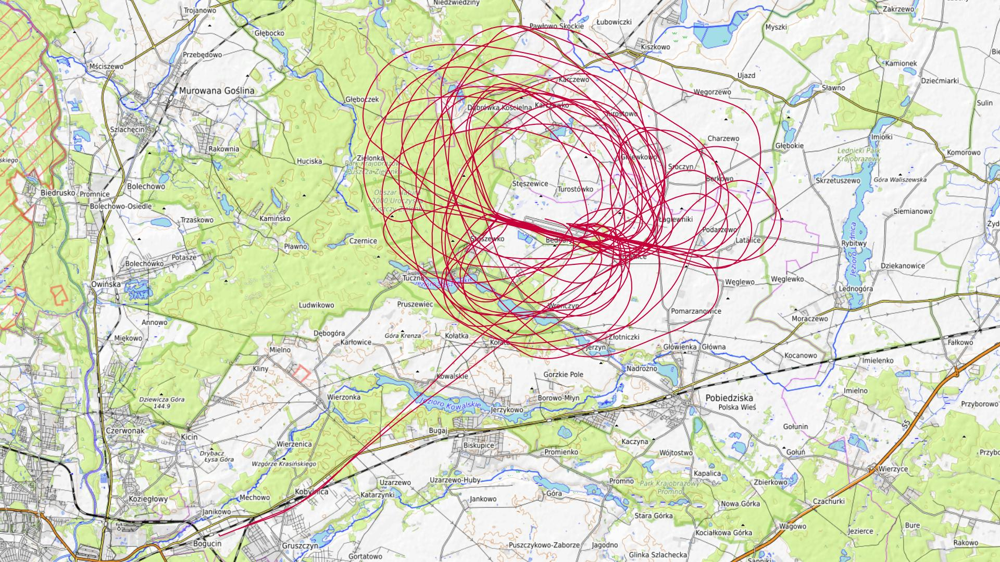

|Lot|Od|Do|Czas [min]|
|----:|--------:|--------:|--------:|
|1|08:12:58|08:17:31|4|
|2|09:06:15|09:31:52|25|
|3|10:05:16|10:29:37|24|
|4|10:40:08|11:04:05|23|
|5|11:11:27|11:37:08|25|
|6|11:48:23|12:13:16|24|
|7|12:19:30|12:45:29|25|
|8|12:53:54|13:18:08|24|
|9|13:26:36|13:49:25|22|
|10|17:14:12|17:19:09|4|

### 2024-07-16 WTOREK

Loty w godzinach: 13:59:16 - 21:03:07, **7 h 3 min**  
Czas netto: **3 h 16 min**  
Ilość lotów: **6**  

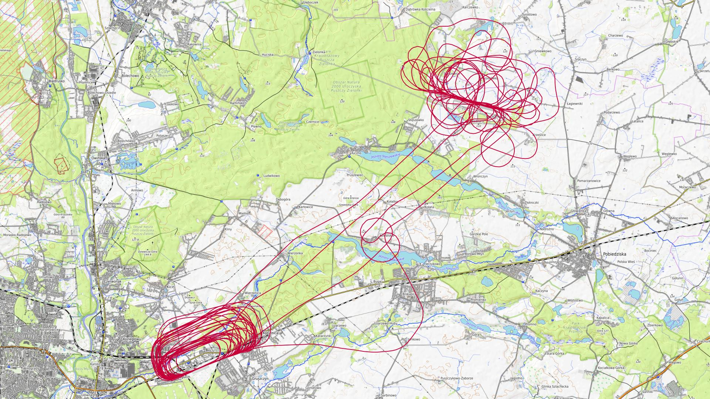

|Lot|Od|Do|Czas [min]|
|----:|--------:|--------:|--------:|
|1|13:59:16|14:28:18|29|
|2|14:30:32|14:42:37|12|
|3|17:02:38|17:57:54|55|
|4|18:44:52|19:32:37|47|
|5|20:07:24|20:46:24|39|
|6|20:49:41|21:02:57|13|

### 2024-07-18 CZWARTEK

Loty w godzinach: 09:51:22 - 21:26:17, **11 h 34 min**  
Czas netto: **6 h 41 min**  
Ilość lotów: **19**  

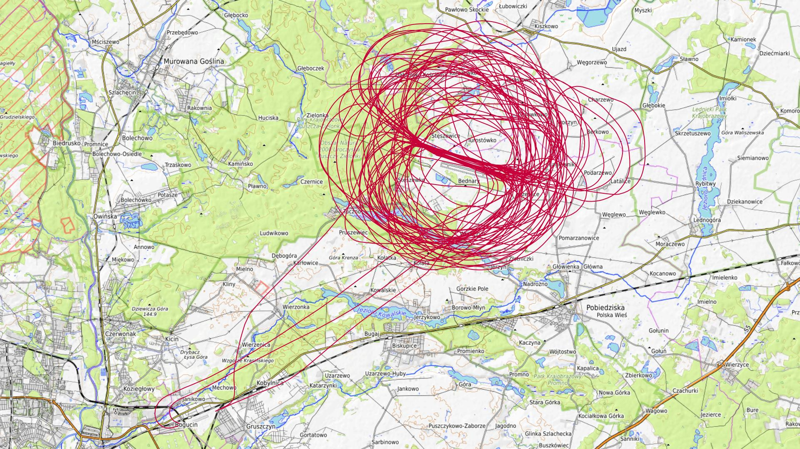

|Lot|Od|Do|Czas [min]|
|----:|--------:|--------:|--------:|
|1|09:51:22|09:56:13|4|
|2|11:18:41|11:40:44|22|
|3|11:49:39|12:12:16|22|
|4|12:23:49|12:47:43|23|
|5|12:59:32|13:21:15|21|
|6|13:32:05|13:55:37|23|
|7|14:07:26|14:31:37|24|
|8|14:43:19|15:08:07|24|
|9|15:19:06|15:42:53|23|
|10|15:53:16|16:15:24|22|
|11|16:27:24|16:53:33|26|
|12|17:04:37|17:30:41|26|
|13|17:41:54|18:06:57|25|
|14|18:16:27|18:40:12|23|
|15|18:51:25|19:20:34|29|
|16|19:29:57|19:53:06|23|
|17|20:03:27|20:29:58|26|
|18|20:57:23|21:02:07|4|
|19|21:22:26|21:26:09|3|

### 2024-07-19 PIĄTEK

Loty w godzinach: 08:06:48 - 20:38:25, **12 h 31 min**  
Czas netto: **7 h 0 min**  
Ilość lotów: **17**  

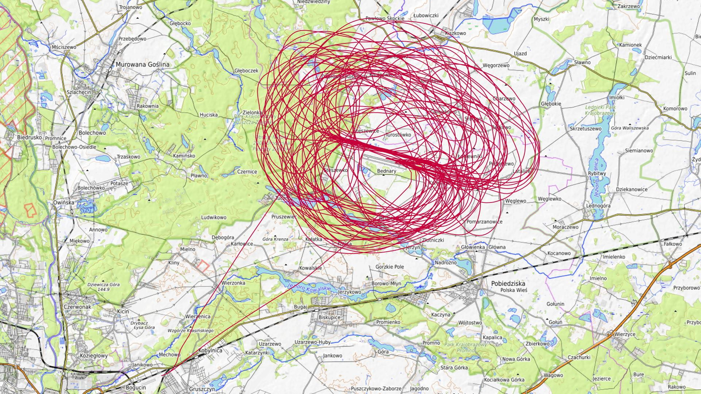

|Lot|Od|Do|Czas [min]|
|----:|--------:|--------:|--------:|
|1|08:06:48|08:10:53|4|
|2|09:24:50|09:51:28|26|
|3|09:59:14|10:23:07|23|
|4|10:32:33|10:56:35|24|
|5|11:09:08|11:34:44|25|
|6|11:43:54|12:08:40|24|
|7|12:25:07|12:51:45|26|
|8|13:00:48|13:24:13|23|
|9|13:32:29|13:59:16|26|
|10|14:07:53|14:34:14|26|
|11|14:42:47|15:07:11|24|
|12|15:17:00|15:48:06|31|
|13|15:56:59|16:21:31|24|
|14|16:30:25|16:56:27|26|
|15|17:39:48|18:06:19|26|
|16|18:47:18|19:12:22|25|
|17|20:07:28|20:38:24|30|

### 2024-07-21 NIEDZIELA

Loty w godzinach: 08:01:35 - 18:04:46, **10 h 3 min**  
Czas netto: **5 h 8 min**  
Ilość lotów: **13**  

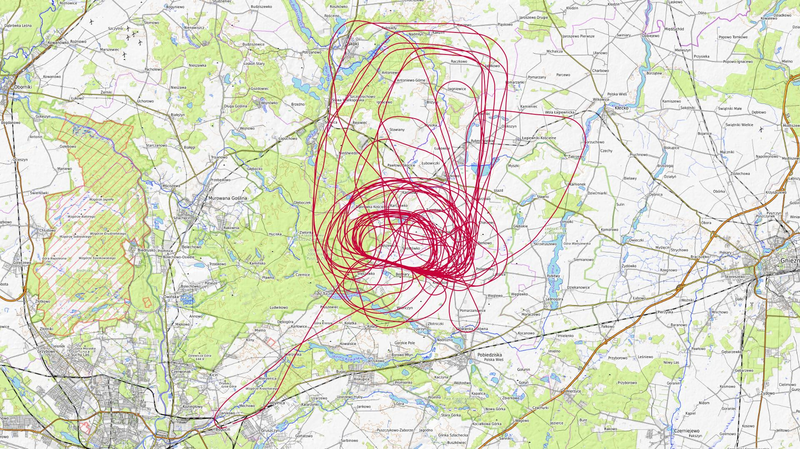

|Lot|Od|Do|Czas [min]|
|----:|--------:|--------:|--------:|
|1|08:01:35|08:06:24|4|
|2|09:17:19|09:46:33|29|
|3|10:21:06|10:46:16|25|
|4|10:55:06|11:19:28|24|
|5|11:28:24|11:54:08|25|
|6|12:02:41|12:26:24|23|
|7|12:34:18|12:58:38|24|
|8|13:08:12|13:29:59|21|
|9|13:37:37|14:02:56|25|
|10|14:46:10|15:13:07|26|
|11|15:41:54|16:07:58|26|
|12|16:41:08|17:06:46|25|
|13|17:39:09|18:04:36|25|

### 2024-07-25 CZWARTEK

Loty w godzinach: 10:03:20 - 20:31:14, **10 h 27 min**  
Czas netto: **4 h 49 min**  
Ilość lotów: **14**  

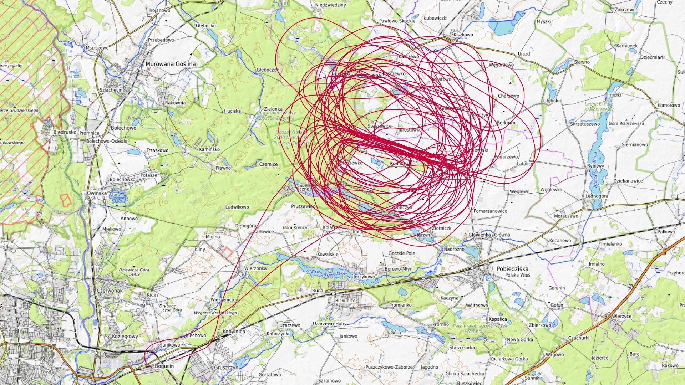

|Lot|Od|Do|Czas [min]|
|----:|--------:|--------:|--------:|
|1|10:03:20|10:08:12|4|
|2|11:17:12|11:37:51|20|
|3|12:15:37|12:39:06|23|
|4|13:19:10|13:43:50|24|
|5|13:55:24|14:09:14|13|
|6|14:22:33|14:44:35|22|
|7|14:56:03|15:21:48|25|
|8|16:11:51|16:35:33|23|
|9|16:46:09|17:00:06|13|
|10|17:11:50|17:35:38|23|
|11|17:47:19|18:02:20|15|
|12|18:13:57|18:39:42|25|
|13|19:28:20|19:52:55|24|
|14|20:03:39|20:31:06|27|

### 2024-07-26 PIĄTEK

Loty w godzinach: 08:08:21 - 19:41:16, **11 h 32 min**  
Czas netto: **6 h 8 min**  
Ilość lotów: **18**  

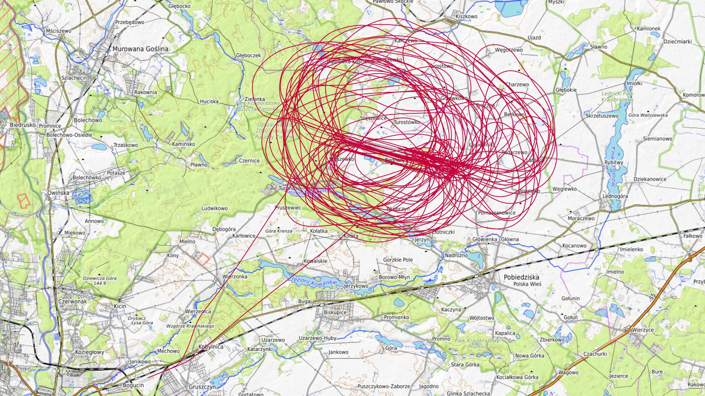

|Lot|Od|Do|Czas [min]|
|----:|--------:|--------:|--------:|
|1|08:08:21|08:12:31|4|
|2|09:10:15|09:36:17|26|
|3|09:43:26|09:56:45|13|
|4|10:08:20|10:29:12|20|
|5|10:37:56|10:51:22|13|
|6|11:02:03|11:25:10|23|
|7|11:34:33|11:57:03|22|
|8|12:54:02|13:19:06|25|
|9|13:30:07|13:55:35|25|
|10|14:04:59|14:19:01|14|
|11|14:30:48|14:55:39|24|
|12|15:05:23|15:19:46|14|
|13|15:30:21|15:52:49|22|
|14|16:01:50|16:25:08|23|
|15|16:34:05|16:59:34|25|
|16|17:37:19|18:02:27|25|
|17|18:46:06|19:08:11|22|
|18|19:17:59|19:41:05|23|

### 2024-07-27 SOBOTA

Loty w godzinach: 07:03:27 - 21:01:33, **13 h 58 min**  
Czas netto: **7 h 46 min**  
Ilość lotów: **20**  

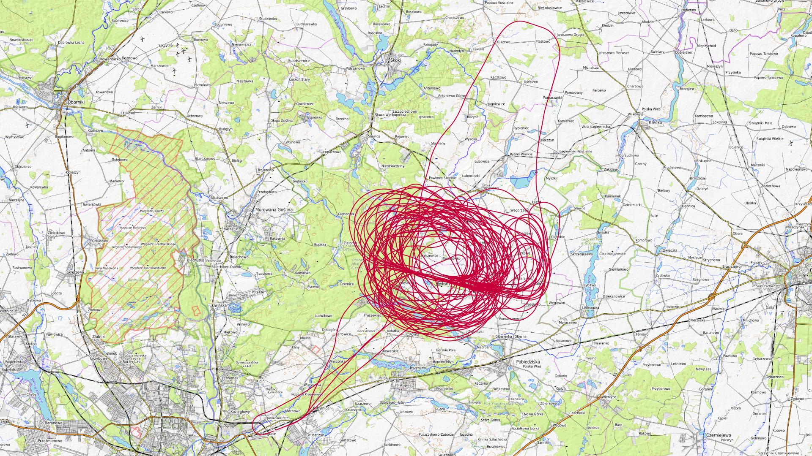

|Lot|Od|Do|Czas [min]|
|----:|--------:|--------:|--------:|
|1|07:03:27|07:08:04|4|
|2|08:07:52|08:36:55|29|
|3|09:10:39|09:36:22|25|
|4|09:46:12|10:12:31|26|
|5|10:19:16|10:44:41|25|
|6|10:58:16|11:21:16|23|
|7|11:27:51|11:53:40|25|
|8|12:05:55|12:29:47|23|
|9|12:39:32|13:04:06|24|
|10|13:23:21|13:28:07|4|
|11|15:17:19|15:44:13|26|
|12|15:54:00|16:19:17|25|
|13|16:28:34|16:54:03|25|
|14|17:04:54|17:30:45|25|
|15|17:40:44|18:07:15|26|
|16|18:19:28|18:46:44|27|
|17|18:55:27|19:20:22|24|
|18|19:29:59|19:56:13|26|
|19|20:04:02|20:27:35|23|
|20|20:39:36|21:01:13|21|

[początek](./)
