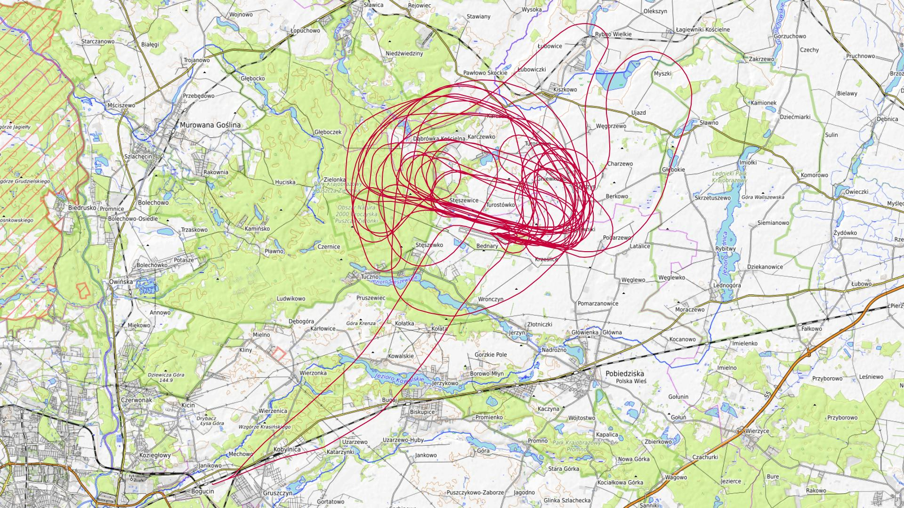
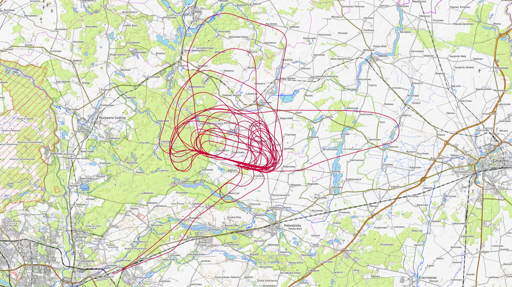
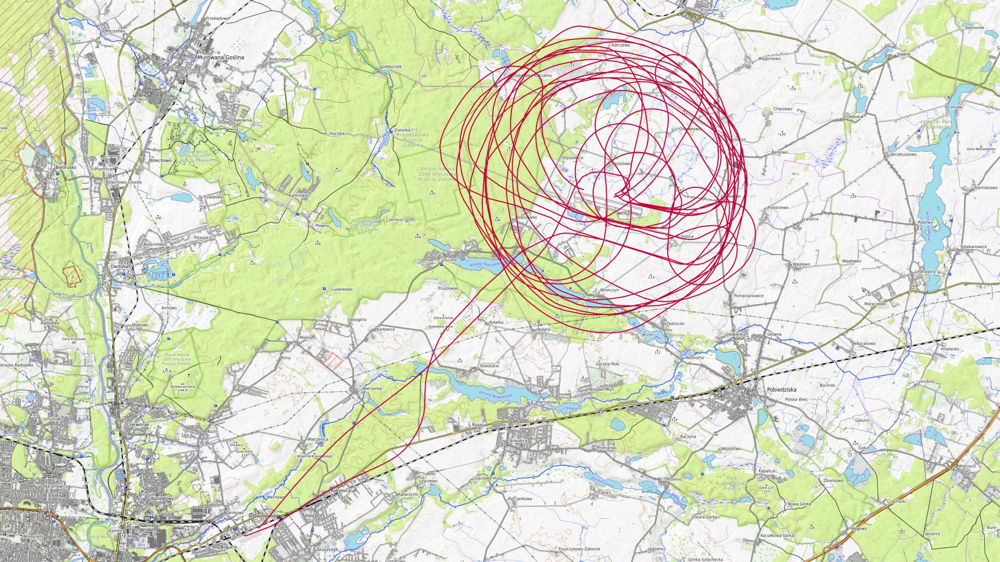
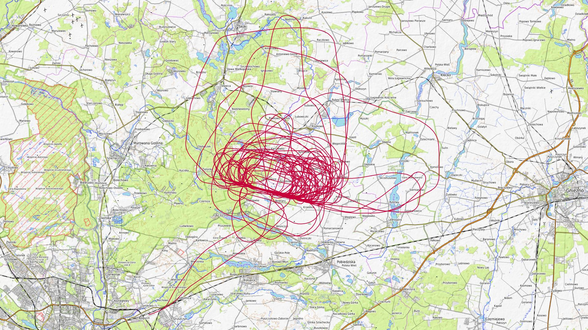
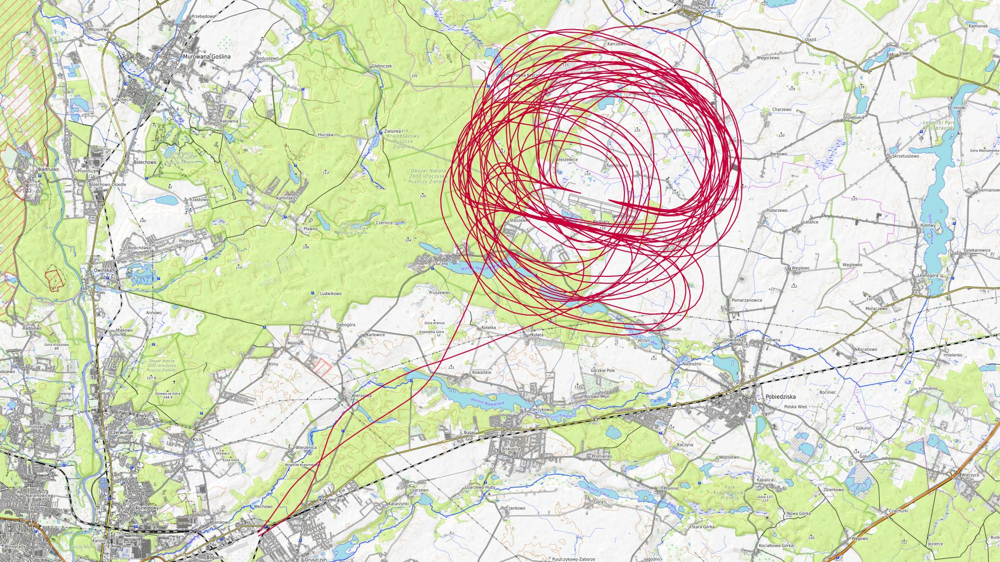
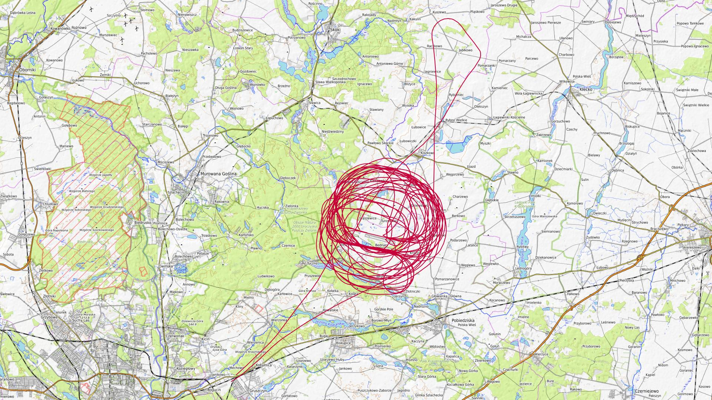

# Październik 2024

Liczba dni z lotami: 6 
Suma czasów netto wszystkich lotów: 21 h 23 min 
 

### 2024-10-05 SOBOTA

Loty w godzinach: 08:44:53 - 17:01:43, **8 h 16 min**  
Czas netto: **2 h 58 min**  
Liczba lotów: **10**  

|Lot|Od|Do|Czas [min]|
|----:|--------:|--------:|--------:|
|1|08:44:53|08:50:06|5|
|2|10:49:18|11:09:16|19|
|3|11:44:19|12:05:36|21|
|4|12:12:50|12:30:43|17|
|5|12:41:09|12:58:58|17|
|6|13:07:42|13:25:32|17|
|7|13:36:06|13:58:40|22|
|8|14:50:41|15:09:54|19|
|9|15:48:38|16:07:39|19|
|10|16:43:44|17:01:30|17|

### 2024-10-06 NIEDZIELA

Loty w godzinach: 09:52:28 - 16:35:39, **6 h 43 min**  
Czas netto: **2 h 45 min**  
Liczba lotów: **9**  

|Lot|Od|Do|Czas [min]|
|----:|--------:|--------:|--------:|
|1|09:52:28|09:56:41|4|
|2|11:09:20|11:30:50|21|
|3|12:04:48|12:22:10|17|
|4|12:30:21|12:48:59|18|
|5|13:00:06|13:18:34|18|
|6|13:50:16|14:10:32|20|
|7|14:21:15|14:39:36|18|
|8|15:13:02|15:33:23|20|
|9|16:09:25|16:35:26|26|

### 2024-10-08 WTOREK

Loty w godzinach: 08:02:27 - 17:54:42, **9 h 52 min**  
Czas netto: **2 h 18 min**  
Liczba lotów: **6**  

|Lot|Od|Do|Czas [min]|
|----:|--------:|--------:|--------:|
|1|08:02:27|08:06:43|4|
|2|11:22:13|11:48:42|26|
|3|12:58:18|13:25:07|26|
|4|14:29:34|14:55:18|25|
|5|15:53:58|16:20:45|26|
|6|17:26:00|17:54:35|28|

### 2024-10-12 SOBOTA

Loty w godzinach: 08:48:26 - 18:13:19, **9 h 24 min**  
Czas netto: **5 h 39 min**  
Liczba lotów: **18**  

|Lot|Od|Do|Czas [min]|
|----:|--------:|--------:|--------:|
|1|08:48:26|08:52:51|4|
|2|09:40:41|09:55:05|14|
|3|10:03:53|10:25:07|21|
|4|10:36:48|10:58:18|21|
|5|11:25:21|11:46:21|21|
|6|11:59:41|12:22:48|23|
|7|12:28:55|12:40:30|11|
|8|12:50:45|13:12:25|21|
|9|13:20:50|13:35:52|15|
|10|13:48:50|14:13:05|24|
|11|14:23:22|14:45:34|22|
|12|14:56:45|15:20:35|23|
|13|15:31:28|15:45:40|14|
|14|15:55:03|16:18:02|22|
|15|16:27:46|16:41:22|13|
|16|16:49:46|17:12:49|23|
|17|17:23:20|17:44:39|21|
|18|17:52:38|18:13:10|20|

### 2024-10-19 SOBOTA

Loty w godzinach: 09:24:36 - 17:33:33, **8 h 8 min**  
Czas netto: **4 h 1 min**  
Liczba lotów: **11**  

|Lot|Od|Do|Czas [min]|
|----:|--------:|--------:|--------:|
|1|09:24:36|09:28:28|3|
|2|11:07:30|11:31:19|23|
|3|11:57:55|12:20:15|22|
|4|12:44:05|13:09:03|24|
|5|13:15:42|13:37:51|22|
|6|13:49:47|14:15:47|26|
|7|14:22:34|14:44:02|21|
|8|14:54:36|15:17:51|23|
|9|15:25:38|15:49:33|23|
|10|16:00:39|16:24:45|24|
|11|17:07:47|17:33:32|25|

### 2024-10-20 NIEDZIELA

Loty w godzinach: 09:21:28 - 17:13:48, **7 h 52 min**  
Czas netto: **3 h 39 min**  
Liczba lotów: **10**  

|Lot|Od|Do|Czas [min]|
|----:|--------:|--------:|--------:|
|1|09:21:28|09:25:09|3|
|2|10:13:27|10:38:54|25|
|3|11:22:45|11:47:40|24|
|4|12:17:54|12:39:29|21|
|5|12:46:26|13:08:48|22|
|6|13:19:24|13:43:05|23|
|7|13:49:38|14:12:23|22|
|8|14:46:56|15:11:50|24|
|9|15:45:49|16:10:22|24|
|10|16:47:57|17:13:47|25|

[początek](./)
