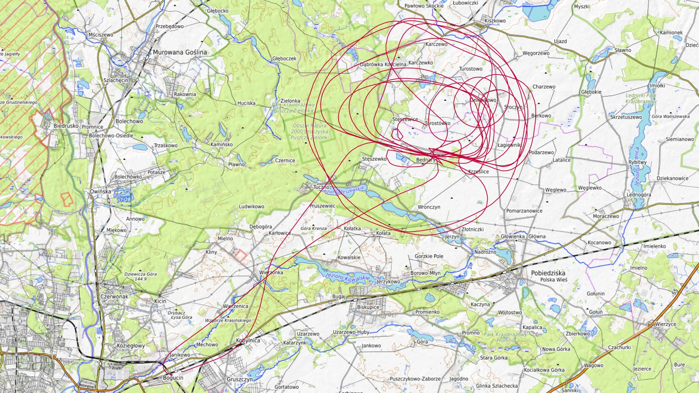
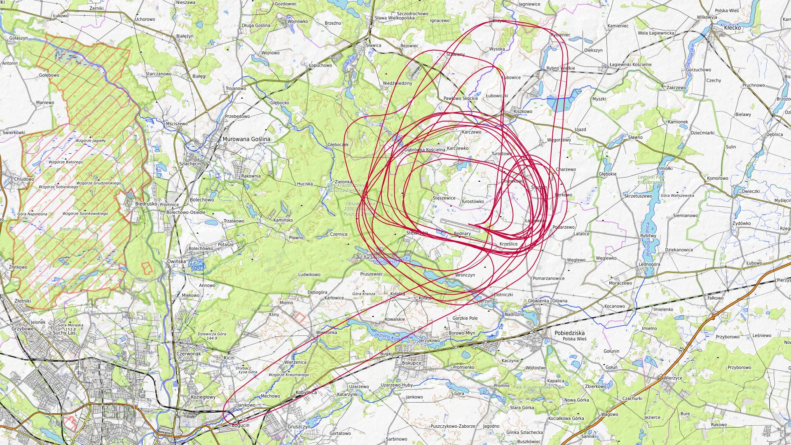

# Kwiecień 2025

Liczba dni z lotami: 2 
Suma czasów netto wszystkich lotów: 3 h 51 min 
 

### 2025-04-12 SOBOTA

Loty w godzinach: 09:07:42 - 18:22:37, **9 h 14 min**  
Czas netto: **1 h 30 min**  
Liczba lotów: **6**  

|Lot|Od|Do|Czas [min]|
|----:|--------:|--------:|--------:|
|1|09:07:42|09:13:27|5|
|2|13:30:54|13:50:10|19|
|3|14:46:31|15:06:20|19|
|4|16:14:37|16:37:11|22|
|5|17:14:04|17:18:32|4|
|6|18:04:13|18:22:24|18|

### 2025-04-13 NIEDZIELA

Loty w godzinach: 08:11:42 - 16:48:32, **8 h 36 min**  
Czas netto: **2 h 21 min**  
Liczba lotów: **7**  

|Lot|Od|Do|Czas [min]|
|----:|--------:|--------:|--------:|
|1|08:11:42|08:16:51|5|
|2|10:15:04|10:35:44|20|
|3|11:23:28|11:46:52|23|
|4|12:26:51|12:51:48|24|
|5|13:37:40|13:58:39|20|
|6|14:45:53|15:08:05|22|
|7|16:22:45|16:47:09|24|

[początek](./)
