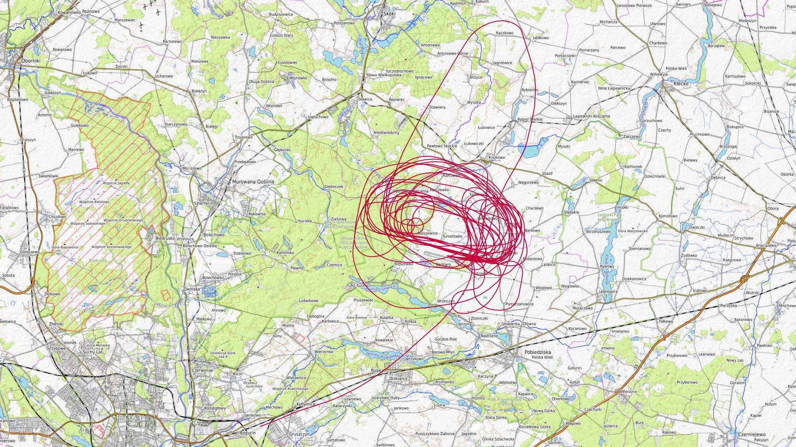
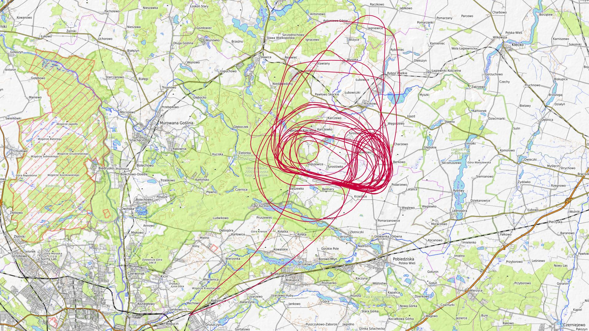

# Kwiecień 2025

Liczba dni z lotami: 4 
Suma czasów netto wszystkich lotów: 9 h 50 min 
 

### 2025-04-12 SOBOTA

Loty w godzinach: 09:07:42 - 18:22:37, **9 h 14 min**  
Czas netto: **1 h 30 min**  
Liczba lotów: **6**  

|Lot|Od|Do|Czas [min]|
|----:|--------:|--------:|--------:|
|1|09:07:42|09:13:27|5|
|2|13:30:54|13:50:10|19|
|3|14:46:31|15:06:20|19|
|4|16:14:37|16:37:11|22|
|5|17:14:04|17:18:32|4|
|6|18:04:13|18:22:24|18|

### 2025-04-13 NIEDZIELA

Loty w godzinach: 08:11:42 - 16:48:32, **8 h 36 min**  
Czas netto: **2 h 21 min**  
Liczba lotów: **7**  

|Lot|Od|Do|Czas [min]|
|----:|--------:|--------:|--------:|
|1|08:11:42|08:16:51|5|
|2|10:15:04|10:35:44|20|
|3|11:23:28|11:46:52|23|
|4|12:26:51|12:51:48|24|
|5|13:37:40|13:58:39|20|
|6|14:45:53|15:08:05|22|
|7|16:22:45|16:47:09|24|

### 2025-04-26 SOBOTA

Loty w godzinach: 10:20:56 - 18:52:13, **8 h 31 min**  
Czas netto: **2 h 53 min**  
Liczba lotów: **9**  

|Lot|Od|Do|Czas [min]|
|----:|--------:|--------:|--------:|
|1|10:20:56|10:37:20|16|
|2|11:19:55|11:35:47|15|
|3|12:17:37|12:34:31|16|
|4|13:14:01|13:35:59|21|
|5|14:20:37|14:40:20|19|
|6|15:19:44|15:41:19|21|
|7|16:23:50|16:41:08|17|
|8|17:16:16|17:37:54|21|
|9|18:29:54|18:52:10|22|

### 2025-04-27 NIEDZIELA

Loty w godzinach: 07:51:47 - 19:04:15, **11 h 12 min**  
Czas netto: **3 h 5 min**  
Liczba lotów: **10**  

|Lot|Od|Do|Czas [min]|
|----:|--------:|--------:|--------:|
|1|07:51:47|07:55:49|4|
|2|09:36:53|09:56:29|19|
|3|12:26:33|12:47:31|20|
|4|13:04:34|13:21:16|16|
|5|14:03:12|14:24:22|21|
|6|14:35:12|14:54:57|19|
|7|15:36:41|15:58:44|22|
|8|16:35:39|16:57:36|21|
|9|17:44:34|18:05:03|20|
|10|18:45:21|19:04:08|18|

[początek](./)
