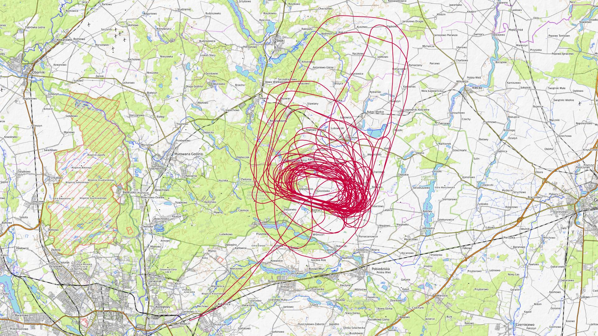
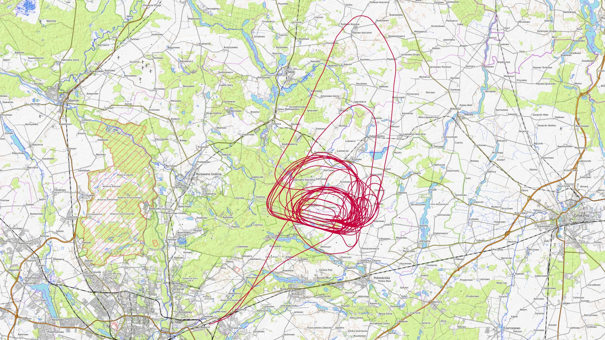
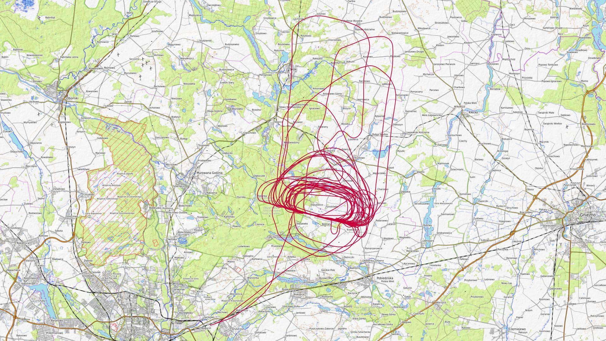
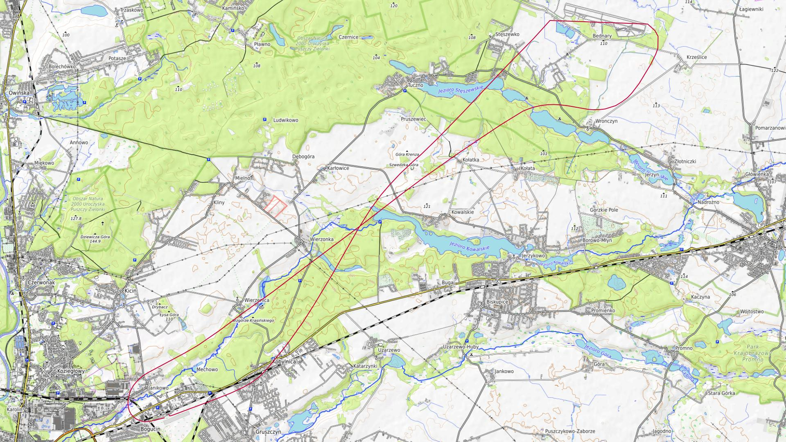
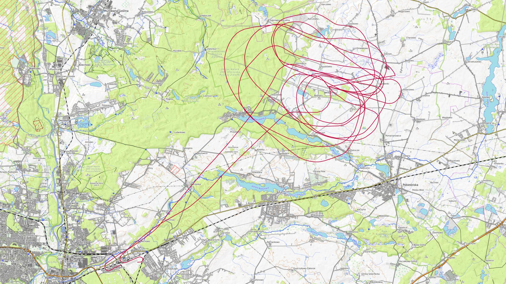
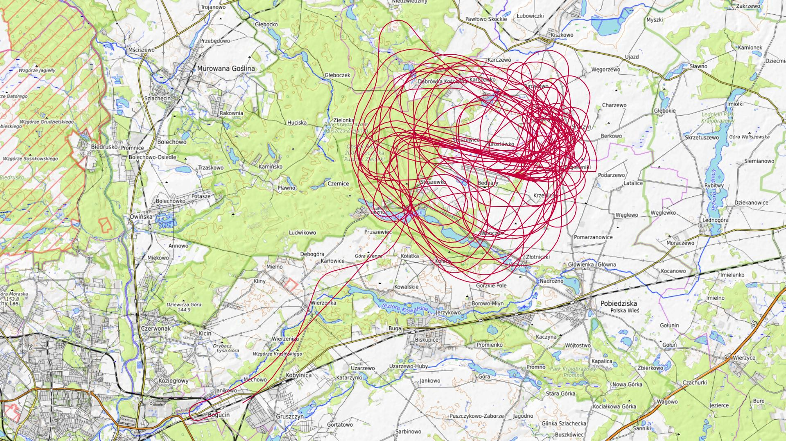
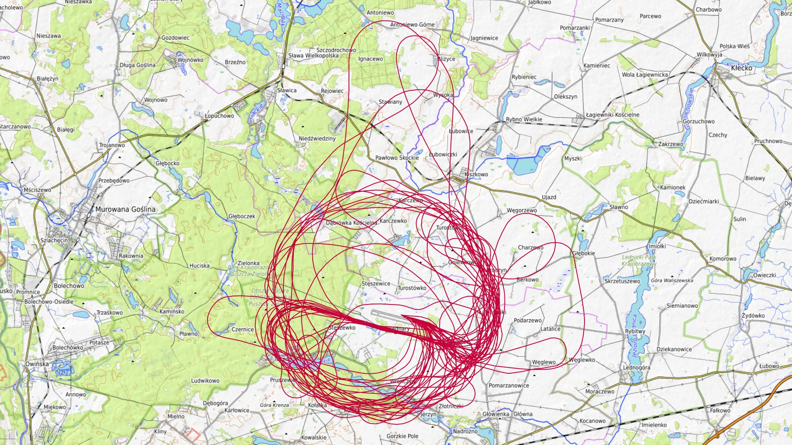
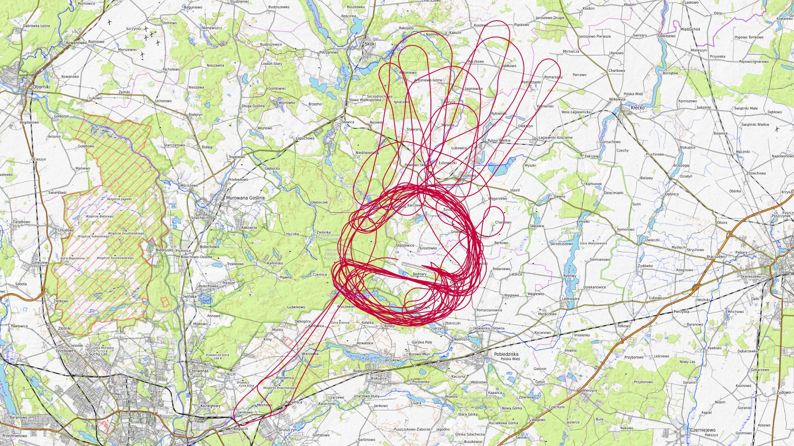
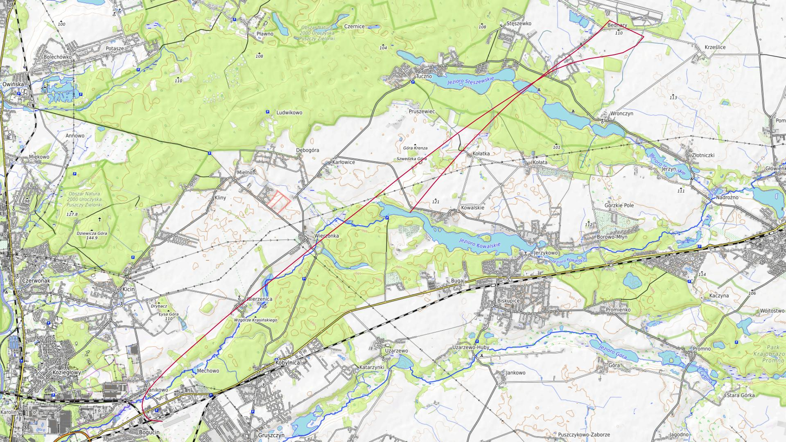
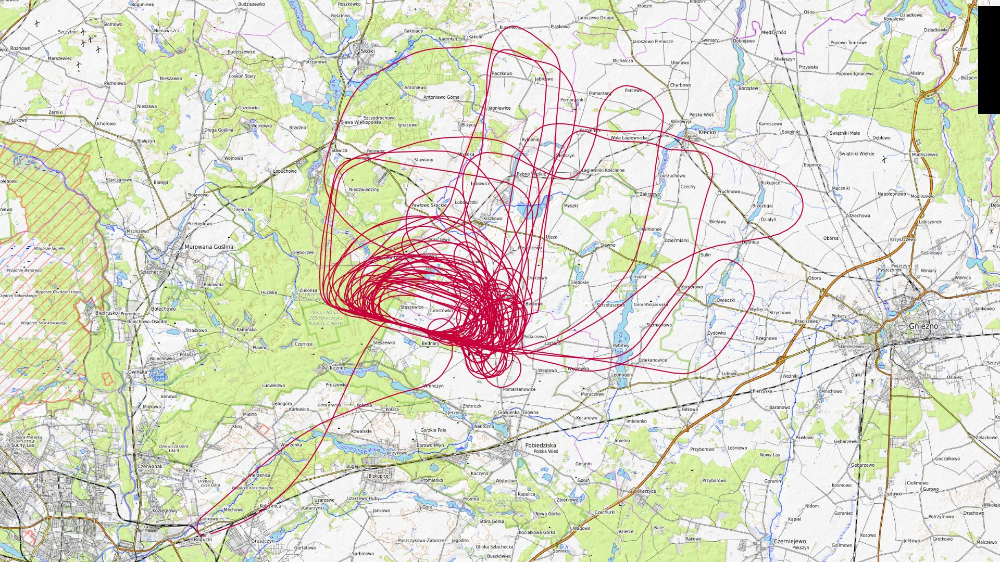

# Maj 2025

Liczba dni z lotami: 10 
Suma czasów netto wszystkich lotów: 34 h 53 min 
 

### 2025-05-01 CZWARTEK

Loty w godzinach: 07:43:08 - 20:27:38, **12 h 44 min**  
Czas netto: **5 h 19 min**  
Liczba lotów: **18**  

|Lot|Od|Do|Czas [min]|
|----:|--------:|--------:|--------:|
|1|07:43:08|07:47:06|3|
|2|09:40:48|09:58:09|17|
|3|10:32:48|10:54:40|21|
|4|11:31:15|11:53:28|22|
|5|12:34:59|12:56:49|21|
|6|13:33:47|13:56:38|22|
|7|14:27:24|14:46:07|18|
|8|14:55:55|15:14:57|19|
|9|15:29:42|15:52:14|22|
|10|16:02:02|16:02:02|0|
|11|16:04:03|16:22:55|18|
|12|16:38:37|16:57:53|19|
|13|17:13:41|17:36:36|22|
|14|17:49:39|18:05:40|16|
|15|18:22:56|18:40:20|17|
|16|18:53:47|19:12:05|18|
|17|19:23:14|19:39:54|16|
|18|20:07:56|20:27:15|19|

### 2025-05-02 PIĄTEK

Loty w godzinach: 07:48:24 - 20:06:59, **12 h 18 min**  
Czas netto: **3 h 23 min**  
Liczba lotów: **12**  

|Lot|Od|Do|Czas [min]|
|----:|--------:|--------:|--------:|
|1|07:48:24|07:52:13|3|
|2|09:16:45|09:36:24|19|
|3|09:44:58|10:02:14|17|
|4|10:42:45|10:59:39|16|
|5|11:45:09|12:09:01|23|
|6|12:38:31|12:57:16|18|
|7|13:06:53|13:27:11|20|
|8|13:41:58|14:01:08|19|
|9|14:12:06|14:30:18|18|
|10|14:45:05|15:06:14|21|
|11|19:06:47|19:17:40|10|
|12|19:53:12|20:06:47|13|

### 2025-05-03 SOBOTA

Loty w godzinach: 07:51:51 - 18:30:40, **10 h 38 min**  
Czas netto: **4 h 4 min**  
Liczba lotów: **12**  

|Lot|Od|Do|Czas [min]|
|----:|--------:|--------:|--------:|
|1|07:51:51|07:55:43|3|
|2|09:11:59|09:33:44|21|
|3|10:11:35|10:30:19|18|
|4|11:00:37|11:19:59|19|
|5|11:53:47|12:18:45|24|
|6|12:54:48|13:16:26|21|
|7|13:56:42|14:21:14|24|
|8|14:39:52|15:03:42|23|
|9|15:15:19|15:40:50|25|
|10|16:16:10|16:35:29|19|
|11|17:08:23|17:30:56|22|
|12|18:11:51|18:30:28|18|

### 2025-05-04 NIEDZIELA

Loty w godzinach: 07:56:29 - 10:15:47, **2 h 19 min**  
Czas netto: **0 h 9 min**  
Liczba lotów: **2**  

|Lot|Od|Do|Czas [min]|
|----:|--------:|--------:|--------:|
|1|07:56:29|08:01:14|4|
|2|10:10:56|10:15:35|4|

### 2025-05-10 SOBOTA

Loty w godzinach: 10:47:16 - 16:07:37, **5 h 20 min**  
Czas netto: **1 h 7 min**  
Liczba lotów: **4**  

|Lot|Od|Do|Czas [min]|
|----:|--------:|--------:|--------:|
|1|10:47:16|10:53:10|5|
|2|13:10:22|13:30:45|20|
|3|14:40:33|15:01:17|20|
|4|15:47:16|16:07:36|20|

### 2025-05-11 NIEDZIELA

Loty w godzinach: 08:07:33 - 18:33:10, **10 h 25 min**  
Czas netto: **4 h 6 min**  
Liczba lotów: **13**  

|Lot|Od|Do|Czas [min]|
|----:|--------:|--------:|--------:|
|1|08:07:33|08:12:04|4|
|2|09:32:39|09:38:15|5|
|3|09:49:50|10:14:00|24|
|4|10:54:50|11:18:34|23|
|5|12:02:12|12:27:09|24|
|6|13:03:49|13:26:11|22|
|7|13:45:09|14:09:04|23|
|8|14:27:58|14:50:55|22|
|9|15:07:48|15:31:39|23|
|10|15:41:25|16:03:29|22|
|11|16:46:35|17:08:31|21|
|12|17:18:19|17:39:14|20|
|13|18:27:55|18:33:08|5|

### 2025-05-24 SOBOTA

Loty w godzinach: 09:29:10 - 18:54:51, **9 h 25 min**  
Czas netto: **4 h 58 min**  
Liczba lotów: **14**  

|Lot|Od|Do|Czas [min]|
|----:|--------:|--------:|--------:|
|1|09:29:10|09:50:27|21|
|2|10:24:45|10:47:40|22|
|3|11:28:06|11:51:10|23|
|4|12:23:44|12:46:05|22|
|5|12:56:15|13:19:33|23|
|6|13:36:20|13:54:41|18|
|7|14:08:52|14:31:42|22|
|8|14:49:46|15:11:39|21|
|9|15:20:45|15:39:25|18|
|10|15:56:59|16:17:09|20|
|11|16:26:38|16:50:09|23|
|12|17:05:32|17:29:12|23|
|13|17:38:50|17:55:32|16|
|14|18:34:53|18:54:49|19|

### 2025-05-25 NIEDZIELA

Loty w godzinach: 09:08:46 - 19:24:42, **10 h 15 min**  
Czas netto: **4 h 43 min**  
Liczba lotów: **13**  

|Lot|Od|Do|Czas [min]|
|----:|--------:|--------:|--------:|
|1|09:08:46|09:29:05|20|
|2|10:07:28|10:30:30|23|
|3|11:14:34|11:37:03|22|
|4|12:10:14|12:35:50|25|
|5|12:44:56|13:05:33|20|
|6|13:24:17|13:52:17|28|
|7|14:00:41|14:23:57|23|
|8|14:37:22|15:00:31|23|
|9|15:16:51|15:21:18|4|
|10|15:55:27|16:20:43|25|
|11|16:53:44|17:17:24|23|
|12|17:56:54|18:21:16|24|
|13|19:04:16|19:23:22|19|

### 2025-05-30 PIĄTEK

Loty w godzinach: 20:49:48 - 21:29:46, **0 h 39 min**  
Czas netto: **0 h 5 min**  
Liczba lotów: **2**  

|Lot|Od|Do|Czas [min]|
|----:|--------:|--------:|--------:|
|1|20:49:48|20:53:39|3|
|2|21:27:57|21:29:39|1|

### 2025-05-31 SOBOTA

Loty w godzinach: 07:57:00 - 20:51:51, **12 h 54 min**  
Czas netto: **6 h 55 min**  
Liczba lotów: **21**  

|Lot|Od|Do|Czas [min]|
|----:|--------:|--------:|--------:|
|1|07:57:00|08:01:29|4|
|2|09:13:47|09:35:29|21|
|3|10:10:20|10:33:14|22|
|4|11:10:49|11:34:01|23|
|5|11:52:23|12:14:02|21|
|6|12:23:51|12:45:48|21|
|7|13:04:45|13:26:08|21|
|8|13:38:18|14:00:26|22|
|9|14:14:32|14:35:18|20|
|10|14:44:53|15:08:59|24|
|11|15:25:27|15:48:28|23|
|12|15:58:24|16:22:36|24|
|13|16:38:10|16:57:39|19|
|14|17:06:29|17:27:37|21|
|15|17:42:46|18:03:01|20|
|16|18:13:08|18:13:08|0|
|17|18:15:09|18:33:04|17|
|18|18:49:11|19:11:09|21|
|19|19:21:58|19:43:37|21|
|20|19:58:42|20:19:35|20|
|21|20:29:19|20:50:30|21|

[początek](./)
