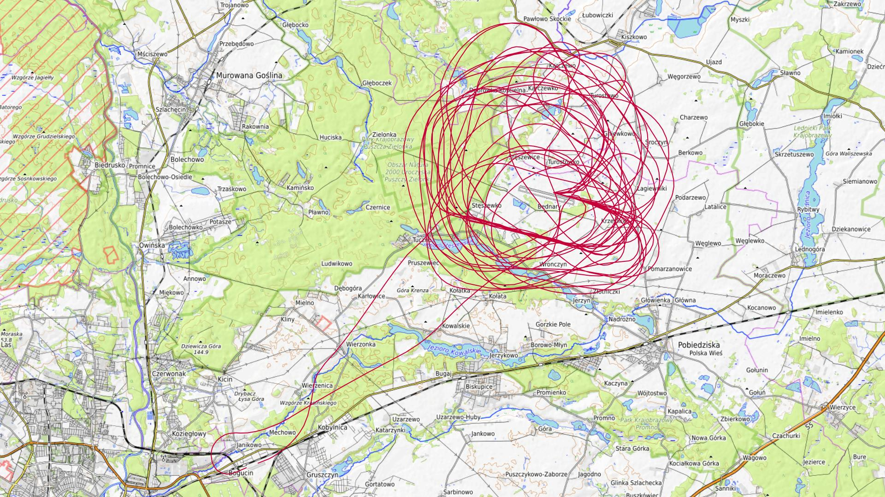
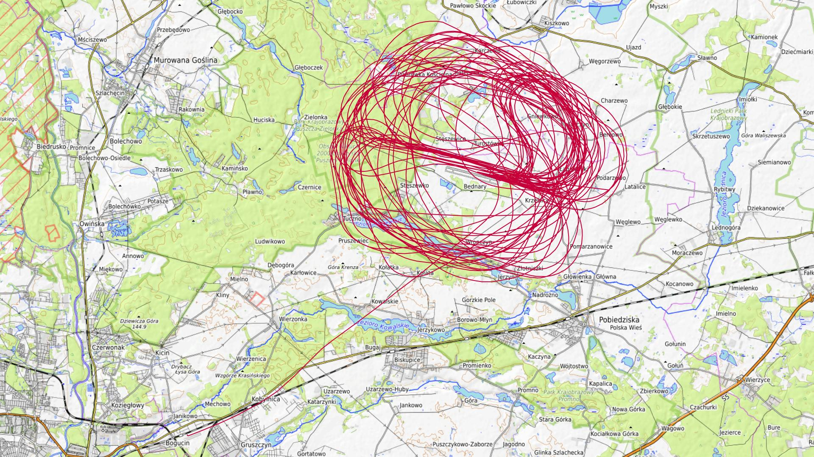
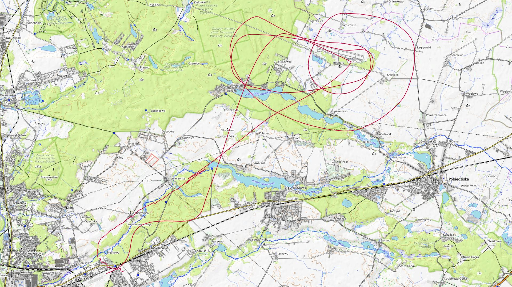
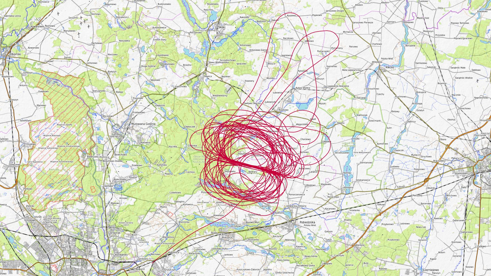

# Czerwiec 2025

Liczba dni z lotami: 14 
Suma czasów netto wszystkich lotów: 54 h 38 min 
 

### 2025-06-01 NIEDZIELA

Loty w godzinach: 10:16:53 - 17:01:12, **6 h 44 min**  
Czas netto: **3 h 55 min**  
Liczba lotów: **11**  

|Lot|Od|Do|Czas [min]|
|----:|--------:|--------:|--------:|
|1|10:16:53|10:40:28|23|
|2|11:17:05|11:42:17|25|
|3|12:00:15|12:23:24|23|
|4|12:34:07|12:59:38|25|
|5|13:16:47|13:41:33|24|
|6|13:51:38|13:51:38|0|
|7|13:53:39|14:17:01|23|
|8|14:34:32|14:58:10|23|
|9|15:06:39|15:29:08|22|
|10|16:06:20|16:30:15|23|
|11|16:41:11|17:00:57|19|

### 2025-06-05 CZWARTEK

Loty w godzinach: 14:33:56 - 20:58:25, **6 h 24 min**  
Czas netto: **1 h 59 min**  
Liczba lotów: **5**  

|Lot|Od|Do|Czas [min]|
|----:|--------:|--------:|--------:|
|1|14:33:56|14:56:51|22|
|2|15:45:59|16:10:16|24|
|3|16:50:11|17:14:25|24|
|4|19:25:29|19:47:32|22|
|5|20:32:12|20:58:13|26|

### 2025-06-06 PIĄTEK

Loty w godzinach: 07:48:31 - 15:45:11, **7 h 56 min**  
Czas netto: **0 h 52 min**  
Liczba lotów: **4**  

|Lot|Od|Do|Czas [min]|
|----:|--------:|--------:|--------:|
|1|07:48:31|07:53:04|4|
|2|10:00:28|10:19:53|19|
|3|11:30:42|11:54:08|23|
|4|15:40:22|15:45:05|4|

### 2025-06-07 SOBOTA

Loty w godzinach: 08:50:41 - 18:46:23, **9 h 55 min**  
Czas netto: **4 h 56 min**  
Liczba lotów: **14**  

|Lot|Od|Do|Czas [min]|
|----:|--------:|--------:|--------:|
|1|08:50:41|08:54:43|4|
|2|09:05:47|09:31:02|25|
|3|10:06:37|10:30:33|23|
|4|11:07:30|11:31:49|24|
|5|11:46:51|12:13:43|26|
|6|12:21:51|12:41:23|19|
|7|12:58:36|13:21:48|23|
|8|13:30:01|13:50:58|20|
|9|14:44:44|15:06:41|21|
|10|15:14:51|15:36:36|21|
|11|15:52:46|16:11:11|18|
|12|16:20:01|16:38:51|18|
|13|17:22:50|17:46:08|23|
|14|18:22:19|18:46:13|23|

### 2025-06-08 NIEDZIELA

Loty w godzinach: 07:21:37 - 16:05:02, **8 h 43 min**  
Czas netto: **3 h 19 min**  
Liczba lotów: **10**  

|Lot|Od|Do|Czas [min]|
|----:|--------:|--------:|--------:|
|1|07:21:37|07:26:24|4|
|2|08:44:24|09:07:43|23|
|3|09:17:13|09:40:37|23|
|4|10:01:10|10:24:25|23|
|5|10:28:56|10:52:08|23|
|6|11:09:38|11:32:57|23|
|7|11:38:16|11:59:57|21|
|8|12:18:05|12:40:56|22|
|9|12:47:03|12:59:37|12|
|10|15:43:29|16:04:57|21|

### 2025-06-12 CZWARTEK

Loty w godzinach: 10:00:41 - 21:02:13, **11 h 1 min**  
Czas netto: **4 h 51 min**  
Liczba lotów: **12**  

|Lot|Od|Do|Czas [min]|
|----:|--------:|--------:|--------:|
|1|10:00:41|10:05:51|5|
|2|11:25:20|11:48:17|22|
|3|12:30:35|12:54:54|24|
|4|13:19:32|13:48:11|28|
|5|14:25:21|14:50:34|25|
|6|15:40:01|16:05:55|25|
|7|16:48:56|17:14:32|25|
|8|17:30:51|17:57:09|26|
|9|18:05:55|18:30:07|24|
|10|18:47:45|19:15:04|27|
|11|19:54:22|20:21:25|27|
|12|20:32:57|21:01:55|28|

### 2025-06-13 PIĄTEK

Loty w godzinach: 08:14:16 - 14:31:57, **6 h 17 min**  
Czas netto: **2 h 56 min**  
Liczba lotów: **9**  

|Lot|Od|Do|Czas [min]|
|----:|--------:|--------:|--------:|
|1|08:14:16|08:19:41|5|
|2|09:14:56|09:29:34|14|
|3|10:10:47|10:32:37|21|
|4|11:08:17|11:32:44|24|
|5|12:10:50|12:36:53|26|
|6|12:42:10|13:11:50|29|
|7|13:28:53|13:54:16|25|
|8|14:00:51|14:00:51|0|
|9|14:02:52|14:31:46|28|

### 2025-06-14 SOBOTA

Loty w godzinach: 12:54:49 - 21:24:26, **8 h 29 min**  
Czas netto: **5 h 41 min**  
Liczba lotów: **13**  

|Lot|Od|Do|Czas [min]|
|----:|--------:|--------:|--------:|
|1|12:54:49|13:20:49|26|
|2|13:26:59|13:54:26|27|
|3|14:13:12|14:37:44|24|
|4|14:42:40|15:07:55|25|
|5|15:24:39|15:51:46|27|
|6|15:57:27|16:23:28|26|
|7|16:40:41|17:07:13|26|
|8|17:16:59|17:44:05|27|
|9|18:03:41|18:27:40|23|
|10|18:34:48|19:00:57|26|
|11|19:16:24|19:42:29|26|
|12|19:51:57|20:17:47|25|
|13|20:54:20|21:24:15|29|

### 2025-06-15 NIEDZIELA

Loty w godzinach: 07:29:14 - 20:02:26, **12 h 33 min**  
Czas netto: **6 h 27 min**  
Liczba lotów: **19**  

|Lot|Od|Do|Czas [min]|
|----:|--------:|--------:|--------:|
|1|07:29:14|07:33:13|3|
|2|09:11:15|09:34:30|23|
|3|10:12:06|10:34:16|22|
|4|10:53:34|11:21:21|27|
|5|11:27:24|11:27:24|0|
|6|11:29:25|11:54:54|25|
|7|12:14:11|12:38:31|24|
|8|12:45:04|13:11:02|25|
|9|13:27:13|13:54:12|26|
|10|13:59:56|14:26:28|26|
|11|14:43:56|15:09:32|25|
|12|15:15:36|15:43:02|27|
|13|16:02:28|16:25:04|22|
|14|16:32:17|16:57:51|25|
|15|17:00:25|17:00:25|0|
|16|17:11:37|17:18:34|6|
|17|17:31:40|17:58:09|26|
|18|18:35:08|18:58:07|22|
|19|19:38:06|20:01:15|23|

### 2025-06-19 CZWARTEK

Loty w godzinach: 08:22:18 - 11:46:32, **3 h 24 min**  
Czas netto: **0 h 26 min**  
Liczba lotów: **2**  

|Lot|Od|Do|Czas [min]|
|----:|--------:|--------:|--------:|
|1|08:22:18|08:26:58|4|
|2|11:24:35|11:46:26|21|

### 2025-06-20 PIĄTEK

Loty w godzinach: 08:22:34 - 20:44:06, **12 h 21 min**  
Czas netto: **6 h 47 min**  
Liczba lotów: **19**  

|Lot|Od|Do|Czas [min]|
|----:|--------:|--------:|--------:|
|1|08:22:34|08:27:06|4|
|2|09:12:22|09:32:34|20|
|3|10:10:05|10:29:32|19|
|4|11:05:21|11:27:26|22|
|5|11:33:02|11:54:24|21|
|6|12:13:31|12:33:23|19|
|7|12:38:17|13:01:54|23|
|8|13:19:49|13:41:52|22|
|9|13:48:24|14:12:19|23|
|10|14:29:29|14:52:57|23|
|11|15:03:17|15:25:32|22|
|12|15:42:27|16:05:08|22|
|13|16:13:20|16:36:42|23|
|14|16:53:28|17:17:11|23|
|15|17:22:24|17:44:30|22|
|16|18:03:24|18:25:24|22|
|17|18:31:30|18:55:02|23|
|18|19:13:58|19:36:07|22|
|19|20:18:48|20:43:40|24|

### 2025-06-21 SOBOTA

Loty w godzinach: 07:27:44 - 17:43:41, **10 h 15 min**  
Czas netto: **4 h 45 min**  
Liczba lotów: **13**  

|Lot|Od|Do|Czas [min]|
|----:|--------:|--------:|--------:|
|1|07:27:44|07:31:46|4|
|2|09:36:36|09:57:14|20|
|3|10:40:33|11:03:21|22|
|4|11:23:53|11:47:07|23|
|5|11:52:24|12:15:55|23|
|6|12:32:28|12:56:03|23|
|7|13:01:42|13:25:28|23|
|8|13:43:41|14:07:50|24|
|9|14:13:40|14:38:32|24|
|10|14:54:51|15:18:30|23|
|11|16:03:18|16:27:54|24|
|12|16:35:05|16:57:14|22|
|13|17:18:54|17:43:39|24|

### 2025-06-22 NIEDZIELA

Loty w godzinach: 11:25:45 - 19:30:38, **8 h 4 min**  
Czas netto: **4 h 52 min**  
Liczba lotów: **13**  

|Lot|Od|Do|Czas [min]|
|----:|--------:|--------:|--------:|
|1|11:25:45|11:50:40|24|
|2|12:11:21|12:36:05|24|
|3|12:43:20|13:07:37|24|
|4|13:26:53|13:52:26|25|
|5|13:58:43|14:22:48|24|
|6|14:41:12|15:04:28|23|
|7|15:11:06|15:35:05|23|
|8|15:46:38|15:53:10|6|
|9|15:59:52|16:25:32|25|
|10|16:32:05|16:55:21|23|
|11|17:03:36|17:23:54|20|
|12|18:07:27|18:27:56|20|
|13|19:04:52|19:30:29|25|

### 2025-06-26 CZWARTEK

Loty w godzinach: 09:57:53 - 20:10:36, **10 h 12 min**  
Czas netto: **2 h 45 min**  
Liczba lotów: **10**  

|Lot|Od|Do|Czas [min]|
|----:|--------:|--------:|--------:|
|1|09:57:53|10:02:05|4|
|2|11:38:29|11:59:49|21|
|3|12:07:37|12:20:54|13|
|4|13:55:46|14:15:54|20|
|5|14:28:40|14:43:15|14|
|6|15:01:28|15:23:34|22|
|7|15:30:34|15:44:53|14|
|8|16:42:21|17:06:45|24|
|9|18:56:46|19:11:08|14|
|10|19:53:20|20:10:27|17|

[początek](./)
