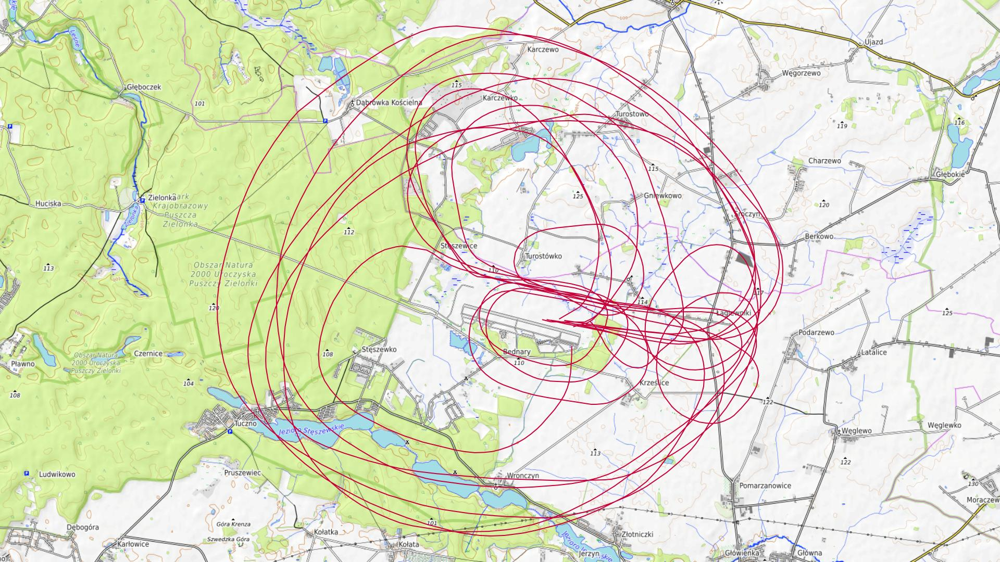
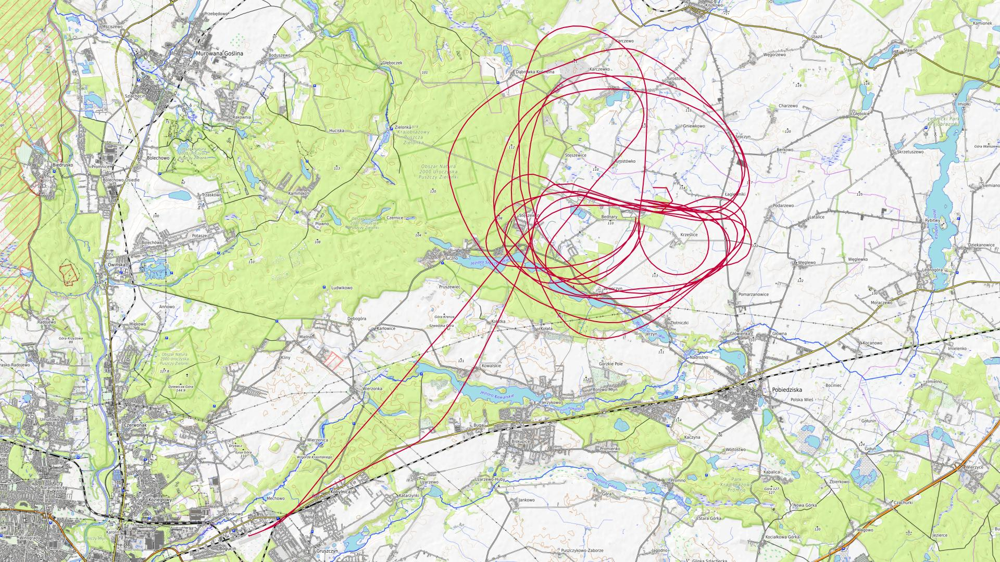
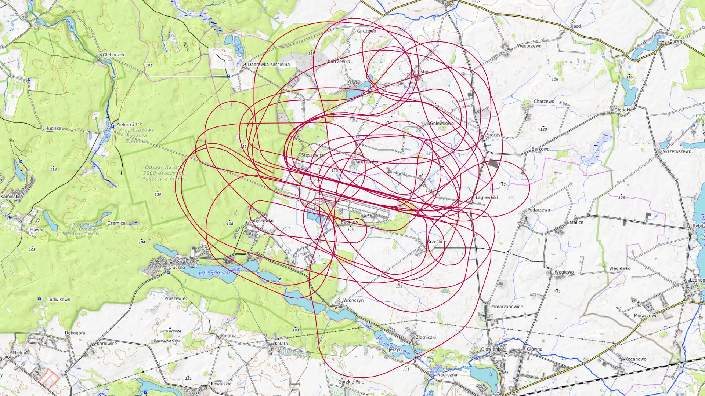
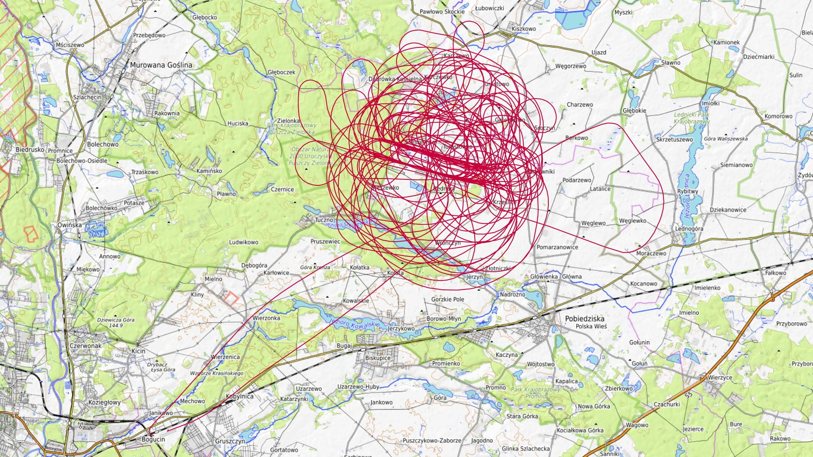
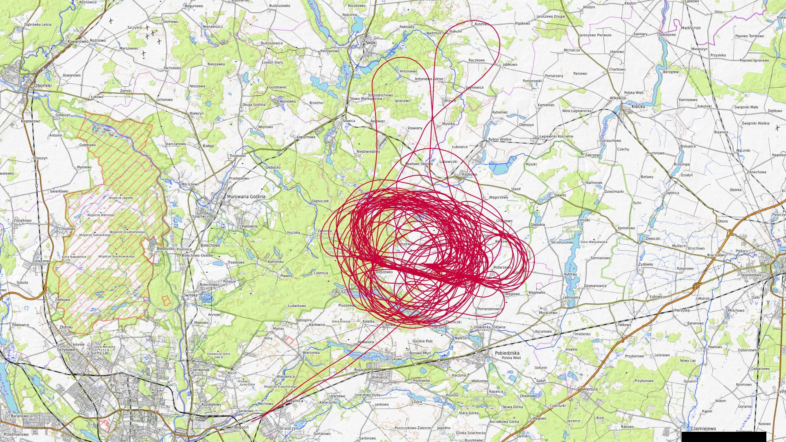
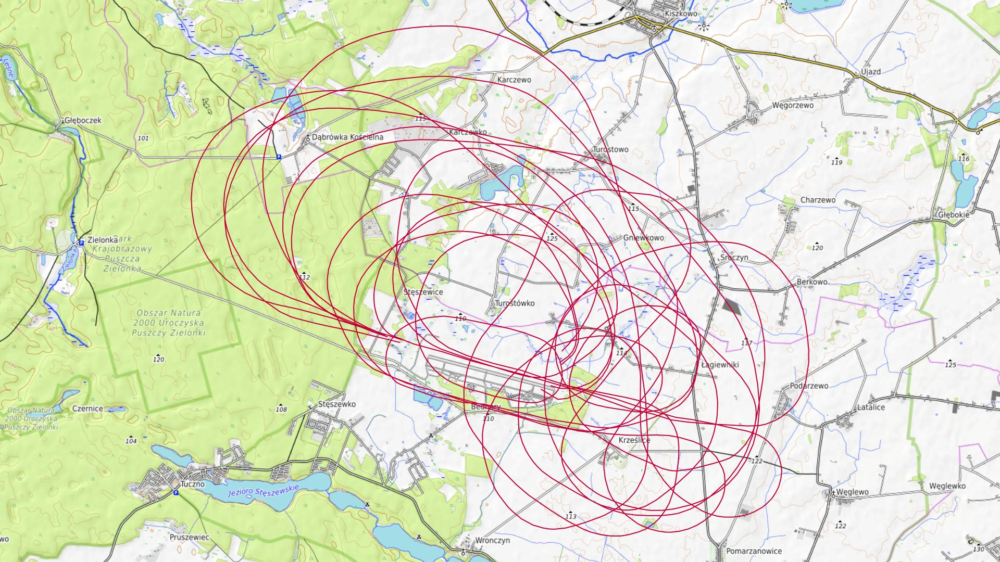
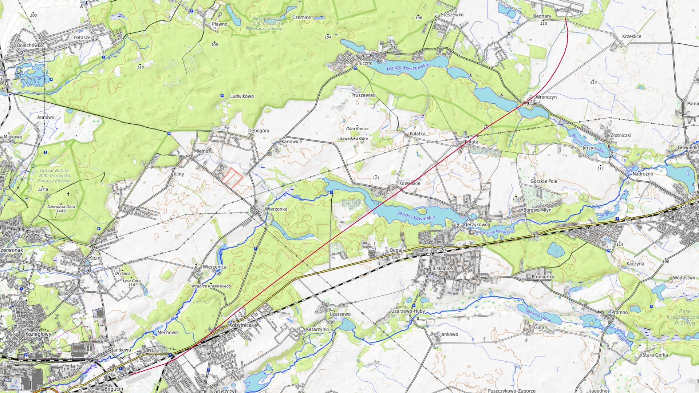
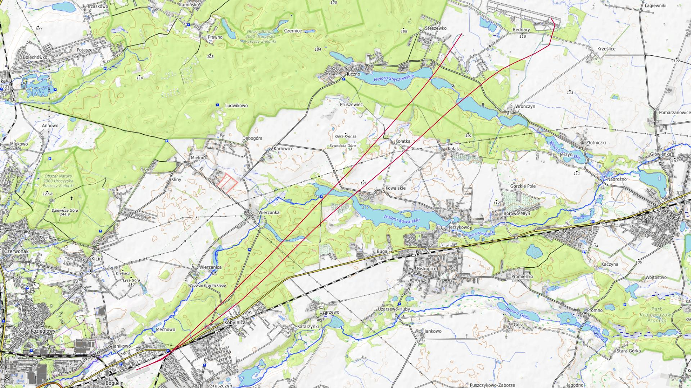

# Lipiec 2025

Liczba dni z lotami: 9 
Suma czasów netto wszystkich lotów: 26 h 9 min 
 

### 2025-07-01 WTOREK

Loty w godzinach: 09:10:17 - 13:34:13, **4 h 23 min**  
Czas netto: **1 h 28 min**  
Liczba lotów: **5**  

|Lot|Od|Do|Czas [min]|
|----:|--------:|--------:|--------:|
|1|09:10:17|09:31:21|21|
|2|10:15:47|10:34:39|18|
|3|11:20:21|11:37:04|16|
|4|12:21:04|12:38:25|17|
|5|13:20:06|13:34:11|14|

### 2025-07-02 ŚRODA

Loty w godzinach: 08:53:03 - 13:59:28, **5 h 6 min**  
Czas netto: **1 h 17 min**  
Liczba lotów: **6**  

|Lot|Od|Do|Czas [min]|
|----:|--------:|--------:|--------:|
|1|08:53:03|09:08:08|15|
|2|09:52:09|10:06:41|14|
|3|10:50:02|11:04:45|14|
|4|11:47:39|11:59:59|12|
|5|12:47:01|13:01:59|14|
|6|13:53:56|13:59:20|5|

### 2025-07-03 CZWARTEK

Loty w godzinach: 08:51:45 - 21:04:45, **12 h 13 min**  
Czas netto: **1 h 41 min**  
Liczba lotów: **5**  

|Lot|Od|Do|Czas [min]|
|----:|--------:|--------:|--------:|
|1|08:51:45|09:09:36|17|
|2|09:56:08|10:11:39|15|
|3|18:42:43|19:05:28|22|
|4|19:46:27|20:08:16|21|
|5|20:40:47|21:04:43|23|

### 2025-07-04 PIĄTEK

Loty w godzinach: 08:50:17 - 21:14:25, **12 h 24 min**  
Czas netto: **5 h 2 min**  
Liczba lotów: **15**  

|Lot|Od|Do|Czas [min]|
|----:|--------:|--------:|--------:|
|1|08:50:17|09:06:53|16|
|2|09:18:44|09:40:10|21|
|3|09:48:31|10:04:35|16|
|4|10:21:35|10:43:02|21|
|5|10:48:14|11:00:50|12|
|6|11:56:54|12:08:52|11|
|7|12:25:26|12:46:32|21|
|8|13:31:26|13:54:28|23|
|9|14:46:34|15:08:37|22|
|10|15:17:06|15:41:24|24|
|11|16:26:29|16:48:33|22|
|12|17:34:46|17:59:03|24|
|13|18:37:15|19:12:51|35|
|14|19:57:32|20:02:23|4|
|15|20:49:30|21:14:20|24|

### 2025-07-05 SOBOTA

Loty w godzinach: 06:27:54 - 21:17:34, **14 h 49 min**  
Czas netto: **7 h 41 min**  
Liczba lotów: **21**  

|Lot|Od|Do|Czas [min]|
|----:|--------:|--------:|--------:|
|1|06:27:54|06:33:08|5|
|2|07:19:22|07:23:30|4|
|3|09:10:41|09:33:23|22|
|4|09:42:39|10:03:11|20|
|5|10:15:12|10:39:43|24|
|6|10:45:32|11:09:50|24|
|7|11:21:52|11:46:02|24|
|8|11:51:20|12:14:57|23|
|9|12:27:56|12:48:55|20|
|10|12:56:30|13:21:12|24|
|11|13:36:10|13:58:24|22|
|12|14:05:22|14:27:59|22|
|13|16:00:59|16:26:03|25|
|14|16:56:47|17:19:23|22|
|15|17:31:11|17:54:22|23|
|16|18:00:48|18:27:07|26|
|17|18:39:25|19:04:43|25|
|18|19:11:19|19:37:27|26|
|19|19:48:20|20:12:57|24|
|20|20:19:24|20:45:39|26|
|21|20:55:04|21:17:31|22|

### 2025-07-06 NIEDZIELA

Loty w godzinach: 06:39:43 - 21:02:18, **14 h 22 min**  
Czas netto: **7 h 21 min**  
Liczba lotów: **21**  

|Lot|Od|Do|Czas [min]|
|----:|--------:|--------:|--------:|
|1|06:39:43|06:45:05|5|
|2|07:39:27|07:44:45|5|
|3|09:21:10|09:46:24|25|
|4|10:02:53|10:26:13|23|
|5|10:32:07|10:58:08|26|
|6|11:12:45|11:38:47|26|
|7|11:44:32|12:10:49|26|
|8|12:25:22|12:51:52|26|
|9|12:58:56|13:25:07|26|
|10|13:41:32|14:07:10|25|
|11|14:14:59|14:40:21|25|
|12|14:53:55|15:19:13|25|
|13|15:25:14|15:51:10|25|
|14|16:07:03|16:32:52|25|
|15|16:39:32|17:05:11|25|
|16|17:15:06|17:15:06|0|
|17|17:19:56|17:41:51|21|
|18|17:47:00|18:10:09|23|
|19|18:47:04|19:12:45|25|
|20|19:50:22|20:12:53|22|
|21|20:57:55|21:02:09|4|

### 2025-07-07 PONIEDZIAŁEK

Loty w godzinach: 09:02:04 - 13:31:21, **4 h 29 min**  
Czas netto: **1 h 24 min**  
Liczba lotów: **6**  

|Lot|Od|Do|Czas [min]|
|----:|--------:|--------:|--------:|
|1|09:02:04|09:15:40|13|
|2|09:51:55|10:04:23|12|
|3|10:43:36|11:00:50|17|
|4|11:36:42|11:48:58|12|
|5|12:26:00|12:43:59|17|
|6|13:19:54|13:31:19|11|

### 2025-07-08 WTOREK

Loty w godzinach: 12:46:34 - 12:52:20, **0 h 5 min**  
Czas netto: **0 h 4 min**  
Liczba lotów: **1**  

|Lot|Od|Do|Czas [min]|
|----:|--------:|--------:|--------:|
|1|12:46:34|12:50:43|4|

### 2025-07-10 CZWARTEK

Loty w godzinach: 08:22:54 - 10:04:24, **1 h 41 min**  
Czas netto: **0 h 7 min**  
Liczba lotów: **2**  

|Lot|Od|Do|Czas [min]|
|----:|--------:|--------:|--------:|
|1|08:22:54|08:27:08|4|
|2|10:00:35|10:04:19|3|

[początek](./)
