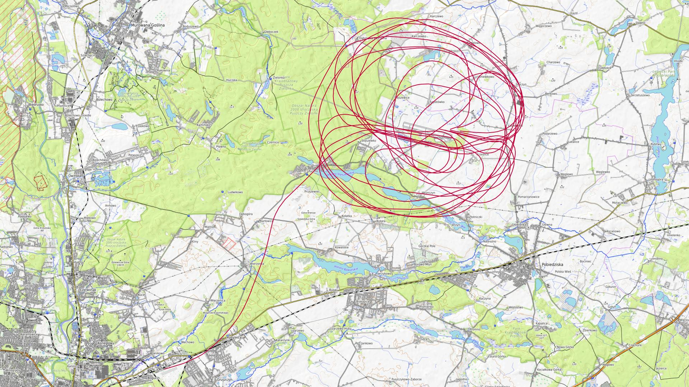
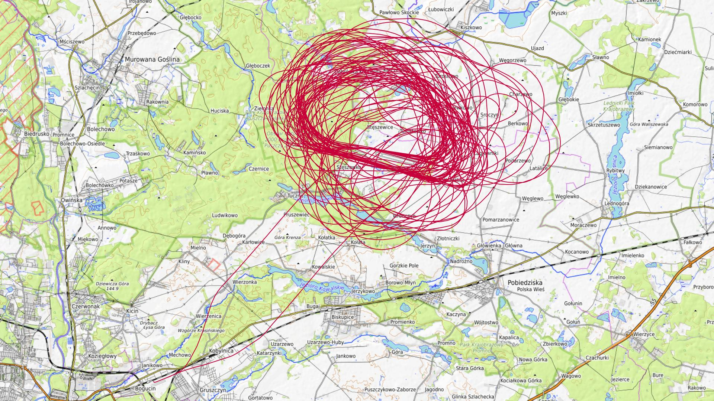
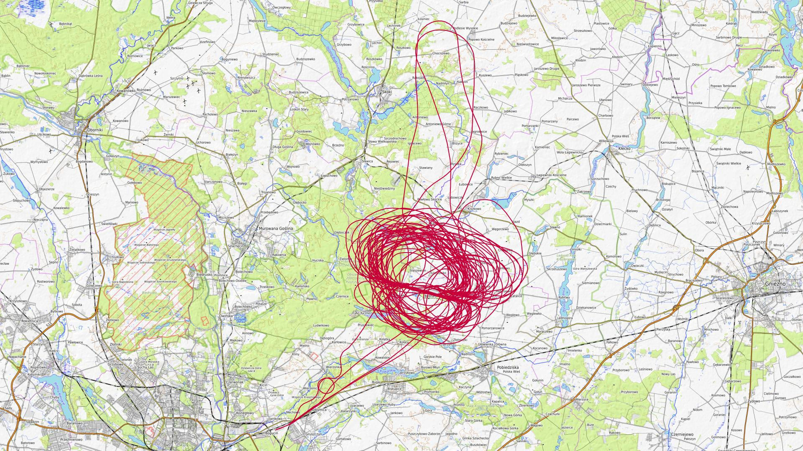
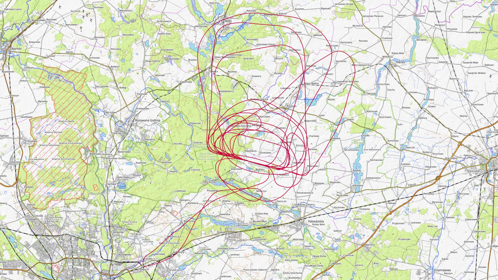
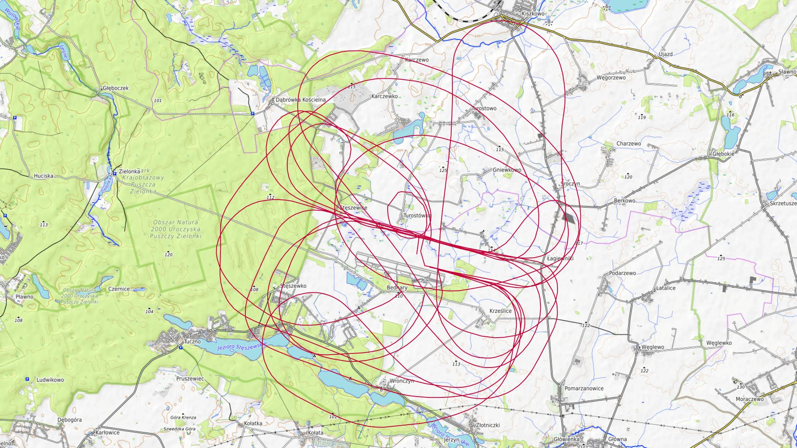
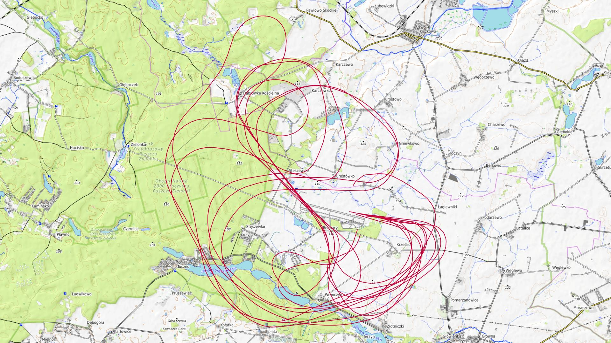
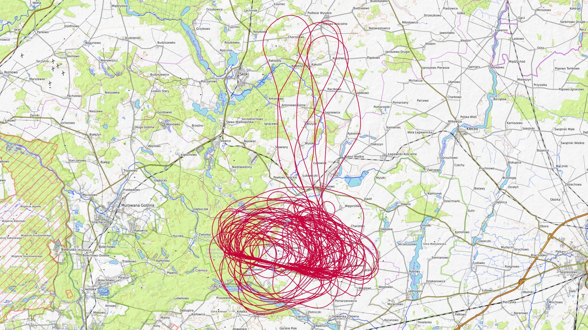

# Sierpień 2025

Liczba dni z lotami: 7 
Suma czasów netto wszystkich lotów: 27 h 48 min 
 

### 2025-08-01 PIĄTEK

Loty w godzinach: 15:30:24 - 20:18:31, **4 h 48 min**  
Czas netto: **1 h 33 min**  
Liczba lotów: **4**  

|Lot|Od|Do|Czas [min]|
|----:|--------:|--------:|--------:|
|1|15:30:24|15:55:21|24|
|2|16:39:36|17:01:43|22|
|3|18:04:18|18:26:36|22|
|4|19:52:38|20:17:05|24|

### 2025-08-02 SOBOTA

Loty w godzinach: 07:24:59 - 20:52:55, **13 h 27 min**  
Czas netto: **7 h 34 min**  
Liczba lotów: **19**  

|Lot|Od|Do|Czas [min]|
|----:|--------:|--------:|--------:|
|1|07:24:59|07:30:05|5|
|2|09:09:35|09:33:17|23|
|3|10:10:17|10:34:41|24|
|4|11:06:21|11:31:11|24|
|5|11:37:55|12:03:32|25|
|6|12:15:48|12:40:35|24|
|7|12:47:43|13:11:00|23|
|8|13:25:20|13:50:23|25|
|9|13:59:30|14:26:35|27|
|10|14:40:55|15:05:16|24|
|11|15:13:11|15:39:02|25|
|12|15:54:26|16:18:23|23|
|13|16:25:49|16:50:47|24|
|14|17:06:01|17:31:01|25|
|15|17:36:54|18:00:24|23|
|16|18:14:45|18:39:53|25|
|17|18:47:15|19:12:35|25|
|18|19:25:53|19:50:26|24|
|19|20:24:51|20:52:43|27|

### 2025-08-09 SOBOTA

Loty w godzinach: 07:44:27 - 20:33:28, **12 h 49 min**  
Czas netto: **6 h 49 min**  
Liczba lotów: **18**  

|Lot|Od|Do|Czas [min]|
|----:|--------:|--------:|--------:|
|1|07:44:27|07:48:48|4|
|2|09:09:03|09:33:04|24|
|3|10:06:18|10:30:27|24|
|4|11:07:58|11:31:51|23|
|5|11:47:38|12:14:12|26|
|6|12:27:55|12:52:39|24|
|7|13:05:18|13:30:58|25|
|8|13:39:47|14:04:56|25|
|9|14:19:50|14:43:28|23|
|10|14:52:20|15:16:23|24|
|11|15:31:19|15:55:12|23|
|12|16:08:23|16:32:11|23|
|13|17:22:43|17:47:43|25|
|14|18:06:24|18:29:47|23|
|15|18:43:11|19:11:11|28|
|16|19:19:39|19:25:25|5|
|17|19:33:19|19:57:41|24|
|18|20:03:56|20:33:15|29|

### 2025-08-10 NIEDZIELA

Loty w godzinach: 07:52:54 - 17:34:48, **9 h 41 min**  
Czas netto: **2 h 13 min**  
Liczba lotów: **7**  

|Lot|Od|Do|Czas [min]|
|----:|--------:|--------:|--------:|
|1|07:52:54|07:57:08|4|
|2|10:04:08|10:28:42|24|
|3|11:11:17|11:33:38|22|
|4|12:10:46|12:30:13|19|
|5|14:06:54|14:26:05|19|
|6|16:02:15|16:21:46|19|
|7|17:09:30|17:33:32|24|

### 2025-08-12 WTOREK

Loty w godzinach: 08:46:05 - 13:24:47, **4 h 38 min**  
Czas netto: **1 h 12 min**  
Liczba lotów: **6**  

|Lot|Od|Do|Czas [min]|
|----:|--------:|--------:|--------:|
|1|08:46:05|08:58:45|12|
|2|09:54:30|10:07:01|12|
|3|10:46:49|10:58:34|11|
|4|11:34:27|11:45:51|11|
|5|12:21:56|12:34:22|12|
|6|13:12:39|13:24:45|12|

### 2025-08-13 ŚRODA

Loty w godzinach: 08:49:02 - 13:04:56, **4 h 15 min**  
Czas netto: **1 h 18 min**  
Liczba lotów: **6**  

|Lot|Od|Do|Czas [min]|
|----:|--------:|--------:|--------:|
|1|08:49:02|09:02:21|13|
|2|09:37:11|09:49:56|12|
|3|10:22:50|10:35:53|13|
|4|11:09:03|11:22:03|13|
|5|12:01:51|12:15:21|13|
|6|12:51:39|13:04:46|13|

### 2025-08-14 CZWARTEK

Loty w godzinach: 08:46:15 - 20:16:10, **11 h 29 min**  
Czas netto: **7 h 5 min**  
Liczba lotów: **19**  

|Lot|Od|Do|Czas [min]|
|----:|--------:|--------:|--------:|
|1|08:46:15|09:00:31|14|
|2|09:38:22|09:51:33|13|
|3|10:44:34|10:57:55|13|
|4|11:08:29|11:33:24|24|
|5|11:39:43|11:54:50|15|
|6|12:08:09|12:32:24|24|
|7|12:39:31|12:53:02|13|
|8|13:05:26|13:28:39|23|
|9|13:37:53|14:03:42|25|
|10|14:16:41|14:43:50|27|
|11|14:51:45|15:17:48|26|
|12|15:31:46|15:57:02|25|
|13|16:07:27|16:33:55|26|
|14|16:48:05|17:15:32|27|
|15|17:28:47|17:55:15|26|
|16|18:08:35|18:34:27|25|
|17|18:42:11|19:03:06|20|
|18|19:16:34|19:41:18|24|
|19|19:48:40|20:16:06|27|

[początek](./)
