# Sierpień 2025

Liczba dni z lotami: 22 
Suma czasów netto wszystkich lotów: 84 h 16 min 
 

### 2025-08-01 PIĄTEK

Loty w godzinach: 15:30:24 - 20:18:31, **4 h 48 min**  
Czas netto: **1 h 33 min**  
Liczba lotów: **4**  

|Lot|Od|Do|Czas [min]|
|----:|--------:|--------:|--------:|
|1|15:30:24|15:55:21|24|
|2|16:39:36|17:01:43|22|
|3|18:04:18|18:26:36|22|
|4|19:52:38|20:17:05|24|

### 2025-08-02 SOBOTA

Loty w godzinach: 07:24:59 - 20:52:55, **13 h 27 min**  
Czas netto: **7 h 34 min**  
Liczba lotów: **19**  

|Lot|Od|Do|Czas [min]|
|----:|--------:|--------:|--------:|
|1|07:24:59|07:30:05|5|
|2|09:09:35|09:33:17|23|
|3|10:10:17|10:34:41|24|
|4|11:06:21|11:31:11|24|
|5|11:37:55|12:03:32|25|
|6|12:15:48|12:40:35|24|
|7|12:47:43|13:11:00|23|
|8|13:25:20|13:50:23|25|
|9|13:59:30|14:26:35|27|
|10|14:40:55|15:05:16|24|
|11|15:13:11|15:39:02|25|
|12|15:54:26|16:18:23|23|
|13|16:25:49|16:50:47|24|
|14|17:06:01|17:31:01|25|
|15|17:36:54|18:00:24|23|
|16|18:14:45|18:39:53|25|
|17|18:47:15|19:12:35|25|
|18|19:25:53|19:50:26|24|
|19|20:24:51|20:52:43|27|

### 2025-08-09 SOBOTA

Loty w godzinach: 07:44:27 - 20:33:28, **12 h 49 min**  
Czas netto: **6 h 49 min**  
Liczba lotów: **18**  

|Lot|Od|Do|Czas [min]|
|----:|--------:|--------:|--------:|
|1|07:44:27|07:48:48|4|
|2|09:09:03|09:33:04|24|
|3|10:06:18|10:30:27|24|
|4|11:07:58|11:31:51|23|
|5|11:47:38|12:14:12|26|
|6|12:27:55|12:52:39|24|
|7|13:05:18|13:30:58|25|
|8|13:39:47|14:04:56|25|
|9|14:19:50|14:43:28|23|
|10|14:52:20|15:16:23|24|
|11|15:31:19|15:55:12|23|
|12|16:08:23|16:32:11|23|
|13|17:22:43|17:47:43|25|
|14|18:06:24|18:29:47|23|
|15|18:43:11|19:11:11|28|
|16|19:19:39|19:25:25|5|
|17|19:33:19|19:57:41|24|
|18|20:03:56|20:33:15|29|

### 2025-08-10 NIEDZIELA

Loty w godzinach: 07:52:54 - 17:34:48, **9 h 41 min**  
Czas netto: **2 h 13 min**  
Liczba lotów: **7**  

|Lot|Od|Do|Czas [min]|
|----:|--------:|--------:|--------:|
|1|07:52:54|07:57:08|4|
|2|10:04:08|10:28:42|24|
|3|11:11:17|11:33:38|22|
|4|12:10:46|12:30:13|19|
|5|14:06:54|14:26:05|19|
|6|16:02:15|16:21:46|19|
|7|17:09:30|17:33:32|24|

### 2025-08-12 WTOREK

Loty w godzinach: 08:46:05 - 13:24:47, **4 h 38 min**  
Czas netto: **1 h 12 min**  
Liczba lotów: **6**  

|Lot|Od|Do|Czas [min]|
|----:|--------:|--------:|--------:|
|1|08:46:05|08:58:45|12|
|2|09:54:30|10:07:01|12|
|3|10:46:49|10:58:34|11|
|4|11:34:27|11:45:51|11|
|5|12:21:56|12:34:22|12|
|6|13:12:39|13:24:45|12|

### 2025-08-13 ŚRODA

Loty w godzinach: 08:49:02 - 13:04:56, **4 h 15 min**  
Czas netto: **1 h 18 min**  
Liczba lotów: **6**  

|Lot|Od|Do|Czas [min]|
|----:|--------:|--------:|--------:|
|1|08:49:02|09:02:21|13|
|2|09:37:11|09:49:56|12|
|3|10:22:50|10:35:53|13|
|4|11:09:03|11:22:03|13|
|5|12:01:51|12:15:21|13|
|6|12:51:39|13:04:46|13|

### 2025-08-14 CZWARTEK

Loty w godzinach: 08:46:15 - 20:16:10, **11 h 29 min**  
Czas netto: **7 h 5 min**  
Liczba lotów: **19**  

|Lot|Od|Do|Czas [min]|
|----:|--------:|--------:|--------:|
|1|08:46:15|09:00:31|14|
|2|09:38:22|09:51:33|13|
|3|10:44:34|10:57:55|13|
|4|11:08:29|11:33:24|24|
|5|11:39:43|11:54:50|15|
|6|12:08:09|12:32:24|24|
|7|12:39:31|12:53:02|13|
|8|13:05:26|13:28:39|23|
|9|13:37:53|14:03:42|25|
|10|14:16:41|14:43:50|27|
|11|14:51:45|15:17:48|26|
|12|15:31:46|15:57:02|25|
|13|16:07:27|16:33:55|26|
|14|16:48:05|17:15:32|27|
|15|17:28:47|17:55:15|26|
|16|18:08:35|18:34:27|25|
|17|18:42:11|19:03:06|20|
|18|19:16:34|19:41:18|24|
|19|19:48:40|20:16:06|27|

### 2025-08-15 PIĄTEK

Loty w godzinach: 06:26:26 - 20:40:45, **14 h 14 min**  
Czas netto: **7 h 43 min**  
Liczba lotów: **25**  

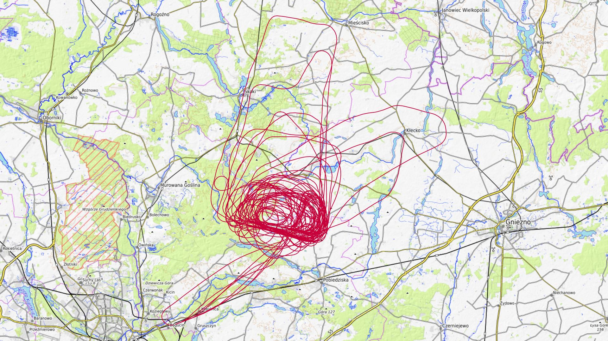

|Lot|Od|Do|Czas [min]|
|----:|--------:|--------:|--------:|
|1|06:26:26|06:31:24|4|
|2|07:16:25|07:21:45|5|
|3|08:27:22|08:51:42|24|
|4|08:56:44|09:12:21|15|
|5|09:17:30|09:43:56|26|
|6|09:55:37|10:10:08|14|
|7|10:17:48|10:41:01|23|
|8|10:53:40|11:05:48|12|
|9|11:12:21|11:38:47|26|
|10|11:51:44|12:14:32|22|
|11|12:18:26|12:30:24|11|
|12|12:44:18|13:10:14|25|
|13|13:16:59|13:29:10|12|
|14|13:49:16|14:15:54|26|
|15|14:24:31|14:48:04|23|
|16|15:01:00|15:26:01|25|
|17|15:33:54|15:55:38|21|
|18|16:08:13|16:34:29|26|
|19|16:47:24|16:52:56|5|
|20|17:05:15|17:29:13|23|
|21|17:36:58|18:02:41|25|
|22|18:16:12|18:41:19|25|
|23|18:54:36|19:20:09|25|
|24|19:56:04|19:59:56|3|
|25|20:35:59|20:40:35|4|

### 2025-08-16 SOBOTA

Loty w godzinach: 07:49:48 - 20:30:32, **12 h 40 min**  
Czas netto: **7 h 3 min**  
Liczba lotów: **19**  

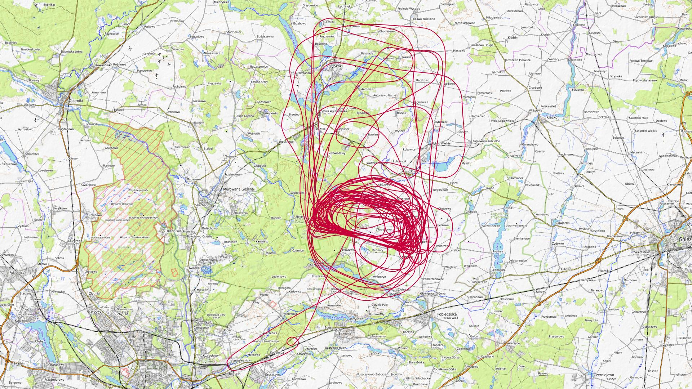

|Lot|Od|Do|Czas [min]|
|----:|--------:|--------:|--------:|
|1|07:49:48|07:54:22|4|
|2|09:04:44|09:29:38|24|
|3|10:12:41|10:33:09|20|
|4|10:47:16|11:13:18|26|
|5|11:25:09|11:47:36|22|
|6|12:00:53|12:23:59|23|
|7|12:31:29|12:56:03|24|
|8|13:10:03|13:35:16|25|
|9|13:43:21|14:07:25|24|
|10|14:21:17|14:45:20|24|
|11|14:54:57|15:18:27|23|
|12|15:31:26|15:53:51|22|
|13|16:01:42|16:25:00|23|
|14|16:39:13|17:01:02|21|
|15|17:10:23|17:33:20|22|
|16|17:47:29|18:09:21|21|
|17|18:17:24|18:41:05|23|
|18|19:17:20|19:39:13|21|
|19|20:06:00|20:29:07|23|

### 2025-08-17 NIEDZIELA

Loty w godzinach: 08:10:51 - 20:23:10, **12 h 12 min**  
Czas netto: **5 h 49 min**  
Liczba lotów: **17**  

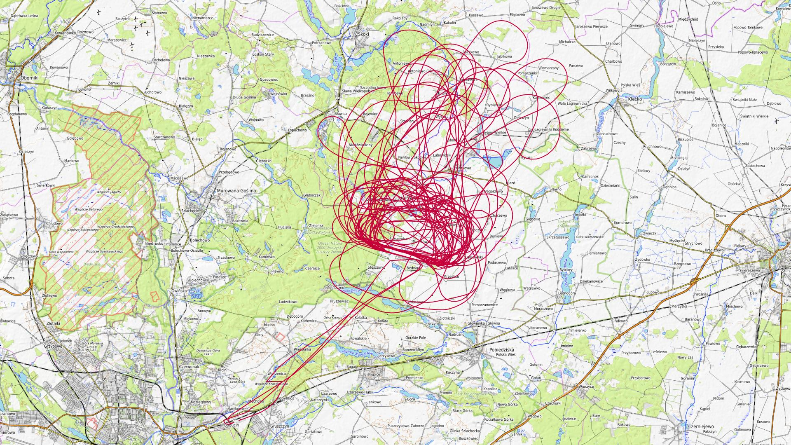

|Lot|Od|Do|Czas [min]|
|----:|--------:|--------:|--------:|
|1|08:10:51|08:15:39|4|
|2|09:16:37|09:43:43|27|
|3|10:24:41|10:49:33|24|
|4|11:21:58|11:44:28|22|
|5|11:50:00|12:15:32|25|
|6|12:29:12|12:50:49|21|
|7|13:00:36|13:25:18|24|
|8|13:41:11|14:04:38|23|
|9|14:12:28|14:35:02|22|
|10|14:50:57|15:14:17|23|
|11|15:19:38|15:43:05|23|
|12|16:04:18|16:29:03|24|
|13|16:37:47|17:03:48|26|
|14|17:17:11|17:39:53|22|
|15|18:29:57|18:51:43|21|
|16|19:34:54|19:40:28|5|
|17|20:18:07|20:22:58|4|

### 2025-08-18 PONIEDZIAŁEK

Loty w godzinach: 08:42:26 - 08:52:41, **0 h 10 min**  
Czas netto: **0 h 10 min**  
Liczba lotów: **1**  

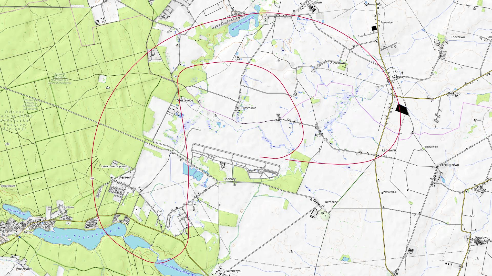

|Lot|Od|Do|Czas [min]|
|----:|--------:|--------:|--------:|
|1|08:42:26|08:52:33|10|

### 2025-08-19 WTOREK

Loty w godzinach: 08:44:55 - 15:20:02, **6 h 35 min**  
Czas netto: **1 h 24 min**  
Liczba lotów: **8**  

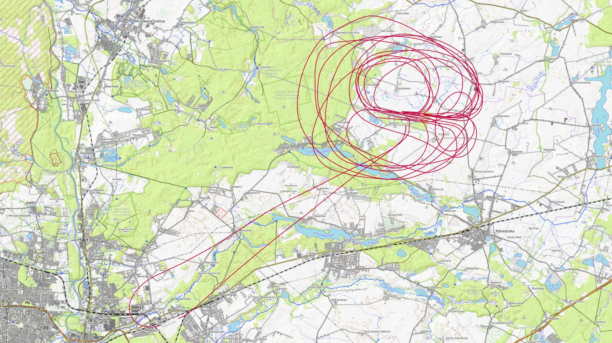

|Lot|Od|Do|Czas [min]|
|----:|--------:|--------:|--------:|
|1|08:44:55|08:59:31|14|
|2|09:39:11|09:53:22|14|
|3|10:30:52|10:42:28|11|
|4|11:23:09|11:35:07|11|
|5|12:09:23|12:21:26|12|
|6|12:57:32|13:09:00|11|
|7|14:12:35|14:16:34|3|
|8|15:15:01|15:19:50|4|

### 2025-08-20 ŚRODA

Loty w godzinach: 08:42:25 - 12:07:21, **3 h 24 min**  
Czas netto: **1 h 6 min**  
Liczba lotów: **5**  

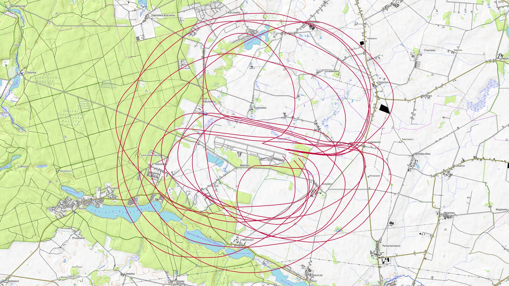

|Lot|Od|Do|Czas [min]|
|----:|--------:|--------:|--------:|
|1|08:42:25|09:00:52|18|
|2|09:34:51|09:47:27|12|
|3|10:22:21|10:34:20|11|
|4|11:09:34|11:21:28|11|
|5|11:55:24|12:07:18|11|

### 2025-08-21 CZWARTEK

Loty w godzinach: 08:42:38 - 20:28:06, **11 h 45 min**  
Czas netto: **5 h 39 min**  
Liczba lotów: **18**  

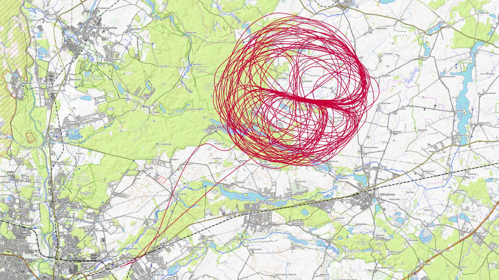

|Lot|Od|Do|Czas [min]|
|----:|--------:|--------:|--------:|
|1|08:42:38|08:54:33|11|
|2|09:31:37|09:43:05|11|
|3|10:34:54|10:46:34|11|
|4|11:19:28|11:31:23|11|
|5|11:40:40|12:07:19|26|
|6|12:11:06|12:22:44|11|
|7|12:40:57|13:06:02|25|
|8|13:09:42|13:20:51|11|
|9|13:34:59|13:59:55|24|
|10|14:08:11|14:30:27|22|
|11|15:07:41|15:29:36|21|
|12|15:37:49|15:59:26|21|
|13|16:37:50|17:05:47|27|
|14|17:11:31|17:36:14|24|
|15|18:15:09|18:39:26|24|
|16|18:46:50|19:09:51|23|
|17|19:22:34|19:45:17|22|
|18|20:23:46|20:28:03|4|

### 2025-08-22 PIĄTEK

Loty w godzinach: 06:10:58 - 18:28:58, **12 h 18 min**  
Czas netto: **4 h 2 min**  
Liczba lotów: **14**  

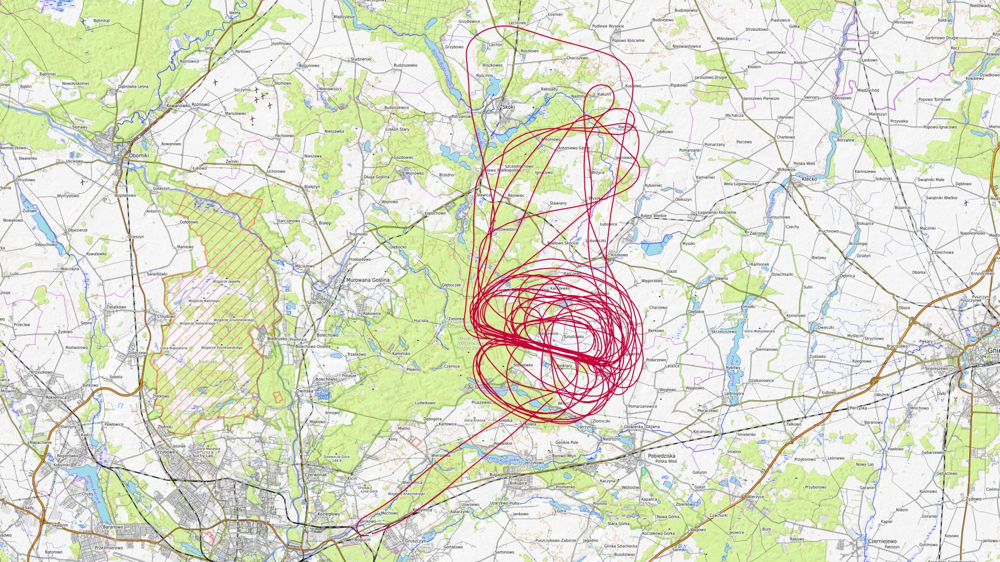

|Lot|Od|Do|Czas [min]|
|----:|--------:|--------:|--------:|
|1|06:10:58|06:15:08|4|
|2|06:50:22|06:54:55|4|
|3|08:44:53|09:08:53|24|
|4|09:13:25|09:24:46|11|
|5|09:48:03|10:09:11|21|
|6|10:18:51|10:29:14|10|
|7|10:41:47|11:01:53|20|
|8|11:10:57|11:22:04|11|
|9|11:32:43|11:55:10|22|
|10|12:31:39|12:54:21|22|
|11|13:49:27|14:11:42|22|
|12|15:07:58|15:31:36|23|
|13|16:15:01|16:38:20|23|
|14|18:07:27|18:28:48|21|

### 2025-08-23 SOBOTA

Loty w godzinach: 06:56:41 - 19:24:39, **12 h 27 min**  
Czas netto: **2 h 37 min**  
Liczba lotów: **9**  

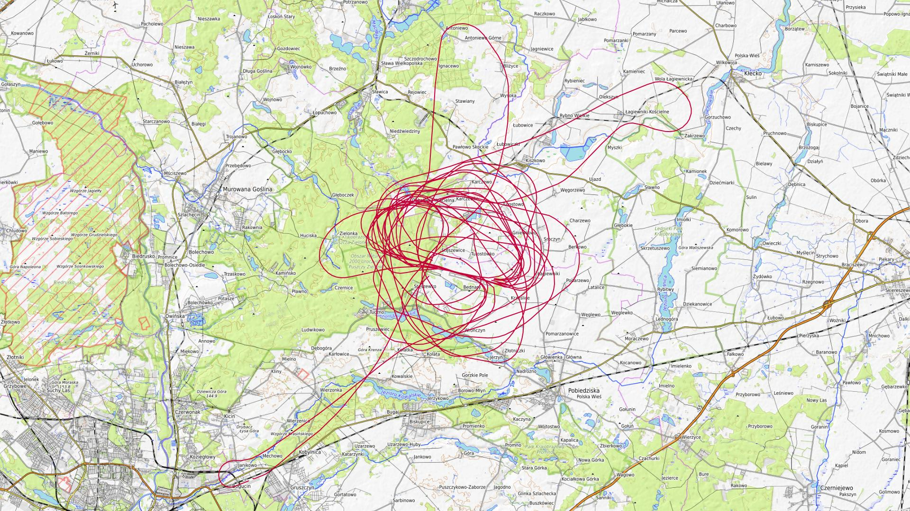

|Lot|Od|Do|Czas [min]|
|----:|--------:|--------:|--------:|
|1|06:56:41|07:01:42|5|
|2|07:29:03|07:34:11|5|
|3|09:04:44|09:25:05|20|
|4|10:05:31|10:27:29|21|
|5|10:40:20|11:00:39|20|
|6|14:17:25|14:37:29|20|
|7|15:43:10|16:04:04|20|
|8|17:17:31|17:40:22|22|
|9|19:03:45|19:24:35|20|

### 2025-08-24 NIEDZIELA

Loty w godzinach: 09:03:47 - 17:49:26, **8 h 45 min**  
Czas netto: **3 h 55 min**  
Liczba lotów: **12**  

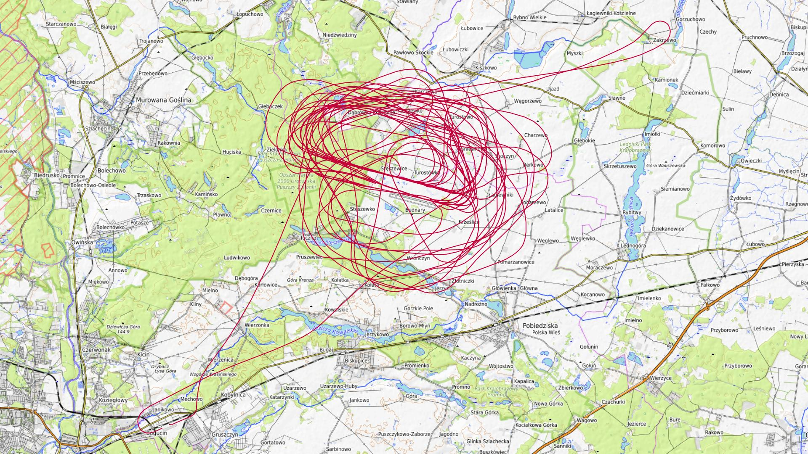

|Lot|Od|Do|Czas [min]|
|----:|--------:|--------:|--------:|
|1|09:03:47|09:26:08|22|
|2|09:44:22|10:07:15|22|
|3|10:13:25|10:33:50|20|
|4|10:53:06|11:14:44|21|
|5|11:21:56|11:42:13|20|
|6|12:20:18|12:42:20|22|
|7|13:21:36|13:44:41|23|
|8|14:16:39|14:36:17|19|
|9|15:10:03|15:29:32|19|
|10|16:01:19|16:19:53|18|
|11|16:52:06|17:12:08|20|
|12|17:44:15|17:49:22|5|

### 2025-08-26 WTOREK

Loty w godzinach: 09:00:46 - 11:53:19, **2 h 52 min**  
Czas netto: **0 h 47 min**  
Liczba lotów: **4**  

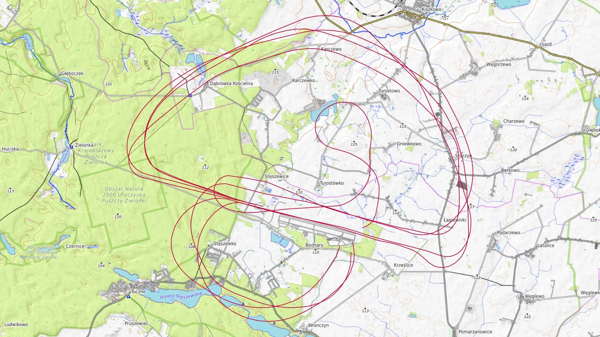

|Lot|Od|Do|Czas [min]|
|----:|--------:|--------:|--------:|
|1|09:00:46|09:12:17|11|
|2|09:46:54|09:58:22|11|
|3|10:36:48|10:47:55|11|
|4|11:40:00|11:53:16|13|

### 2025-08-27 ŚRODA

Loty w godzinach: 08:58:47 - 13:55:15, **4 h 56 min**  
Czas netto: **1 h 16 min**  
Liczba lotów: **7**  

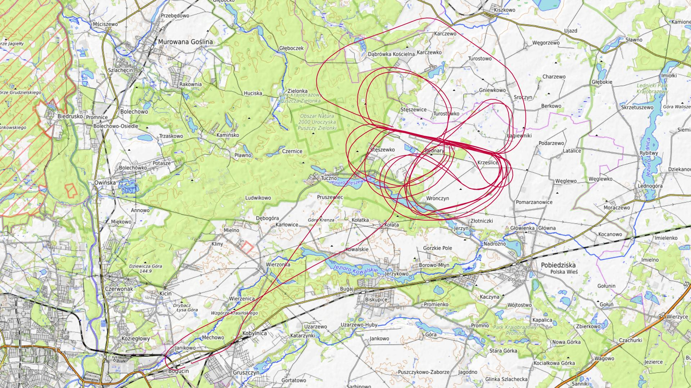

|Lot|Od|Do|Czas [min]|
|----:|--------:|--------:|--------:|
|1|08:58:47|09:10:37|11|
|2|09:47:53|09:59:39|11|
|3|10:29:29|10:41:03|11|
|4|11:31:27|11:42:46|11|
|5|12:19:36|12:30:52|11|
|6|13:00:46|13:14:36|13|
|7|13:50:27|13:55:10|4|

### 2025-08-28 CZWARTEK

Loty w godzinach: 09:07:00 - 19:44:46, **10 h 37 min**  
Czas netto: **4 h 20 min**  
Liczba lotów: **14**  

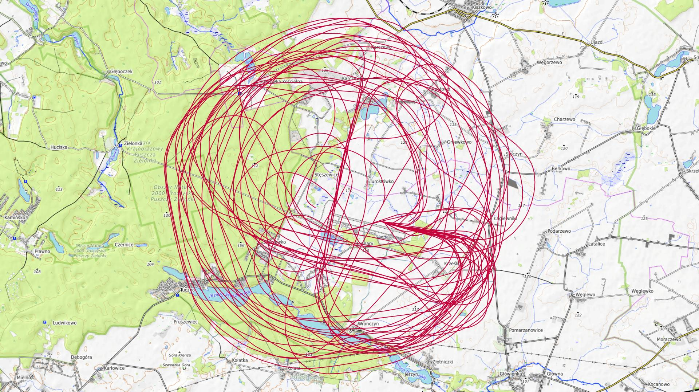

|Lot|Od|Do|Czas [min]|
|----:|--------:|--------:|--------:|
|1|09:07:00|09:19:07|12|
|2|09:52:23|09:52:23|0|
|3|09:54:24|10:04:33|10|
|4|10:39:01|10:51:09|12|
|5|11:30:07|11:57:45|27|
|6|12:07:39|12:19:36|11|
|7|12:33:22|12:56:18|22|
|8|13:00:26|13:13:45|13|
|9|13:27:32|13:52:45|25|
|10|14:00:49|14:22:37|21|
|11|15:41:31|16:07:06|25|
|12|16:56:32|17:19:47|23|
|13|18:01:58|18:29:02|27|
|14|19:17:37|19:44:42|27|

### 2025-08-30 SOBOTA

Loty w godzinach: 12:36:24 - 19:33:05, **6 h 56 min**  
Czas netto: **2 h 55 min**  
Liczba lotów: **10**  

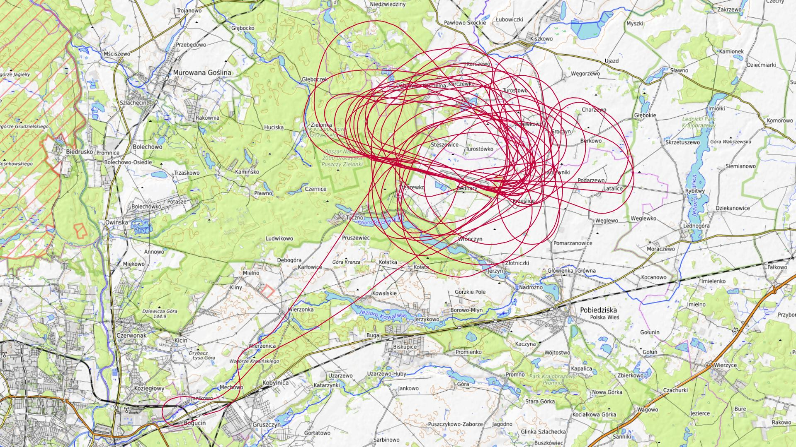

|Lot|Od|Do|Czas [min]|
|----:|--------:|--------:|--------:|
|1|12:36:24|12:41:37|5|
|2|13:56:03|14:21:09|25|
|3|14:59:24|15:24:16|24|
|4|16:00:54|16:26:34|25|
|5|17:00:27|17:25:16|24|
|6|17:56:16|18:21:29|25|
|7|18:31:29|18:31:29|0|
|8|18:33:30|18:55:02|21|
|9|19:06:22|19:06:22|0|
|10|19:08:23|19:31:19|22|

### 2025-08-31 NIEDZIELA

Loty w godzinach: 07:40:49 - 20:08:13, **12 h 27 min**  
Czas netto: **7 h 35 min**  
Liczba lotów: **22**  

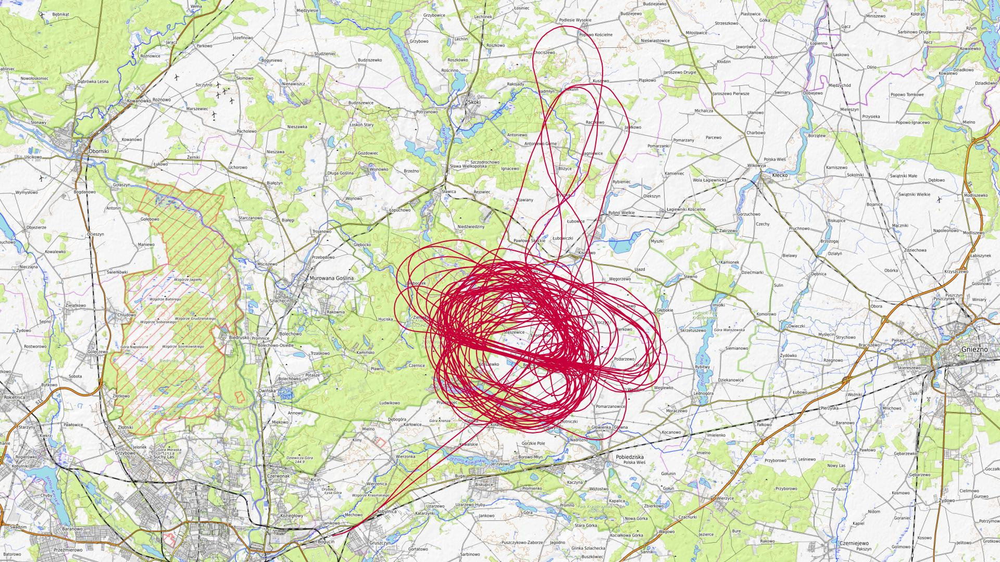

|Lot|Od|Do|Czas [min]|
|----:|--------:|--------:|--------:|
|1|07:40:49|07:45:19|4|
|2|08:46:49|09:11:51|25|
|3|09:46:34|10:11:03|24|
|4|10:19:03|10:44:00|24|
|5|10:59:14|11:24:40|25|
|6|11:32:25|11:56:09|23|
|7|12:10:05|12:35:44|25|
|8|12:42:00|13:07:34|25|
|9|13:22:02|13:47:28|25|
|10|13:55:10|13:55:10|0|
|11|13:57:11|14:20:26|23|
|12|14:34:23|14:59:08|24|
|13|15:05:16|15:05:16|0|
|14|15:07:17|15:31:02|23|
|15|15:45:02|16:08:00|22|
|16|16:13:31|16:39:03|25|
|17|16:52:17|17:18:00|25|
|18|17:23:59|17:47:40|23|
|19|18:04:14|18:28:52|24|
|20|18:37:09|19:03:31|26|
|21|19:16:33|19:41:47|25|
|22|20:02:07|20:06:49|4|

[początek](./)
