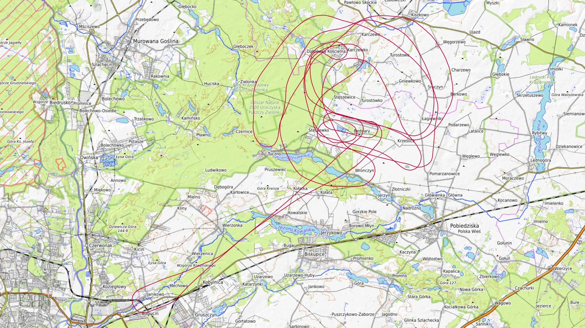
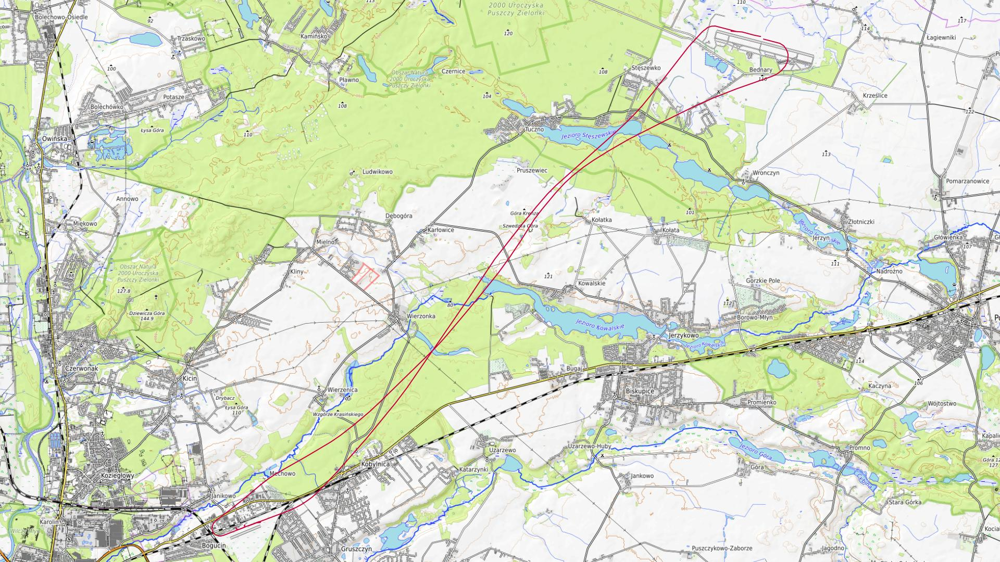
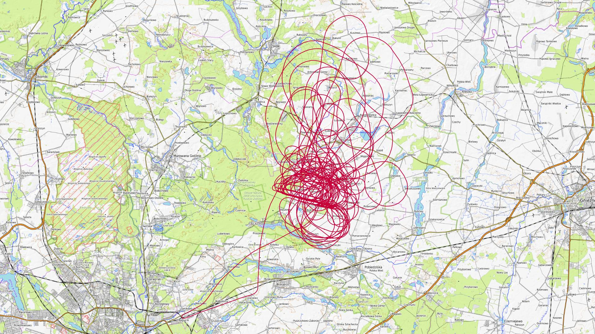
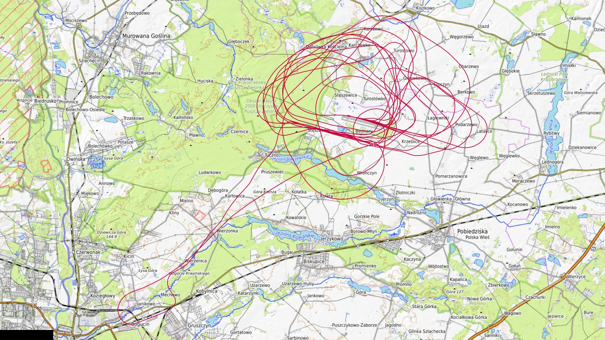

# Październik 2025

Liczba dni z lotami: 4 
Suma czasów netto wszystkich lotów: 7 h 58 min 
 

### 2025-10-04 SOBOTA

Loty w godzinach: 07:46:32 - 12:13:40, **4 h 27 min**  
Czas netto: **0 h 56 min**  
Liczba lotów: **6**  

|Lot|Od|Do|Czas [min]|
|----:|--------:|--------:|--------:|
|1|07:49:15|07:53:04|3|
|2|07:53:45|07:55:22|1|
|3|07:55:24|07:55:24|0|
|4|09:40:56|10:02:38|21|
|5|11:08:37|11:32:56|24|
|6|12:06:27|12:11:30|5|

### 2025-10-18 SOBOTA

Loty w godzinach: 08:23:52 - 10:01:03, **1 h 37 min**  
Czas netto: **0 h 9 min**  
Liczba lotów: **2**  

|Lot|Od|Do|Czas [min]|
|----:|--------:|--------:|--------:|
|1|08:34:42|08:39:53|5|
|2|09:55:00|09:59:29|4|

### 2025-10-19 NIEDZIELA

Loty w godzinach: 07:56:11 - 17:29:25, **9 h 33 min**  
Czas netto: **5 h 6 min**  
Liczba lotów: **17**  

|Lot|Od|Do|Czas [min]|
|----:|--------:|--------:|--------:|
|1|08:00:17|08:05:45|5|
|2|08:29:34|08:52:50|23|
|3|09:31:07|09:50:49|19|
|4|10:28:16|10:52:09|23|
|5|11:30:34|11:53:49|23|
|6|12:02:00|12:26:07|24|
|7|12:31:16|12:31:43|0|
|8|12:38:31|13:02:57|24|
|9|13:11:10|13:33:37|22|
|10|13:49:18|14:09:38|20|
|11|14:09:45|14:09:45|0|
|12|14:23:05|14:45:57|22|
|13|15:02:01|15:25:16|23|
|14|15:25:59|15:25:59|0|
|15|15:31:41|15:53:23|21|
|16|16:06:22|16:29:09|22|
|17|16:58:45|17:27:31|28|

### 2025-10-25 SOBOTA

Loty w godzinach: 08:42:39 - 15:32:31, **6 h 49 min**  
Czas netto: **1 h 45 min**  
Liczba lotów: **6**  

|Lot|Od|Do|Czas [min]|
|----:|--------:|--------:|--------:|
|1|08:59:37|09:04:19|4|
|2|11:07:41|11:26:44|19|
|3|12:07:19|12:26:33|19|
|4|13:09:42|13:29:14|19|
|5|14:06:07|14:26:19|20|
|6|15:08:21|15:30:54|22|

[początek](./)
