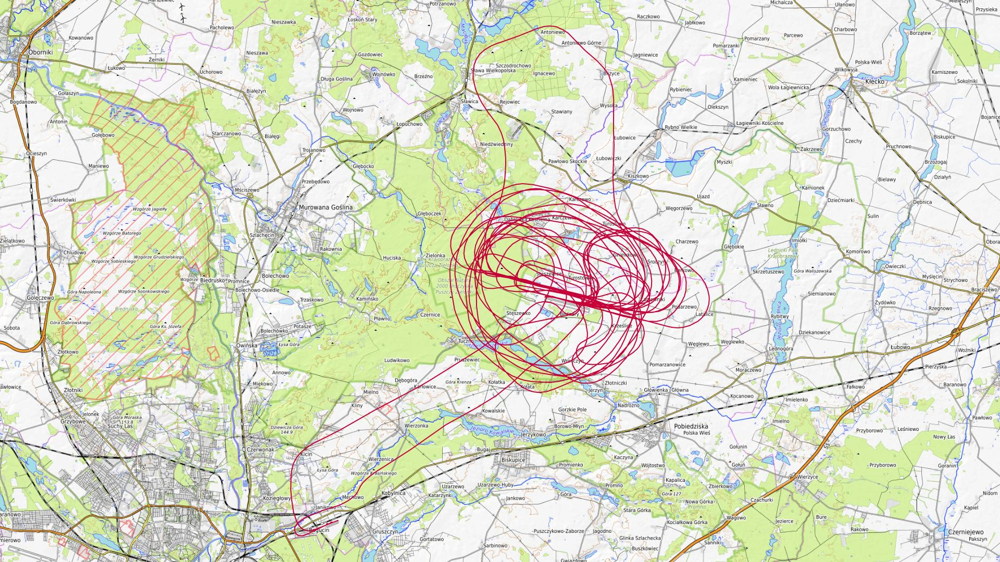
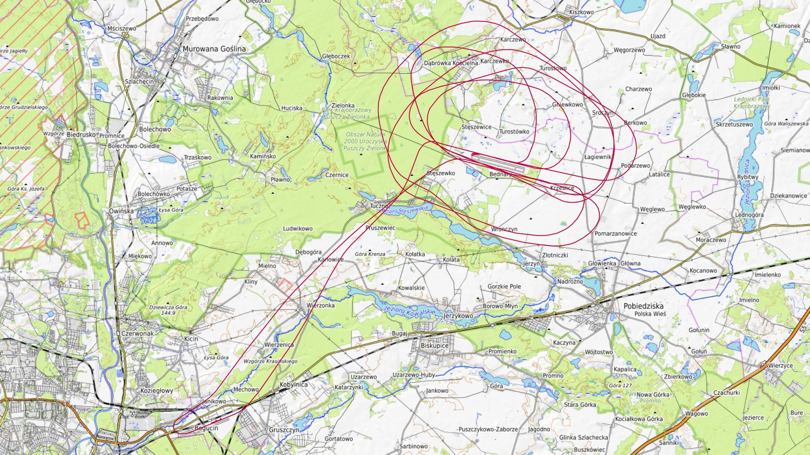
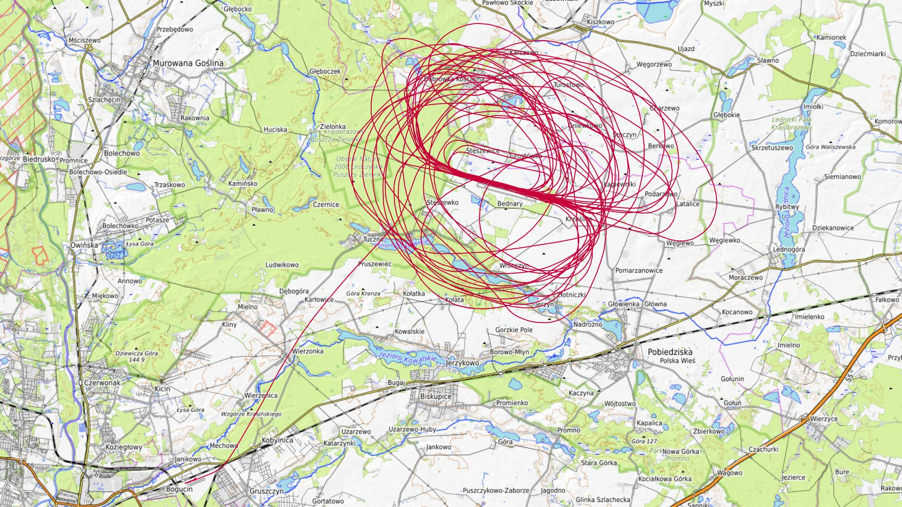
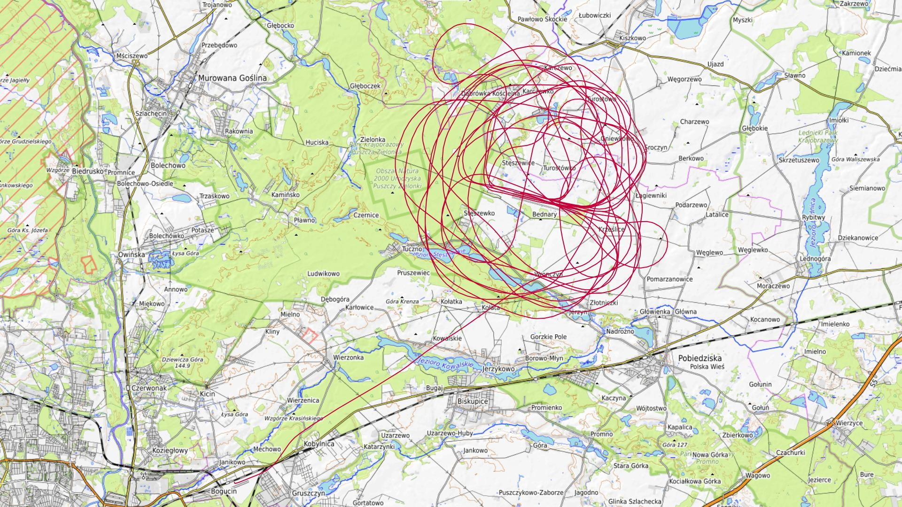

# Kwiecień 2026

Liczba dni z lotami: 5 
Suma czasów netto wszystkich lotów: 9 h 49 min 
 

### 2026-04-11 SOBOTA

Loty w godzinach: 08:04:04.55 - 18:22:14.48, **10 h 18 min**  
Czas netto: **2 h 40 min**  
Liczba lotów: **11**  

|Lot|Od|Do|Czas [min]|
|----:|--------:|--------:|--------:|
|1|08:44:47.79|08:50:18.45|5|
|2|11:20:55.34|11:23:46.13|2|
|3|11:24:35.98|11:26:57.44|2|
|4|11:28:49.95|11:30:13.17|1|
|5|11:36:49.42|11:57:53.87|21|
|6|12:39:43.82|12:59:58.77|20|
|7|13:39:27.1|14:01:02.43|21|
|8|14:41:50.62|15:03:36.68|21|
|9|15:43:56.05|16:05:24.75|21|
|10|16:47:37.42|17:08:05.54|20|
|11|17:57:53.53|18:20:03.97|22|

### 2026-04-12 NIEDZIELA

Loty w godzinach: 08:21:04.06 - 13:44:00.24, **5 h 22 min**  
Czas netto: **0 h 48 min**  
Liczba lotów: **3**  

|Lot|Od|Do|Czas [min]|
|----:|--------:|--------:|--------:|
|1|09:00:21.52|09:04:23.62|4|
|2|11:40:13.76|12:02:06.32|21|
|3|13:18:29.64|13:41:15.67|22|

### 2026-04-18 SOBOTA

Loty w godzinach: 07:28:35.5 - 19:33:12.67, **12 h 4 min**  
Czas netto: **3 h 32 min**  
Liczba lotów: **13**  

|Lot|Od|Do|Czas [min]|
|----:|--------:|--------:|--------:|
|1|08:00:38.24|08:05:03.18|4|
|2|09:50:14.49|10:13:02.47|22|
|3|10:59:11.04|11:21:22.62|22|
|4|12:18:18.37|12:40:42.07|22|
|5|13:26:36.8|13:49:04.59|22|
|6|14:37:54.25|14:58:49.22|20|
|7|15:42:35.88|16:05:22.6|22|
|8|16:48:58.23|17:12:13.39|23|
|9|17:51:18.15|18:13:33.98|22|
|10|18:50:45.69|19:13:00.24|22|
|11|19:21:14.6|19:23:49.98|2|
|12|19:24:43.53|19:27:05.37|2|
|13|19:29:30.56|19:31:44.97|2|

### 2026-04-19 NIEDZIELA

Loty w godzinach: 09:01:39.4 - 13:57:35.2, **4 h 55 min**  
Czas netto: **2 h 0 min**  
Liczba lotów: **5**  

|Lot|Od|Do|Czas [min]|
|----:|--------:|--------:|--------:|
|1|09:09:13.75|09:34:23.72|25|
|2|10:08:27.69|10:31:13.15|22|
|3|11:10:34.65|11:33:01.71|22|
|4|12:02:49.95|12:25:32.33|22|
|5|13:28:49.55|13:55:51.43|27|

### 2026-04-25 SOBOTA

Loty w godzinach: 07:37:28.46 - 12:18:49.87, **4 h 41 min**  
Czas netto: **0 h 47 min**  
Liczba lotów: **4**  

|Lot|Od|Do|Czas [min]|
|----:|--------:|--------:|--------:|
|1|08:14:41.5|08:16:00.38|1|
|2|10:00:22.99|10:05:07.03|4|
|3|10:48:19.03|11:08:32.04|20|
|4|11:54:59.59|12:15:53.74|20|

[początek](./)
