# Maj 2026

Liczba dni z lotami: 11 
Suma czasów netto wszystkich lotów: 48 h 55 min 
 

### 2026-05-01 PIĄTEK

Loty w godzinach: 09:20:00.49 - 20:06:21.64, **10 h 46 min**  
Czas netto: **5 h 50 min**  
Liczba lotów: **18**  

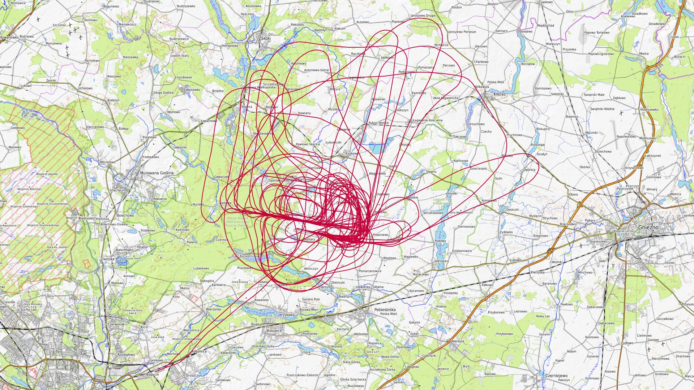

|Lot|Od|Do|Czas [min]|
|----:|--------:|--------:|--------:|
|1|09:23:31.21|09:27:33|4|
|2|09:33:14.59|09:53:33.54|20|
|3|10:30:01.96|10:52:48.71|22|
|4|11:34:41.97|11:57:12.3|22|
|5|12:34:50.16|12:56:25.37|21|
|6|13:06:01.12|13:26:08.37|20|
|7|13:38:44.61|14:05:35.19|26|
|8|14:12:17.48|14:35:07.59|22|
|9|14:45:57.16|15:08:10.63|22|
|10|15:16:11.99|15:37:16.81|21|
|11|15:48:57.38|16:07:36.95|18|
|12|16:50:27.67|17:13:27.62|22|
|13|17:25:49.12|17:49:12.55|23|
|14|18:19:14.04|18:38:52.76|19|
|15|18:39:30.46|18:40:06.66|0|
|16|18:50:13.93|19:10:16.89|20|
|17|19:16:43.69|19:38:23.39|21|
|18|19:46:25.17|20:05:52.28|19|

### 2026-05-02 SOBOTA

Loty w godzinach: 08:00:34.44 - 20:09:54.43, **12 h 9 min**  
Czas netto: **7 h 44 min**  
Liczba lotów: **24**  

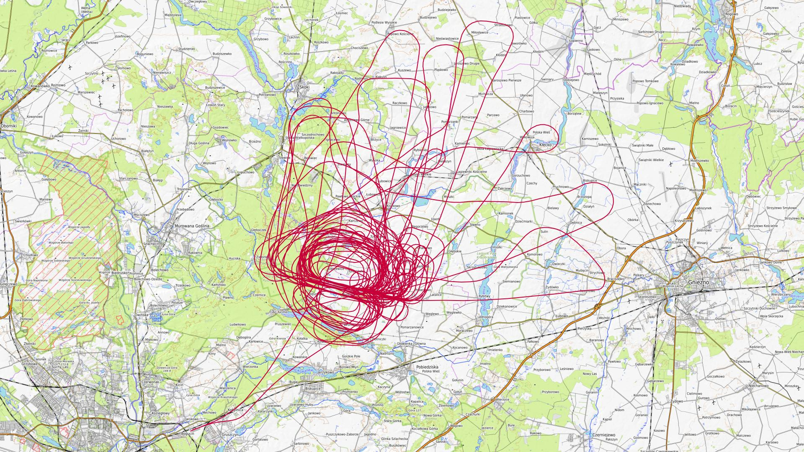

|Lot|Od|Do|Czas [min]|
|----:|--------:|--------:|--------:|
|1|08:05:36.28|08:09:38.51|4|
|2|09:07:40.29|09:29:29.95|21|
|3|09:35:47.94|09:59:24.61|23|
|4|10:09:15.36|10:30:52.65|21|
|5|10:31:27.28|10:31:27.28|0|
|6|10:33:46.84|10:37:25.3|3|
|7|10:44:26.94|11:04:58.94|20|
|8|11:14:37.63|11:38:28.85|23|
|9|11:51:04.01|12:15:08.21|24|
|10|12:22:04.78|12:43:58.53|21|
|11|12:55:40.36|13:21:04.33|25|
|12|13:27:00.77|13:48:16.87|21|
|13|14:01:15.45|14:25:00.43|23|
|14|14:31:17.85|14:53:45.18|22|
|15|15:05:57.21|15:32:09.14|26|
|16|15:37:28.06|15:58:42.37|21|
|17|16:11:27.92|16:35:27.84|23|
|18|16:40:15.7|17:00:41.41|20|
|19|17:01:11.17|17:01:48.38|0|
|20|17:12:30.74|17:33:56.35|21|
|21|17:40:54.78|18:04:01.31|23|
|22|18:15:48.75|18:39:35.96|23|
|23|19:17:44.59|19:38:05.28|20|
|24|19:42:45.09|20:07:42.67|24|

### 2026-05-03 NIEDZIELA

Loty w godzinach: 07:55:09.39 - 16:12:20.12, **8 h 17 min**  
Czas netto: **3 h 19 min**  
Liczba lotów: **9**  

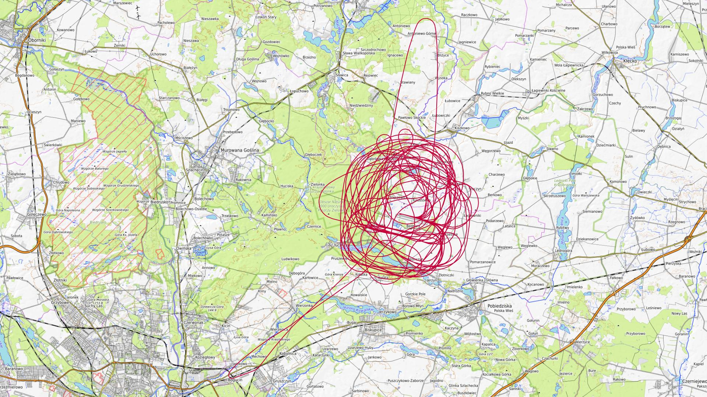

|Lot|Od|Do|Czas [min]|
|----:|--------:|--------:|--------:|
|1|07:59:00.36|08:03:48.6|4|
|2|09:11:53.58|09:37:27.37|25|
|3|10:13:41.6|10:39:46.2|26|
|4|11:18:02.54|11:43:40.85|25|
|5|12:15:32.54|12:39:44.95|24|
|6|12:51:29.31|13:15:45.5|24|
|7|13:26:01.75|13:47:03.03|21|
|8|13:53:05.81|14:15:43.32|22|
|9|15:45:03.81|16:10:42.49|25|

### 2026-05-09 SOBOTA

Loty w godzinach: 07:36:04.27 - 19:48:49.6, **12 h 12 min**  
Czas netto: **3 h 38 min**  
Liczba lotów: **13**  

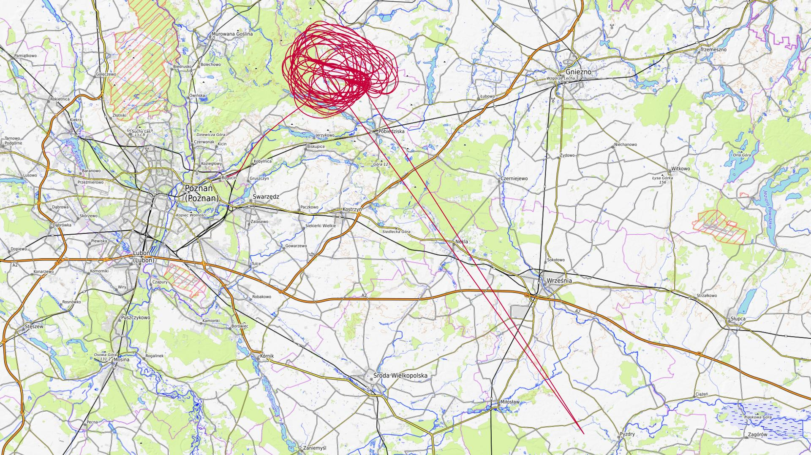

|Lot|Od|Do|Czas [min]|
|----:|--------:|--------:|--------:|
|1|08:07:17.06|08:11:34.89|4|
|2|09:31:25.21|09:54:07.97|22|
|3|10:34:26.17|10:53:43.83|19|
|4|11:03:04.46|11:04:17.05|1|
|5|11:44:35.09|12:00:12.66|15|
|6|12:59:19.22|13:22:20.96|23|
|7|14:08:07.03|14:29:43.21|21|
|8|15:18:12.09|15:40:39.07|22|
|9|16:25:27.44|16:48:05.65|22|
|10|17:23:31.3|17:43:06.17|19|
|11|17:45:02.48|17:46:45.72|1|
|12|18:25:08.01|18:47:06.99|21|
|13|19:25:42.25|19:47:38.58|21|

### 2026-05-10 NIEDZIELA

Loty w godzinach: 09:03:49.46 - 17:45:46.92, **8 h 41 min**  
Czas netto: **3 h 29 min**  
Liczba lotów: **11**  

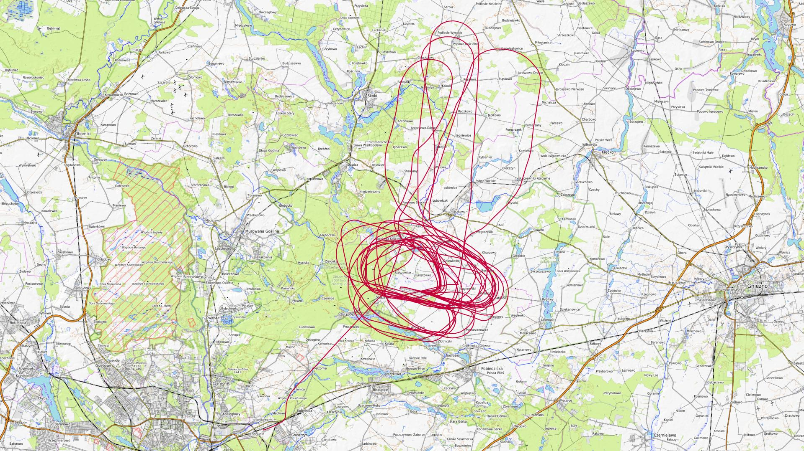

|Lot|Od|Do|Czas [min]|
|----:|--------:|--------:|--------:|
|1|09:10:25.99|09:33:15.07|22|
|2|10:09:06.35|10:32:06.3|22|
|3|10:32:11.44|10:32:13.16|0|
|4|11:12:14.09|11:34:37.85|22|
|5|12:17:11.3|12:40:14.79|23|
|6|13:17:27.18|13:38:57.42|21|
|7|14:18:56.69|14:43:01.08|24|
|8|14:48:42.39|14:50:02.15|1|
|9|15:20:13.26|15:43:11.27|22|
|10|16:18:24.29|16:42:18.11|23|
|11|17:19:37.55|17:43:46.89|24|

### 2026-05-16 SOBOTA

Loty w godzinach: 07:25:13.24 - 19:20:14.46, **11 h 55 min**  
Czas netto: **3 h 20 min**  
Liczba lotów: **11**  

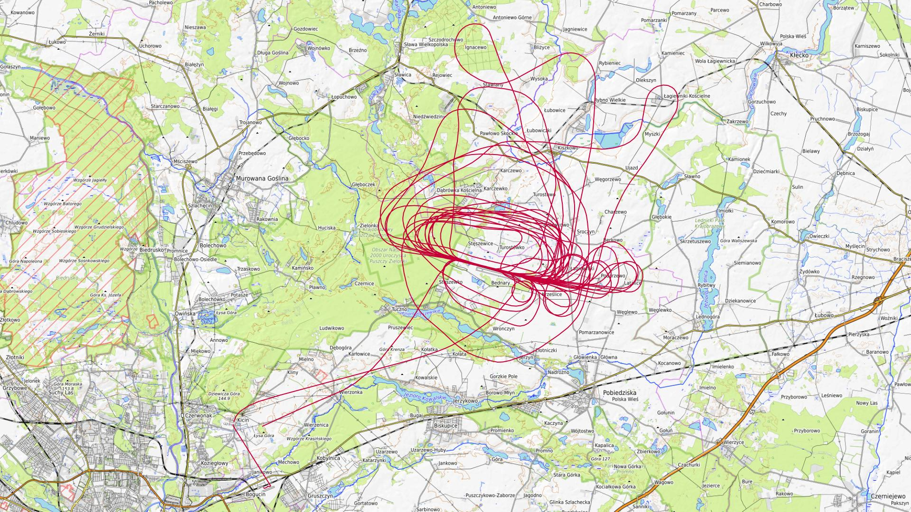

|Lot|Od|Do|Czas [min]|
|----:|--------:|--------:|--------:|
|1|07:59:41.65|08:03:25.33|3|
|2|10:06:01.07|10:25:57.78|19|
|3|11:07:47.13|11:27:17.7|19|
|4|11:29:26.19|11:55:56.17|26|
|5|12:08:59.13|12:27:03.77|18|
|6|13:03:44.66|13:22:51.56|19|
|7|14:03:34.53|14:23:08.48|19|
|8|15:06:17.41|15:25:21.34|19|
|9|16:06:33.57|16:23:46.51|17|
|10|17:05:46.46|17:22:36.09|16|
|11|18:07:11.05|18:28:17.1|21|

### 2026-05-17 NIEDZIELA

Loty w godzinach: 07:28:51.38 - 15:49:04.58, **8 h 20 min**  
Czas netto: **3 h 2 min**  
Liczba lotów: **10**  

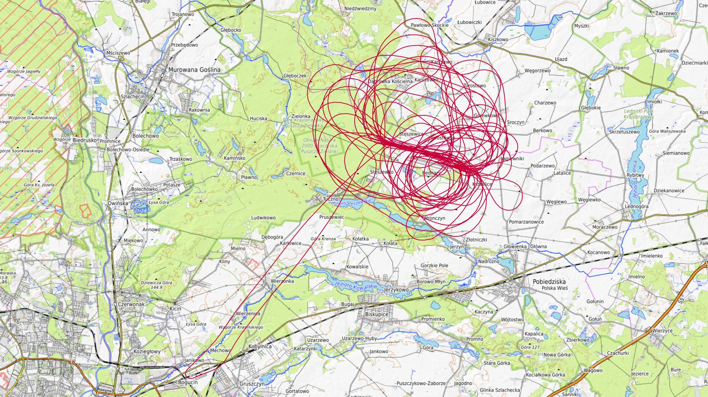

|Lot|Od|Do|Czas [min]|
|----:|--------:|--------:|--------:|
|1|08:05:38.41|08:11:16.69|5|
|2|09:19:08.31|09:39:18.44|20|
|3|10:14:38.44|10:34:41.6|20|
|4|11:13:28.38|11:34:10.52|20|
|5|12:11:29.8|12:32:16.82|20|
|6|12:43:40.46|13:05:36.01|21|
|7|13:19:21.6|13:39:25.43|20|
|8|13:49:49.14|14:10:20.64|20|
|9|14:21:33.78|14:40:44.47|19|
|10|15:32:44.03|15:46:32.88|13|

### 2026-05-23 SOBOTA

Loty w godzinach: 07:44:07.86 - 20:36:21.16, **12 h 52 min**  
Czas netto: **6 h 36 min**  
Liczba lotów: **21**  

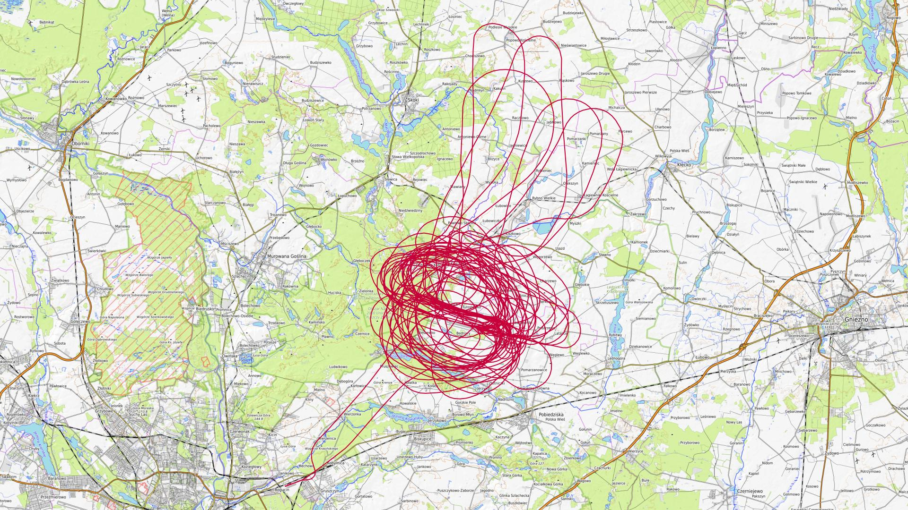

|Lot|Od|Do|Czas [min]|
|----:|--------:|--------:|--------:|
|1|08:15:06.01|08:19:31.07|4|
|2|09:55:01.74|10:18:44.9|23|
|3|10:19:34.24|10:19:34.24|0|
|4|10:23:44.97|10:48:09|24|
|5|10:55:33.78|11:18:51.7|23|
|6|11:31:22.89|11:55:02.32|23|
|7|12:08:36.61|12:30:57.08|22|
|8|13:05:29.37|13:31:43.7|26|
|9|13:45:42.91|14:09:29.6|23|
|10|14:18:07.55|14:43:04.42|24|
|11|14:43:08.92|14:43:10.41|0|
|12|14:56:36.91|15:23:10.55|26|
|13|15:30:10.17|15:53:48.34|23|
|14|16:09:20.64|16:34:39.82|25|
|15|16:39:44.03|17:06:39.44|26|
|16|17:46:31.05|18:07:19.63|20|
|17|18:15:20.95|18:39:48.1|24|
|18|18:55:22.57|19:19:08.65|23|
|19|19:19:39.82|19:19:48.33|0|
|20|19:20:29.39|19:23:19.39|2|
|21|20:08:34.75|20:34:03.42|25|

### 2026-05-24 NIEDZIELA

Loty w godzinach: 07:35:01.26 - 17:12:22.28, **9 h 37 min**  
Czas netto: **3 h 31 min**  
Liczba lotów: **13**  

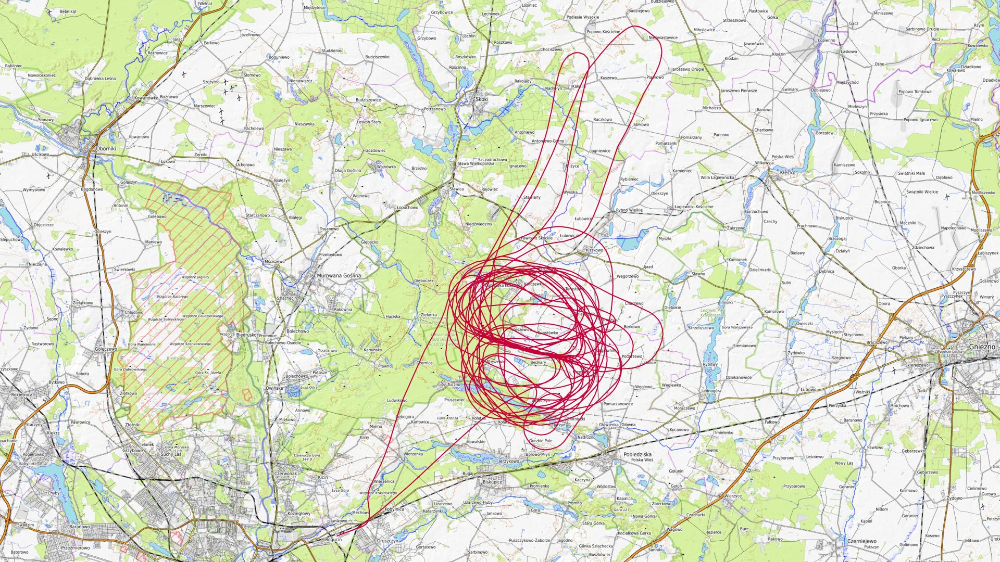

|Lot|Od|Do|Czas [min]|
|----:|--------:|--------:|--------:|
|1|08:09:23.4|08:13:14.04|3|
|2|09:29:25.49|09:53:08.01|23|
|3|09:53:11.25|09:53:12.01|0|
|4|10:05:36.24|10:28:08.41|22|
|5|10:35:50.32|11:02:33.86|26|
|6|11:03:25.96|11:03:25.96|0|
|7|11:17:10.14|11:42:15.41|25|
|8|11:45:01.61|11:51:52.68|6|
|9|12:45:10.39|13:11:39.98|26|
|10|14:37:54.39|14:59:40.11|21|
|11|15:01:29.01|15:01:29.01|0|
|12|15:36:05.68|16:02:42.18|26|
|13|16:42:36.53|17:10:22.38|27|

### 2026-05-30 SOBOTA

Loty w godzinach: 09:25:38.72 - 18:54:51.79, **9 h 29 min**  
Czas netto: **3 h 7 min**  
Liczba lotów: **13**  

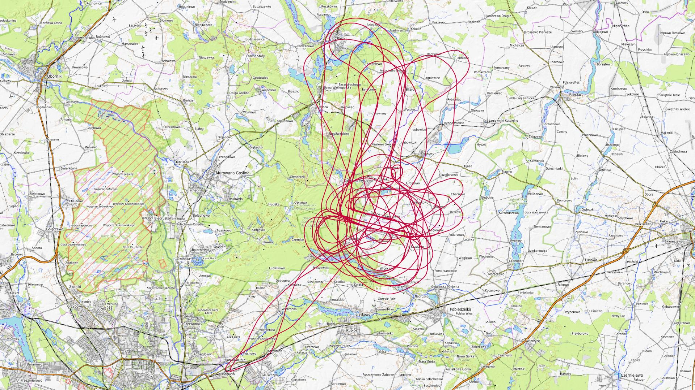

|Lot|Od|Do|Czas [min]|
|----:|--------:|--------:|--------:|
|1|09:37:50.97|09:37:50.97|0|
|2|09:37:52.85|09:43:43.31|5|
|3|12:05:30.17|12:29:50.44|24|
|4|12:35:09.34|12:58:14.3|23|
|5|13:12:14.44|13:34:39.61|22|
|6|13:45:19.56|14:09:18.49|23|
|7|14:45:58.21|15:10:10.25|24|
|8|15:48:34.69|16:14:27.82|25|
|9|16:59:59.03|17:25:46.61|25|
|10|17:26:21.06|17:29:22.76|3|
|11|18:13:23.83|18:16:59.5|3|
|12|18:46:28.73|18:51:24.84|4|
|13|18:53:08.66|18:53:56.8|0|

### 2026-05-31 NIEDZIELA

Loty w godzinach: 09:08:13.03 - 18:38:21.9, **9 h 30 min**  
Czas netto: **5 h 14 min**  
Liczba lotów: **15**  

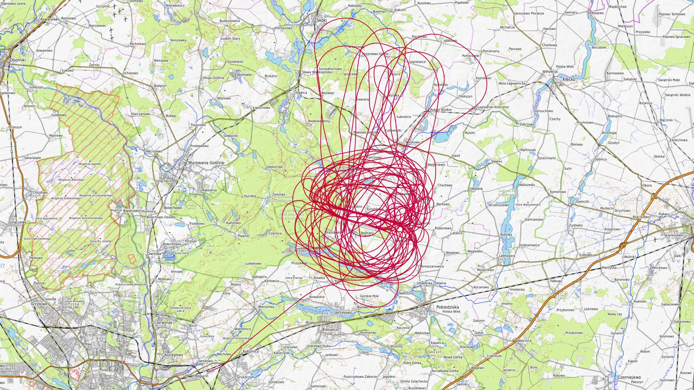

|Lot|Od|Do|Czas [min]|
|----:|--------:|--------:|--------:|
|1|09:15:18.98|09:41:44.74|26|
|2|10:24:03.29|10:52:14.23|28|
|3|11:25:17.59|11:52:05.76|26|
|4|12:30:19.64|12:56:09.73|25|
|5|12:57:59.65|12:57:59.65|0|
|6|13:09:15.1|13:36:08.13|26|
|7|13:51:03.39|14:16:10.91|25|
|8|14:23:02.07|14:49:26.97|26|
|9|14:50:16.17|14:51:50.59|1|
|10|15:04:28.8|15:28:57.01|24|
|11|15:29:32.48|15:29:32.48|0|
|12|15:44:55.45|16:11:31.92|26|
|13|16:19:43.45|16:44:50.27|25|
|14|17:00:57.18|17:26:09.02|25|
|15|18:09:37.31|18:35:20.4|25|

[początek](./)
