# Czerwiec 2026

Liczba dni z lotami: 13 
Suma czasów netto wszystkich lotów: 53 h 31 min 
 

### 2026-06-04 CZWARTEK

Loty w godzinach: 07:23:27.68 - 20:43:59.21, **13 h 20 min**  
Czas netto: **6 h 9 min**  
Liczba lotów: **16**  

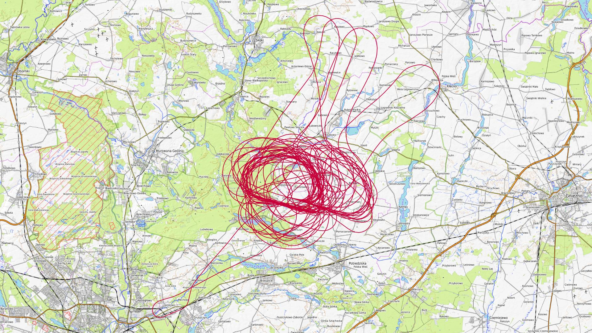

|Lot|Od|Do|Czas [min]|
|----:|--------:|--------:|--------:|
|1|07:56:40.7|08:01:32.31|4|
|2|09:35:49.67|09:57:00.16|21|
|3|10:41:01.62|11:05:26.03|24|
|4|11:42:32.36|12:06:34.72|24|
|5|12:18:37.76|12:45:11.49|26|
|6|12:55:52.33|13:14:52.43|19|
|7|13:27:25.57|13:52:56.86|25|
|8|14:01:28.11|14:28:08.1|26|
|9|14:40:11.78|15:05:55.1|25|
|10|15:16:49.56|15:42:22.79|25|
|11|16:17:30.24|16:43:50.52|26|
|12|16:56:07.26|17:20:45.5|24|
|13|17:56:55.9|18:24:58.15|28|
|14|18:33:26.87|18:55:53.78|22|
|15|19:09:18.33|19:30:51.62|21|
|16|20:18:40.27|20:41:56.99|23|

### 2026-06-07 NIEDZIELA

Loty w godzinach: 07:26:30.8 - 15:13:53.47, **7 h 47 min**  
Czas netto: **2 h 40 min**  
Liczba lotów: **9**  

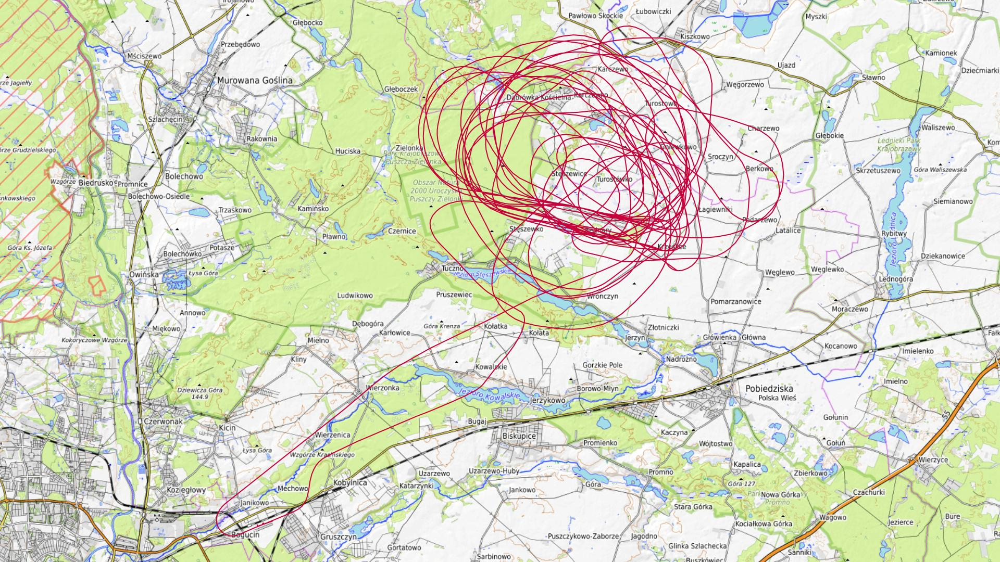

|Lot|Od|Do|Czas [min]|
|----:|--------:|--------:|--------:|
|1|07:59:13.87|08:03:56.01|4|
|2|09:26:34.75|09:48:03.42|21|
|3|10:29:22.74|10:51:42.26|22|
|4|11:36:34.62|12:00:17.07|23|
|5|12:01:34.59|12:01:46.72|0|
|6|12:42:49.86|13:06:29.43|23|
|7|13:19:45.55|13:39:35.04|19|
|8|13:45:53.92|14:04:15.6|18|
|9|14:44:51.38|15:10:51.9|26|

### 2026-06-11 CZWARTEK

Loty w godzinach: 15:41:27.85 - 21:00:03.6, **5 h 18 min**  
Czas netto: **0 h 45 min**  
Liczba lotów: **3**  

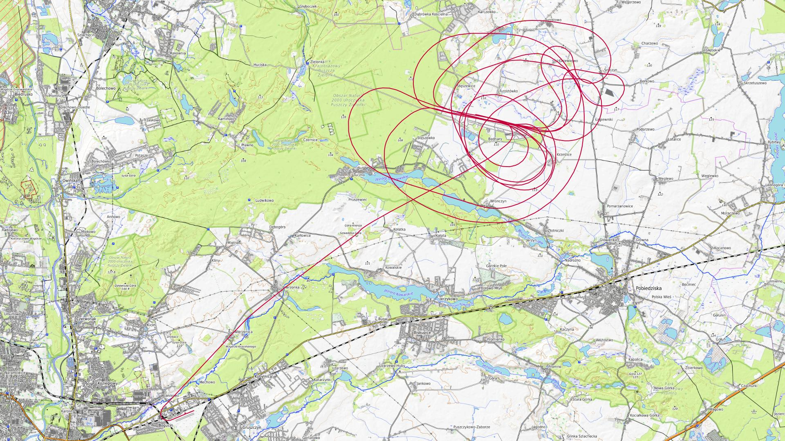

|Lot|Od|Do|Czas [min]|
|----:|--------:|--------:|--------:|
|1|16:20:14.12|16:25:22.77|5|
|2|19:32:18.35|19:53:29.34|21|
|3|20:39:14.94|20:58:32.37|19|

### 2026-06-12 PIĄTEK

Loty w godzinach: 09:29:37.8 - 19:46:43.29, **10 h 17 min**  
Czas netto: **2 h 36 min**  
Liczba lotów: **9**  

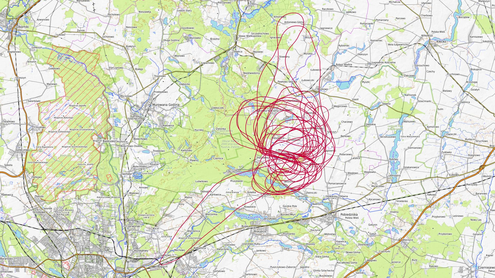

|Lot|Od|Do|Czas [min]|
|----:|--------:|--------:|--------:|
|1|09:34:20.25|09:54:52.17|20|
|2|10:40:22.78|11:00:41.97|20|
|3|11:51:51.44|12:13:16.29|21|
|4|13:05:52.47|13:28:31.93|22|
|5|14:11:40.57|14:31:55.95|20|
|6|15:08:58.31|15:27:50.56|18|
|7|16:22:33.18|16:45:46.38|23|
|8|19:03:50.74|19:08:40.41|4|
|9|19:41:06.59|19:45:53.21|4|

### 2026-06-13 SOBOTA

Loty w godzinach: 09:10:28.66 - 17:14:11.23, **8 h 3 min**  
Czas netto: **2 h 20 min**  
Liczba lotów: **6**  

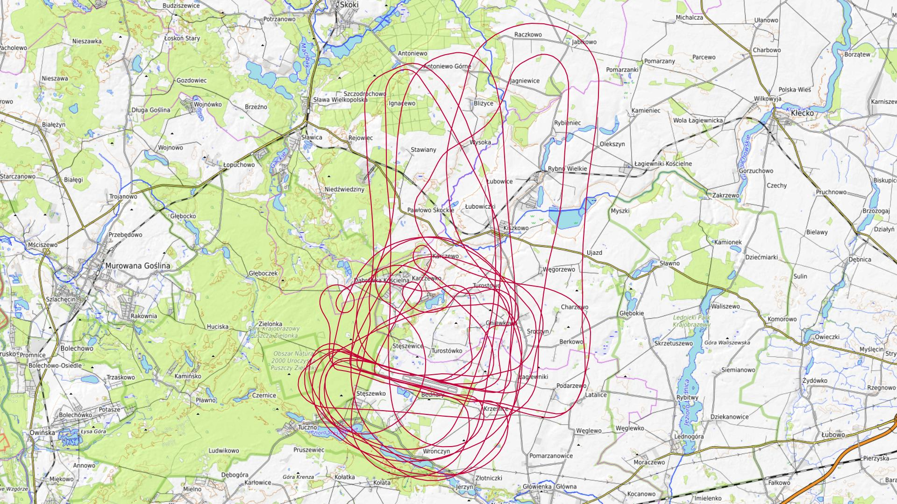

|Lot|Od|Do|Czas [min]|
|----:|--------:|--------:|--------:|
|1|09:16:09.17|09:39:10.77|23|
|2|10:20:34.92|10:42:18.79|21|
|3|12:05:55.32|12:29:23.01|23|
|4|13:18:39.65|13:42:31.38|23|
|5|14:25:26.49|14:50:21.6|24|
|6|16:49:12.77|17:12:25.16|23|

### 2026-06-18 CZWARTEK

Loty w godzinach: 08:45:20.36 - 20:31:12.99, **11 h 45 min**  
Czas netto: **3 h 41 min**  
Liczba lotów: **12**  

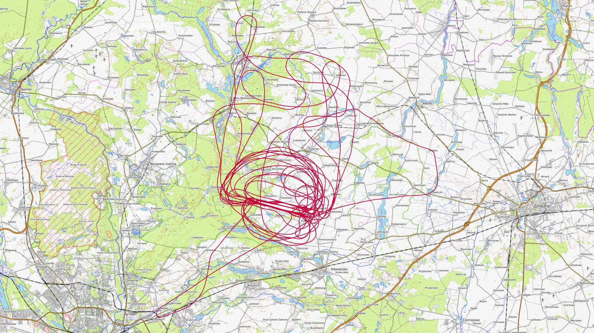

|Lot|Od|Do|Czas [min]|
|----:|--------:|--------:|--------:|
|1|08:49:16.23|08:53:26.3|4|
|2|11:17:35.83|11:41:07.55|23|
|3|12:21:13.19|12:44:53.42|23|
|4|13:24:49.27|13:46:59.84|22|
|5|14:25:50.33|14:50:53.08|25|
|6|14:51:40.52|14:52:36.75|0|
|7|15:30:19.5|15:56:23.75|26|
|8|16:38:45.78|17:02:40.98|23|
|9|17:47:29.21|18:12:56.7|25|
|10|18:13:26.52|18:13:26.52|0|
|11|18:54:20.16|19:16:22.14|22|
|12|20:04:57.95|20:29:12.45|24|

### 2026-06-19 PIĄTEK

Loty w godzinach: 08:03:10.27 - 18:02:02.11, **9 h 58 min**  
Czas netto: **3 h 22 min**  
Liczba lotów: **10**  

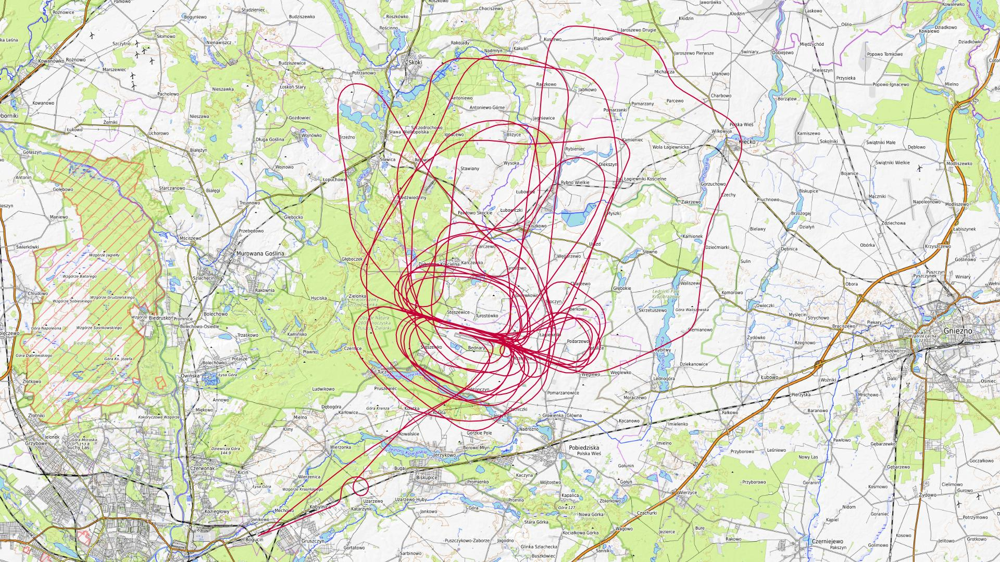

|Lot|Od|Do|Czas [min]|
|----:|--------:|--------:|--------:|
|1|08:24:04.77|08:27:52.71|3|
|2|09:44:32.14|10:05:51.74|21|
|3|11:02:09.14|11:27:55.39|25|
|4|12:03:08.79|12:26:15.41|23|
|5|13:05:46.77|13:29:14.29|23|
|6|14:03:15.84|14:28:43|25|
|7|15:07:52.02|15:35:35.64|27|
|8|16:10:47.83|16:33:46.64|22|
|9|17:09:27.27|17:32:52.52|23|
|10|17:54:24.47|17:59:29.9|5|

### 2026-06-20 SOBOTA

Loty w godzinach: 07:30:30.54 - 21:12:56.53, **13 h 42 min**  
Czas netto: **6 h 33 min**  
Liczba lotów: **19**  

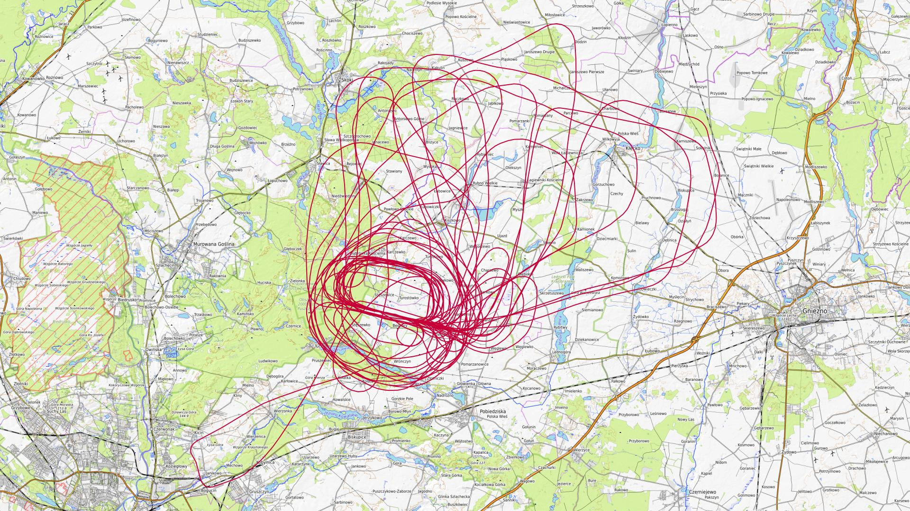

|Lot|Od|Do|Czas [min]|
|----:|--------:|--------:|--------:|
|1|07:33:00.6|07:38:16.4|5|
|2|09:06:25.87|09:30:38.77|24|
|3|10:10:33.9|10:36:49.94|26|
|4|11:12:28.44|11:38:05.35|25|
|5|11:49:22.31|12:13:58.12|24|
|6|12:18:32.47|12:41:07.76|22|
|7|12:53:44.9|13:17:58.37|24|
|8|13:23:48.54|13:50:35.57|26|
|9|14:26:51.47|14:52:05.86|25|
|10|14:58:10.8|15:21:05.33|22|
|11|15:32:54.95|15:55:24.18|22|
|12|16:32:37.68|16:58:15.1|25|
|13|17:34:41.08|18:00:44.27|26|
|14|18:01:19.11|18:01:19.11|0|
|15|18:34:34.58|19:00:16.62|25|
|16|19:06:00.79|19:26:41.65|20|
|17|19:40:38.7|20:02:56.77|22|
|18|20:03:16.8|20:03:16.8|0|
|19|20:48:13.92|21:11:31.35|23|

### 2026-06-21 NIEDZIELA

Loty w godzinach: 07:38:20.23 - 16:43:10.2, **9 h 4 min**  
Czas netto: **4 h 38 min**  
Liczba lotów: **13**  

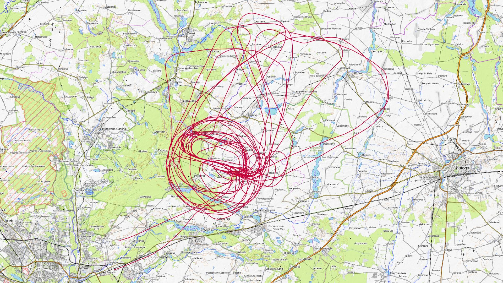

|Lot|Od|Do|Czas [min]|
|----:|--------:|--------:|--------:|
|1|07:38:22.32|07:41:54.57|3|
|2|09:08:11.8|09:31:51.63|23|
|3|09:35:48.51|09:41:30.72|5|
|4|10:07:23.63|10:30:00.18|22|
|5|11:08:23.76|11:34:14.51|25|
|6|11:45:43.39|12:10:36.16|24|
|7|12:17:06.06|12:41:21.54|24|
|8|12:52:59.48|13:15:52.45|22|
|9|13:22:38.53|13:46:52.46|24|
|10|14:20:45.74|14:47:39.96|26|
|11|14:52:51.52|15:17:47.67|24|
|12|15:30:50.18|15:55:54.48|25|
|13|16:17:17.96|16:41:03.23|23|

### 2026-06-25 CZWARTEK

Loty w godzinach: 10:20:35.29 - 20:42:34.05, **10 h 21 min**  
Czas netto: **5 h 0 min**  
Liczba lotów: **10**  

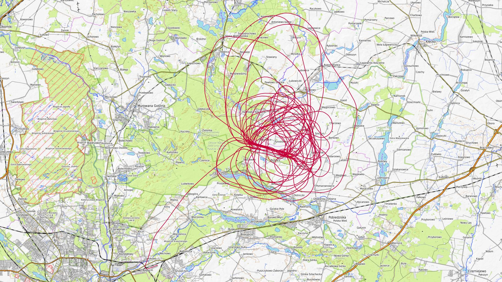

|Lot|Od|Do|Czas [min]|
|----:|--------:|--------:|--------:|
|1|10:23:51.59|10:27:49.22|3|
|2|10:28:08.71|10:28:45.32|0|
|3|11:33:34.89|13:14:28.53|100|
|4|13:55:43.41|14:18:43.43|23|
|5|14:27:17.85|15:25:06.08|57|
|6|16:11:15.76|16:33:33.53|22|
|7|17:17:45.77|17:42:15.01|24|
|8|18:12:40.66|18:33:30.34|20|
|9|19:13:30.96|19:39:39.79|26|
|10|20:21:55.3|20:42:32.64|20|

### 2026-06-26 PIĄTEK

Loty w godzinach: 11:37:59.39 - 19:31:17.46, **7 h 53 min**  
Czas netto: **4 h 25 min**  
Liczba lotów: **6**  

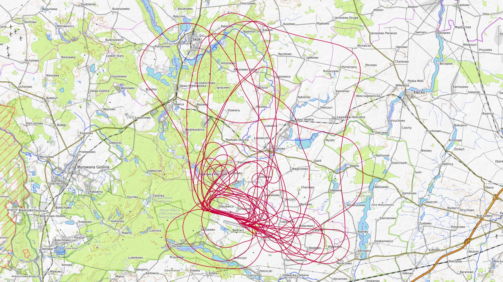

|Lot|Od|Do|Czas [min]|
|----:|--------:|--------:|--------:|
|1|11:37:59.39|12:01:27.24|23|
|2|12:45:52.01|13:07:47.28|21|
|3|13:54:13|15:24:14.62|90|
|4|16:05:18.01|17:25:38.3|80|
|5|18:06:45.45|18:33:14.59|26|
|6|19:08:06.24|19:31:17.1|23|

### 2026-06-27 SOBOTA

Loty w godzinach: 06:48:35.28 - 18:30:47.11, **11 h 42 min**  
Czas netto: **5 h 6 min**  
Liczba lotów: **16**  

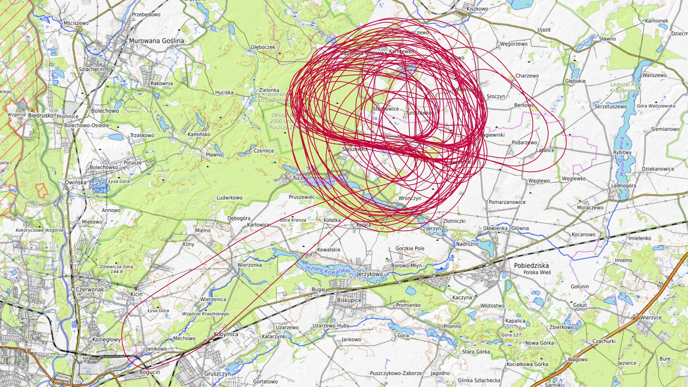

|Lot|Od|Do|Czas [min]|
|----:|--------:|--------:|--------:|
|1|06:48:53.59|06:53:04.33|4|
|2|07:30:01.9|07:35:03.24|5|
|3|09:08:37.5|09:37:47.81|29|
|4|09:39:43.86|09:40:52.52|1|
|5|10:09:01.53|10:37:26.68|28|
|6|11:24:24.05|11:51:33.65|27|
|7|11:57:03.27|12:22:03.75|25|
|8|13:09:46.82|13:36:54.1|27|
|9|13:46:41.45|14:11:29.29|24|
|10|14:24:35.18|14:49:20.84|24|
|11|14:57:35.1|15:20:46.94|23|
|12|15:21:47.7|15:21:47.7|0|
|13|15:35:04.95|15:57:23.34|22|
|14|16:47:44.57|17:14:47.42|27|
|15|17:15:20.18|17:24:40.49|9|
|16|17:58:56.4|18:26:35.93|27|

### 2026-06-28 NIEDZIELA

Loty w godzinach: 07:06:36.85 - 17:04:45.94, **9 h 58 min**  
Czas netto: **6 h 10 min**  
Liczba lotów: **18**  

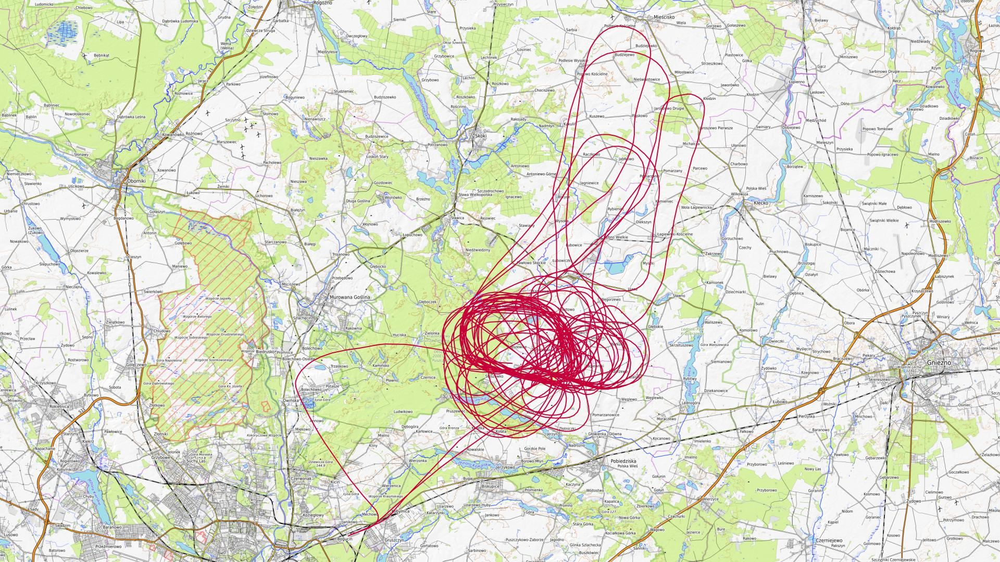

|Lot|Od|Do|Czas [min]|
|----:|--------:|--------:|--------:|
|1|07:06:39.41|07:10:55.19|4|
|2|07:50:53.05|07:54:55.97|4|
|3|09:04:10.15|09:28:46.65|24|
|4|09:35:25.83|10:02:09.85|26|
|5|10:02:17.2|10:02:17.2|0|
|6|10:14:55.98|10:41:06.14|26|
|7|10:41:46.3|10:45:22.99|3|
|8|10:46:36.68|11:12:29.19|25|
|9|11:25:22.52|11:54:01.29|28|
|10|11:54:04.69|11:56:19.25|2|
|11|11:59:20.5|12:26:34.82|27|
|12|12:39:12.9|13:08:07.45|28|
|13|13:13:35.88|13:39:31.18|25|
|14|13:42:45.52|13:43:08.82|0|
|15|13:52:26.34|14:17:39.83|25|
|16|14:25:10.77|14:47:56.02|22|
|17|14:50:07.66|14:50:07.66|0|
|18|15:29:07.75|17:03:28.67|94|

[początek](./)
