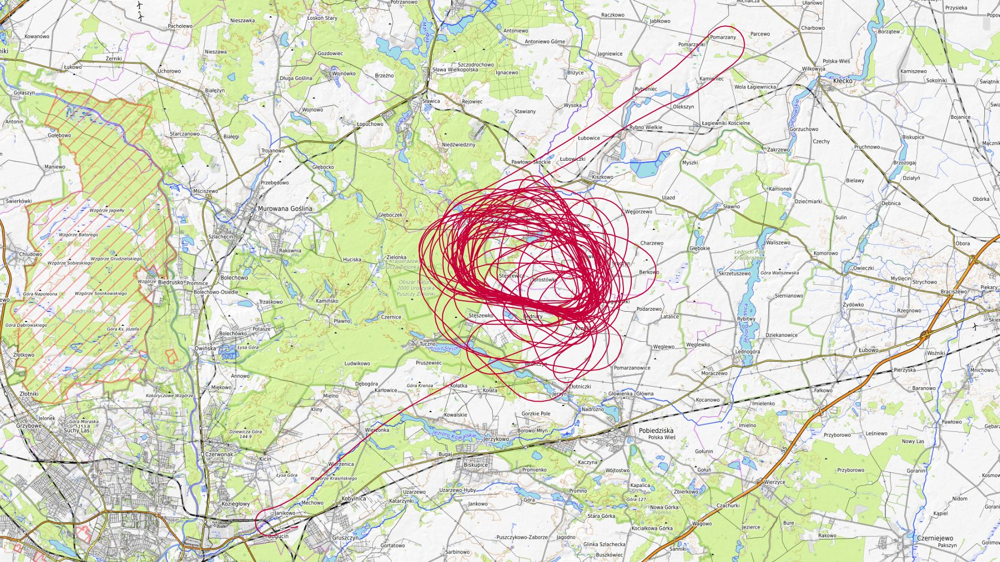

# Lipiec 2026

Liczba dni z lotami: 1 
Suma czasów netto wszystkich lotów: 6 h 7 min 
 

### 2026-07-02 CZWARTEK

Loty w godzinach: 09:39:58 - 20:43:46, **11 h 3 min**  
Czas netto: **6 h 7 min**  
Liczba lotów: **10**  

|Lot|Od|Do|Czas [min]|
|----:|--------:|--------:|--------:|
|1|10:10:06|11:48:35|98|
|2|12:48:48|13:11:41|22|
|3|13:57:32|14:52:54|55|
|4|15:29:26|15:51:10|21|
|5|16:35:23|16:56:58|21|
|6|17:10:43|18:07:45|57|
|7|18:44:12|19:05:35|21|
|8|19:14:08|19:36:13|22|
|9|19:49:29|20:10:28|20|
|10|20:17:28|20:43:41|26|

[początek](./)
